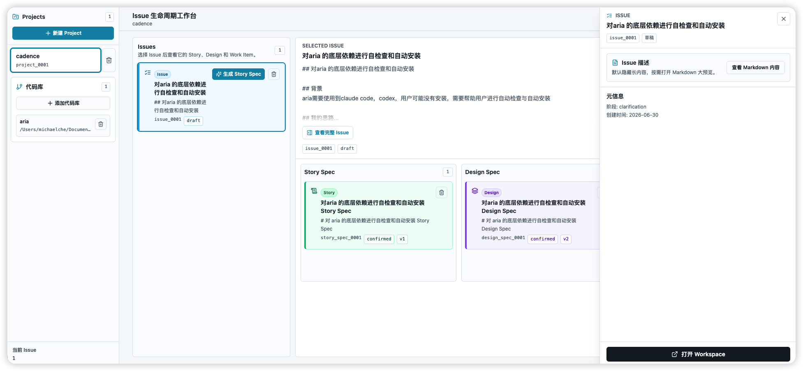
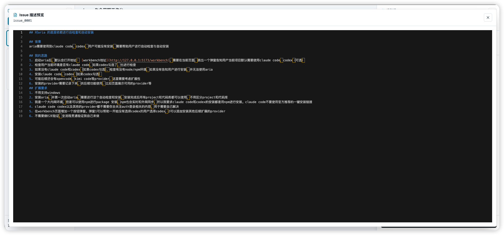
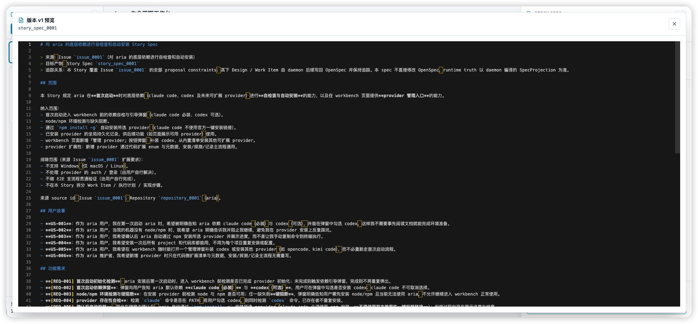
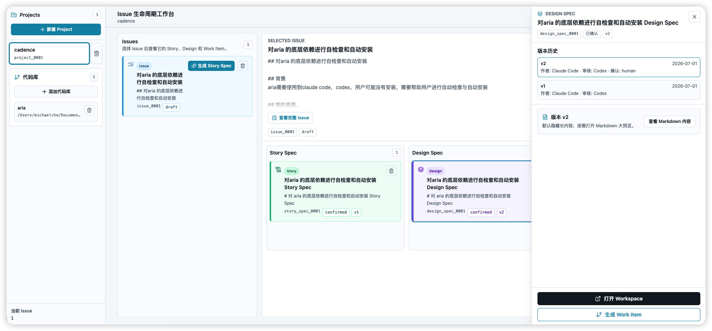
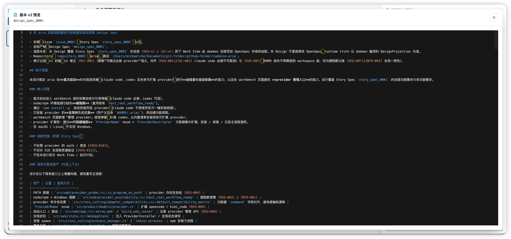
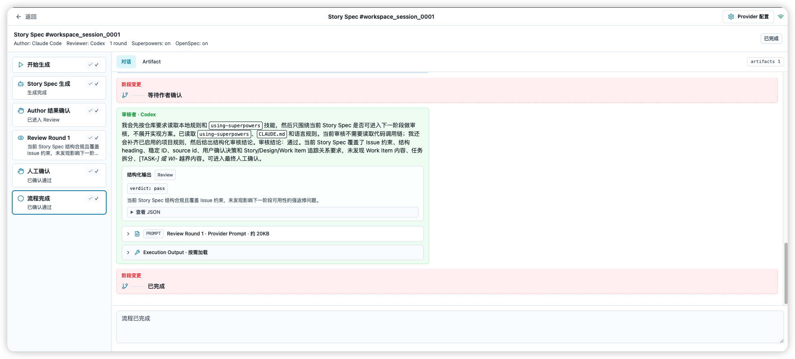
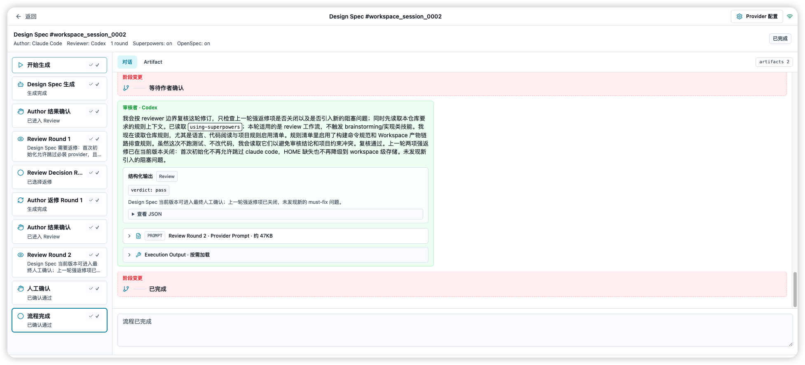

# Cadence Aria

An AI-assisted software development workbench. Cadence Aria systematically breaks down requirements (Issues) into Story Specs, Design Specs, and Work Items, then drives them through unified Provider Workspace and Coding Workspace sessions for generation, cross-review, implementation, and verification/rollback — making AI a traceable, auditable, and reversible R&D collaborator.

[](LICENSE)

---

## Table of Contents

- [Core Capabilities](#core-capabilities)
- [Workbench Overview](#workbench-overview)
- [Tech Stack](#tech-stack)
- [Quick Start](#quick-start)
- [Development Guide](#development-guide)
- [Project Structure](#project-structure)
- [License](#license)

---

## Core Capabilities

### 1. Issue Lifecycle Workbench

The product backbone is **Project → Repository → Issue**. The home page shows a four-column board:

- **Issue**: the source of requirements, bound to a repository context.
- **Story Spec**: user stories and split suggestions derived from an Issue.
- **Design Spec**: frontend / backend design documents derived from confirmed Stories.
- **Work Item**: executable tasks derived from both Story and Design Specs.

Clicking an Issue enters focus mode; the right three columns automatically filter to that Issue's full derivation chain, making it easy to trace the path from requirement to code.


### 2. Project / Repository / Issue Management

The left sidebar centrally manages Projects and Repositories:

- Create a Project as a collection of requirements.
- Add local repository paths to a Project; Issues are automatically bound to code context upon creation.
- Issues support Markdown descriptions, phases (clarification / development), and status tracking.



### 3. AI Provider Driver & Dependency Self-Check

Aria depends on **Claude Code** (required) and **Codex** (optional) as underlying executors. On first launch it automatically inspects the environment:

- Checks whether `node` / `npm` are available.
- Checks whether `claude` / `codex` commands are on `PATH`.
- If missing, guides the user through `npm install -g` (not the official one-liner), making it easier to sync through internal mirrors or package managers.

The provider architecture is extensible; OpenCode, Kimi Code, and other AI executors can be added with low friction.



### 4. Story / Design / Work Item Generation & Version History

Every artifact card supports:

- **AI generation**: trigger a provider to produce suggestions from an Issue or upstream artifact.
- **Cross-review**: author provider generates → reviewer provider reviews → author provider revises; after the configured number of rounds, it proceeds to human confirmation.
- **Version history**: every generation and revision is kept as a version (v1, v2, …) with full Markdown and review records.
- **Human confirmation**: confirmed artifacts can flow downstream.








### 5. Work Item Group & Execution Plan

Work Items are organized as Groups containing:

- Dependency graph
- Split options (frontend/backend split, include integration/E2E tests, require execution-plan confirmation)
- Child Work Item details
- Associated Coding Attempt status

After a Plan is generated and human-confirmed, the Work Item can enter the Coding Workspace for development, testing, review, rework, and final acceptance.


### 6. Provider Workspace Dialog

A unified conversational workspace hosts the full lifecycle of Story, Design, and Work Item artifacts:

- Left track shows current node and state.
- Center chat area shows provider inputs, outputs, clarification Q&A, and user instructions.
- Right artifact area shows Markdown/JSON artifacts, version history, review comments, and confirmation records.





### 7. Coding Workspace

Once a Work Item is confirmed, it enters the Coding Workspace:

- Multi-role execution (Analyst, Planner, Coder, Tester, Reviewer) in sequence or parallel.
- Real-time streaming events, permission requests, Stage Gates, and human confirmations.
- Supports execution-plan changes, Abort, Diff viewing, and Rollback.

---

## Tech Stack

| Layer | Technology |
|-------|------------|
| Backend | Rust (Edition 2024), Axum, Tokio, rust-embed |
| Frontend | TypeScript, React 19, Vite, TanStack Router, Zustand, Tailwind CSS, Monaco Editor |
| Testing | Rust integration / unit tests, Vitest, Playwright E2E |
| Distribution | npm / npx (`@cadence-aria/cli`) |

---

## Quick Start

### Use via npx (recommended for end users)

```bash
npx @cadence-aria/cli
```

This opens the browser automatically and navigates to `http://127.0.0.1:<port>/workbench`.

### Run from source

```bash
# 1. Build frontend assets (the backend embeds web/dist at compile time via rust-embed)
pnpm -C web install   # first time only
pnpm -C web build

# 2. Start the backend + frontend dev server
cargo run --locked -- web --workspace . --host 127.0.0.1 --port 4317
# In another terminal, start the frontend dev server
cd web && pnpm dev --port 5173
```

In dev mode the frontend proxies `/api` to `http://127.0.0.1:4317`. Open `http://127.0.0.1:5173`.

### Requirements

- macOS or Linux (Windows is not currently supported)
- Rust (version pinned in `rust-toolchain.toml`)
- Node.js >= 18 and pnpm
- Claude Code (the app guides installation if missing on first launch)

---

## Development Guide

### Build & Check

```bash
# Any cargo build/test must be preceded by a frontend build
pnpm -C web build

# Formatting
cargo fmt --check

# Clippy
cargo clippy --all-targets --all-features --locked -- -D warnings

# Check
cargo check --locked

# Test
cargo test --locked

# Frontend type check
cd web && pnpm tsc -b

# Frontend unit tests
cd web && pnpm test
```

> Note: do **not** pass `-j 1` to `cargo test`; parallelism is managed by `.cargo/config.toml`.

### npx Local Smoke Test

```bash
pnpm -C web build
cargo build --release
node scripts/smoke-npx.mjs
```

See also:

- `cadence/readmes/2026-05-31_README_npx分发开发与发布指南_v1.0.md`
- `cadence/readmes/2026-05-30_README_sccache可选缓存_v1.0.md`
- `cadence/project-rules/build-test-commands.md`

---

## Project Structure

```text
.
├── src/                    # Rust backend
│   ├── cli.rs              # CLI entry
│   ├── cross_cutting/      # Provider adapters, process management, artifact validation
│   ├── daemon/             # Daemon and state machine
│   ├── interactive/        # REPL / interactive projections
│   ├── product/            # Product indexes: Project / Issue / Repository / WorkItem
│   ├── protocol/           # Protocol definitions
│   ├── runtime_units/      # Runtime execution units
│   ├── task_run/           # Task run orchestration
│   └── web/                # Web API, WebSocket, static assets
├── web/                    # React + TypeScript frontend
│   ├── src/
│   │   ├── components/     # Components (lifecycle, chat-workspace, coding-workspace)
│   │   ├── pages/          # Pages (Workbench, ChatWorkspace, CodingWorkspace)
│   │   ├── state/          # Zustand state
│   │   └── api/            # API client and types
│   └── e2e/                # Playwright E2E
├── npm/                    # npx distribution packages
│   ├── cli/                # JS launcher
│   ├── cli-darwin-arm64/
│   ├── cli-darwin-x64/
│   └── cli-linux-x64/
├── cadence/                # Project artifacts: designs, plans, PRDs, rules
│   ├── designs/            # Technical design docs
│   ├── plans/              # Planning docs
│   ├── prds/               # Product requirement docs
│   └── project-rules/      # Project-specific rules
├── tests/                  # Rust integration tests
├── scripts/                # Build and release scripts
└── README.md               # 中文 README
```

---

## License

[MIT](LICENSE)
