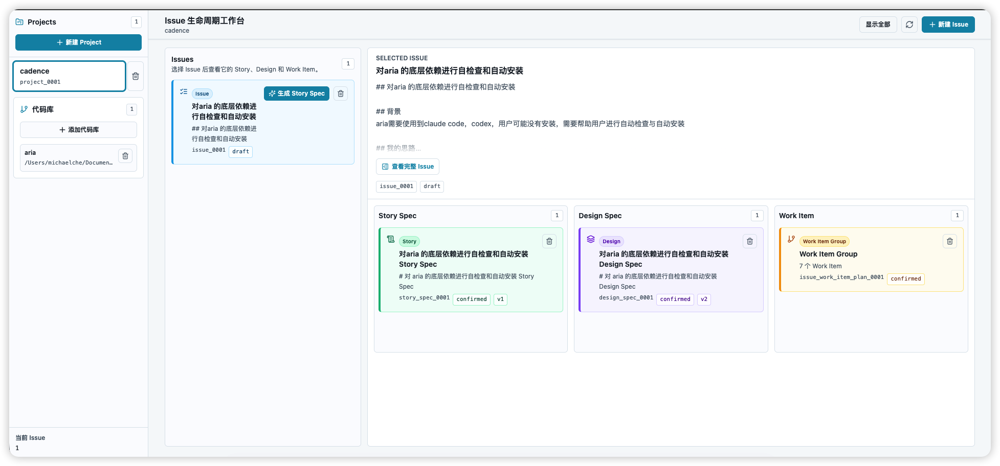
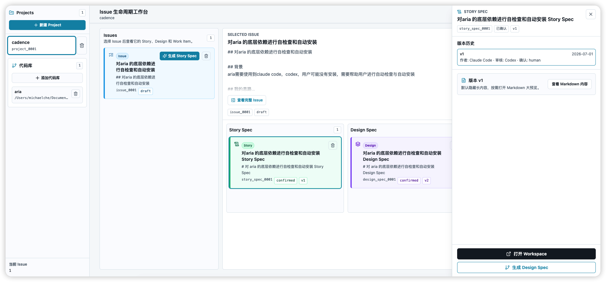
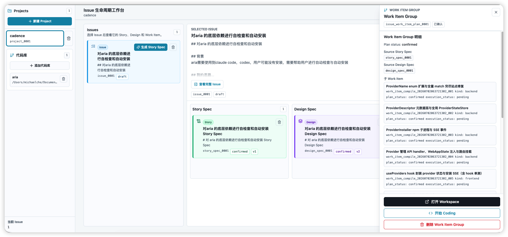
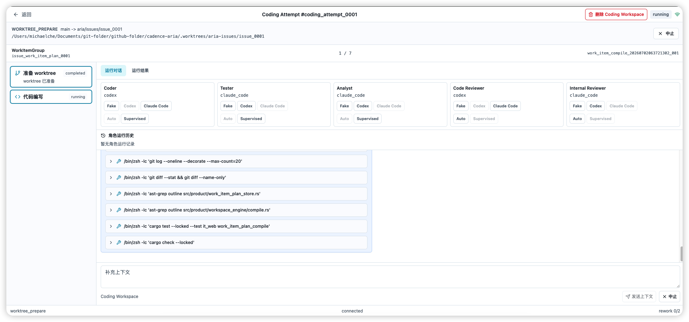

# Cadence Aria

AI 辅助的软件开发工作平台。Cadence Aria 把需求（Issue）系统地拆分为 Story Spec、Design Spec 与 Work Item，并通过统一的 Provider Workspace 与 Coding Workspace 完成生成、交叉审核、编码实现与验证回滚，让 AI 成为可追踪、可审计、可回退的研发协作者。

[](LICENSE)

---

## 目录

- [核心能力](#核心能力)
- [如何使用系统](#如何使用系统)
- [技术栈](#技术栈)
- [快速开始](#快速开始)
- [开发指南](#开发指南)
- [项目结构](#项目结构)
- [许可证](#许可证)

---

## 核心能力

### 1. Issue 生命周期工作台

以 **Project → Repository → Issue** 为产品主线，首页提供四列看板：

- **Issue**：需求源头，绑定代码库上下文。
- **Story Spec**：由 Issue 派生的用户故事与拆分建议。
- **Design Spec**：由已确认 Story 派生的前端 / 后端设计文档。
- **Work Item**：由 Story 与 Design 联合派生的可执行任务。

点击 Issue 进入聚焦态，右侧三列自动过滤出该 Issue 的完整派生链路，方便追踪从需求到代码的完整路径。



### 2. 群聊式 Spec 生成

除传统流水线外，Aria 支持在多人群聊工作台中共同讨论并定稿 Spec：创建群聊后可邀请角色、围绕 Story / Design 产物线持续讨论，定稿后版本会回到 Issue 看板并保留版本历史，也可从定稿产物进入 Work Item 派生流程。

在主工作台右上角打开 **设置 → Spec 生成模式**，选择「流水线模式」或「群聊模式」。流水线模式保持原有 Story、Design 与 Work Item 生成流程不变；群聊模式下从 Issue 看板进入群聊工作台。

### 3. Project / Repository / Issue 管理

左侧边栏统一管理 Project 与代码库（Repository）：

- 创建 Project 作为需求集合。
- 为 Project 添加本地代码库路径，Issue 自动生成即绑定代码上下文。
- Issue 支持 Markdown 描述、阶段（clarification / development）与状态追踪。


### 4. AI Provider 驱动与依赖自检

Aria 默认依赖 **Claude Code**（必装）与 **Codex**（可选）作为底层执行器。首次启动时会自动检测环境：

- 检测 `node` / `npm` 是否可用。
- 检测 `claude` / `codex` 命令是否在 `PATH`。
- 缺失时通过 `npm install -g` 引导自动安装（不使用官方一键安装链接，便于内网与包管理器同步）。

Provider 架构可扩展，后续可低成本接入 OpenCode、Kimi Code 等新的 AI 执行器。


### 5. Story / Design / Work Item 生成与版本历史

每个产物卡片都支持：

- **AI 生成**：从 Issue 或上游产物触发 Provider 生成建议。
- **交叉 Review**：作者 provider 生成 → reviewer provider 审查 → 作者 provider 修订，达到配置轮次后进入人工确认。
- **版本历史**：每次生成与修订都保留版本（v1、v2 …），可查看 Markdown 全文与审核记录。
- **人工确认**：确认后的产物才能进入下游派生。




### 6. Work Item Group 与执行计划

Work Item 以 Group 形式组织，包含：

- 依赖图（Dependency Graph）
- 拆分选项（是否拆分前后端、是否包含集成/E2E 测试、是否需要执行计划确认）
- 子 Work Item 明细
- 关联的 Coding Attempt 状态

生成 Plan 并经人工确认后，方可进入 Coding Workspace 执行开发、测试、Review、Rework 与最终验收。



### 7. Provider Workspace 弹窗

统一的对话式工作区承载 Story、Design、Work Item 的全流程：

- 左侧流程轨道显示当前节点与状态。
- 中间对话区展示 provider 输入、输出、澄清问答与用户补充指令。
- 右侧产物区展示 Markdown/JSON 产物、版本历史、Review 意见与确认记录。


### 8. Coding Workspace

Work Item 确认后进入 Coding Workspace：

- 多角色（Analyst、Planner、Coder、Tester、Reviewer）顺序/并行执行。
- 实时流式事件、权限请求、Stage Gate 与人工确认。
- 支持执行计划变更、Abort、Diff 查看与回滚（Rollback）。



---

## 技术栈

| 层级 | 技术 |
|------|------|
| 后端 | Rust（Edition 2024）、Axum、Tokio、rust-embed |
| 前端 | TypeScript、React 19、Vite、TanStack Router、Zustand、Tailwind CSS、Monaco Editor |
| 测试 | Rust 集成测试 / 单元测试、Vitest、Playwright E2E |
| 分发 | npm / npx（`@cadence-aria/cli`） |

---

## 快速开始

### 通过 npx 使用（推荐终端用户）

```bash
npx @cadence-aria/cli
```

启动后将自动打开浏览器并进入 `http://127.0.0.1:<port>/workbench`。

### 本地源码启动

```bash
# 1. 构建前端产物（后端编译时通过 rust-embed 嵌入 web/dist，必须先构建）
pnpm -C web install   # 首次
pnpm -C web build

# 2. 启动后端 + 前端开发服务
cargo run --locked -- web --workspace . --host 127.0.0.1 --port 4317
# 在另一个终端启动前端 dev server
cd web && pnpm dev --port 5173
```

开发模式下前端代理 `/api` 到 `http://127.0.0.1:4317`，访问 `http://127.0.0.1:5173` 即可。

### 环境要求

- macOS 或 Linux（Windows 不在当前支持范围）
- Rust（版本以 `rust-toolchain.toml` 为准）
- Node.js >= 18 与 pnpm
- Claude Code（首次启动时如不存在的会引导安装）

---

## 开发指南

### 构建与检查

```bash
# 任何 cargo 构建/测试前必须先构建前端产物
pnpm -C web build

# 格式化
cargo fmt --check

# Clippy
cargo clippy --all-targets --all-features --locked -- -D warnings

# 检查
cargo check --locked

# 测试
cargo test --locked

# 前端类型检查
cd web && pnpm tsc -b

# 前端单元测试
cd web && pnpm test
```

> 注意：禁止给 `cargo test` 添加 `-j 1`；并行度由 `.cargo/config.toml` 统一托管。

### npx 本地冒烟

```bash
pnpm -C web build
cargo build --release
node scripts/smoke-npx.mjs
```

详见：

- `cadence/readmes/2026-05-31_README_npx分发开发与发布指南_v1.0.md`
- `cadence/readmes/2026-05-30_README_sccache可选缓存_v1.0.md`
- `cadence/project-rules/build-test-commands.md`

---

## 项目结构

```text
.
├── src/                    # Rust 后端
│   ├── cli.rs              # CLI 入口
│   ├── cross_cutting/      # Provider 适配、进程管理、artifact 校验等
│   ├── daemon/             # 守护进程与状态机
│   ├── interactive/        # REPL / 交互投影
│   ├── product/            # Project / Issue / Repository / WorkItem 等产品索引
│   ├── protocol/           # 协议定义
│   ├── runtime_units/      # 运行时执行单元
│   ├── task_run/           # 任务运行编排
│   └── web/                # Web API、WebSocket、静态资源
├── web/                    # React + TypeScript 前端
│   ├── src/
│   │   ├── components/     # 组件（lifecycle、chat-workspace、coding-workspace）
│   │   ├── pages/          # 页面（Workbench、ChatWorkspace、CodingWorkspace）
│   │   ├── state/          # Zustand 状态
│   │   └── api/            # API 客户端与类型
│   └── e2e/                # Playwright E2E
├── npm/                    # npx 分发包
│   ├── cli/                # JS launcher
│   ├── cli-darwin-arm64/
│   ├── cli-darwin-x64/
│   └── cli-linux-x64/
├── cadence/                # 项目产物文档、设计、计划、规则
│   ├── designs/            # 技术方案
│   ├── plans/              # 计划文档
│   ├── prds/               # 需求文档
│   └── project-rules/      # 项目自定义规则
├── tests/                  # Rust 集成测试
├── scripts/                # 构建与发布脚本
└── README.en.md            # English README
```

---

## 如何使用系统

### 1. 启动与首次环境自检

#### 通过 npx 启动

```bash
npx @cadence-aria/cli
```

launcher 会自动选择空闲端口，启动后端，并打开浏览器进入 `http://127.0.0.1:<port>/workbench`。

#### 本地源码启动

```bash
pnpm -C web build
cargo run --locked -- web --workspace . --host 127.0.0.1 --port 4317
# 在另一个终端
cd web && pnpm dev --port 5173
```

然后访问 `http://127.0.0.1:5173`，开发模式下前端会把 `/api/*` 代理到 `4317` 端口的后端。

#### 首次启动依赖自检

首次启动时 Aria 会检查环境：

- `node` / `npm` 是否可用；
- `claude`（Claude Code，必装）是否在 `PATH`；
- `codex`（可选）是否在 `PATH`。

如果缺失，会弹出引导窗口，提示通过 `npm install -g` 安装对应 Provider。Claude Code 必须安装后才能继续使用；Codex 可跳过，日后再通过右上角 **Provider 配置** 补装。

---

### 2. Workbench 主界面

默认进入 `/workbench`，页面分为三块：

- **左侧边栏**：Project 列表、当前 Project 的代码库列表、当前 Issue 数量。
- **Issues 列**：当前 Project 下的所有 Issue。
- **右侧详情区**：选中 Issue 后，展示该 Issue 派生的 Story Spec、Design Spec 和 Work Item 卡片。

---

### 3. 创建 Project

1. 点击左侧边栏顶部的 **+ 新建 Project**。
2. 输入 Project 名称。
3. 创建后，该 Project 会出现在列表中并被自动选中。

Project 是需求的集合，后续所有 Issue、Repository、Spec 和 Work Item 都挂在 Project 下。

---

### 4. 添加代码库（Repository）

Issue 必须绑定代码库上下文，Story / Design / Work Item 的生成和执行都依赖这个上下文。

1. 在左侧边栏的 **代码库** 区域点击 **+ 添加代码库**。
2. 输入本地代码库的绝对路径。
3. 保存后，该 Repository 会显示在列表中，包含名称与路径。

如果路径后续失效，相关 Issue 与派生卡片会进入 blocked 状态，需要重新绑定或修复路径。

---

### 5. 创建 Issue

1. 点击 Issues 区域附近的 **+ 新建 Issue**。
2. 选择要绑定的 Repository。
3. 输入标题和 Markdown 描述（背景、思路、约束等）。
4. 保存后，Issue 以 `draft` 状态出现在 Issues 列表。

点击某个 Issue 卡片进入**聚焦态**：右侧详情区只展示该 Issue 派生的 Story Spec、Design Spec 和 Work Item。

---

### 6. 生成 Story Spec

1. 在 Issues 列表中选中目标 Issue。
2. 点击 Issue 卡片上的 **生成 Story Spec**。
3. 系统打开 **Provider Workspace 弹窗**：
   - **左侧流程轨道**：固定节点与当前状态（准备上下文、建议拆分、生成草稿、交叉 Review、修订、人工确认）。
   - **中间对话区**：Provider 基于 Issue 描述和代码上下文给出拆分建议，用户可以补充指令、回答澄清问题。
   - **右侧产物区**：生成的 Markdown 产物、版本历史、Review 意见。
4. Provider 可能会建议把一个 Issue 拆成多个 Story Spec。
5. 用户审核拆分建议后，确认创建对应 Story Spec 卡片。
6. Story Spec 卡片显示为 `confirmed` / `v1` 等状态。

---

### 7. 生成 Design Spec

Design Spec 只能从**已确认**的 Story Spec 派生。

1. 在右侧详情区选中一个已确认的 Story Spec。
2. 点击 **生成 Design Spec**。
3. 在 Workspace 弹窗中，Provider 建议：
   - Story 到 Design 的映射（一对一或多对一）；
   - Design 类型：`frontend`、`backend`，或两者都有。
4. 用户审核映射和类型后，确认创建 Design Spec 卡片。
5. 每张 Design Spec 同样支持多版本、交叉 Review 和人工确认。

---

### 8. 生成 Work Item Plan 与 Work Item

Work Item 必须由 Story Spec 与 Design Spec 联合派生。

1. 选中已确认的 Story Spec 和 Design Spec。
2. 点击 **生成 Work Item** / **生成 Work Item Plan**。
3. 系统弹出 **Work Item Plan 配置弹窗**，可配置：
   - 是否包含集成测试（`include_integration_tests`）；
   - 是否包含 E2E 测试（`include_e2e_tests`）；
   - 是否强制前后端拆分（`force_frontend_backend_split`）；
   - 是否需要执行计划人工确认（`require_execution_plan_confirm`）。
4. 确认配置后，Provider 生成 Plan，包含：
   - 子 Work Item 列表；
   - Work Item 之间的依赖图（Dependency Graph）；
   - 拆分结论与校验发现（validator findings）。
5. 用户查看 Plan 后点击确认，Work Item Group 卡片创建成功。
6. Work Item Group 卡片内展示子 Work Item 明细和关联的 Coding Attempt 状态。

**关键规则**：Work Item 必须先有 Plan 并经人工确认，才能进入 Coding 阶段。

---

### 9. Provider Workspace 弹窗的通用操作

无论是 Story、Design 还是 Work Item，Workspace 弹窗的交互模式一致：

- **顶部配置条**：可查看或调整 Provider 组合、Review 轮次、superpowers / OpenSpec 约束、Repository 上下文。
- **左侧流程轨道**：固定节点，显示当前进行到哪一步。
- **中间对话区**：
  - 查看 Provider 的输入摘要；
  - 查看 Provider 的流式输出；
  - 输入补充要求或回答澄清；
  - 查看权限请求、Review 结论、阶段变更。
- **右侧产物区**：
  - 查看 Markdown / JSON 产物全文；
  - 切换版本历史（v1、v2 …）；
  - 查看 Review 意见链；
  - 查看确认记录。

流程到达人工确认节点时，会暂停等待用户点击确认；如果不通过，可要求修改，进入下一轮修订。

---

### 10. 进入 Coding Workspace

1. 在 Work Item Group 或单个 Work Item 卡片上点击 **打开 Workspace** / **开始 Coding**。
2. 系统进入 `/workbench/coding/$attemptId`，即 Coding Workspace。

Coding Workspace 中的典型流程：

- **Analyst**：分析需求与代码上下文；
- **Planner**：制定执行计划；
- **Coder**：按 plan 修改代码；
- **Tester**：运行测试、验证结果；
- **Reviewer**：审查改动。

每个角色运行时都会通过 WebSocket 实时推送事件，界面左侧显示 Timeline，中间显示对话与输出，右侧显示 Artifact / Diff / 测试报告。

过程中可能触发以下交互：

- **权限请求**：Provider 需要执行敏感操作（如写入文件、运行命令）时，弹出授权请求；
- **Stage Gate**：到达关键节点暂停，等待人工确认继续、要求修改或终止；
- **执行计划变更**：用户可申请修改执行计划，Provider 重新评估；
- **Abort**：随时中断当前 Coding Attempt；
- **Rollback**：如果执行结果不满意，可回退到之前状态。

---

### 11. 删除 Project / Issue / 产物

Workbench 支持直接删除：

- **Project**：左侧边栏点击项目卡片旁的删除按钮；
- **Repository**：代码库列表点击删除按钮；
- **Issue**：Issues 列表点击 Issue 卡片旁的删除按钮；
- **Story Spec / Design Spec / Work Item**：右侧详情区点击卡片上的删除按钮。

删除通常是 soft-delete，产品索引层保留记录，必要时可从 runtime 重建。

---

### 12. 刷新与状态查看

- 页面会自动轮询当前 Project 的 Issues、Repositories、Lifecycle 数据。
- 点击 **刷新** 按钮可手动同步最新状态。
- Issue 和产物卡片会显示当前状态、版本号、确认状态、更新时间。
- 当前 Project 的 Issue 总数显示在左侧边栏底部。

---

### 13. 命令行补充操作

除了 Web 界面，Aria 也提供 CLI：

```bash
# 查看 daemon 状态
aria daemon status --workspace .

# 启动 daemon
aria daemon run --workspace .

# 直接运行一个 task
aria task run --workspace . "你的需求描述"

# 启动 web 服务
aria web --workspace . --host 127.0.0.1 --port 4317
```

不过日常主要操作都通过 `/workbench` 工作台完成。

---

## 许可证

[MIT](LICENSE)
