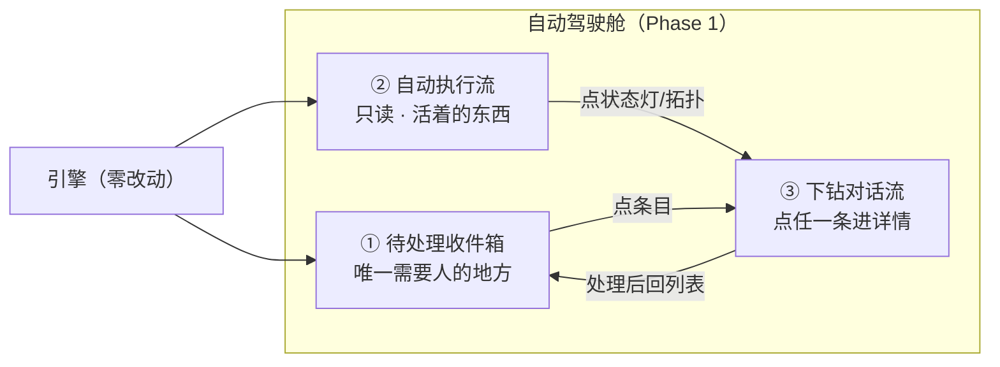
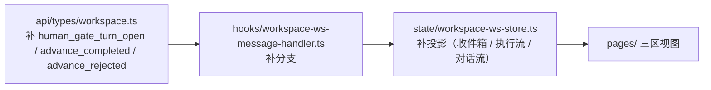
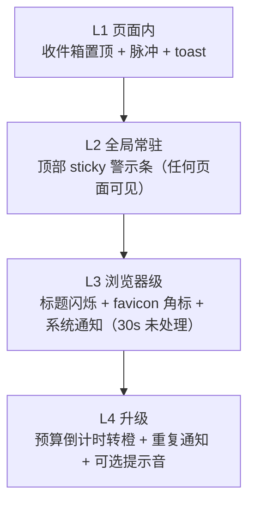

# 设计文档：3.7 UI/UX 改造 —— 自动执行驾驶舱

> **状态**：立项设计 v1.0（用户已拍板决策全录；controller 终验后呈用户审）
> **一句话**：把 aria 工作区引擎的 web 前端从「多面板控制台」改造成「自动执行驾驶舱」——系统自动跑全程，人只在卡壳点被叫醒。

- **设计编号**：DES-2026-09-13-UI37-COCKPIT
- **日期**：2026-09-13
- **版本**：v1.0
- **范围**：aria 工作区引擎的 web 前端（`web/src/`，React + Vite + Zustand + TanStack Router + Tailwind）
- **阶段定位**：五阶段路线 v2.0 的 **3.7 UI/UX 改造**（专项测量轮之后、阶段 4 扩展与退役之前）
- **上游权威**：`cadence/notes/2026-09-03_路线图更新_五阶段路线_v2.0.md`
- **关联 defer 账**：`cadence/reports/workitem-conversational-gate-advance/defer-ledger.md` —— **DEF-1（前端 UI）/ DEF-3（SC 子 session 只读呈现形态）由本设计吸收**；DEF-4/5/6 归阶段 4
- **决策来源**：用户已拍板（本设计只登记决策，不重新论证，不引入未拍板项）

> 本文只定义 UI/UX 的形态、分区、交互动线与验收口径。**不写代码、不改后端、引擎零等待**：Phase 1–4 全部只动 `web/src/`。

## 目录

0. [目标与范式](#0-目标与范式)
1. [设计系统（增量不换血）](#1-设计系统增量不换血)
2. [Phase 1：自动驾驶舱（主战场）](#2-phase-1自动驾驶舱主战场)
3. [卡壳提醒体系（四层递进）](#3-卡壳提醒体系四层递进)
4. [Phase 2：编码仪表盘](#4-phase-2编码仪表盘)
5. [Phase 3：计划审批深度](#5-phase-3计划审批深度)
6. [Phase 4：advance / 接管操作收口](#6-phase-4advance--接管操作收口)
7. [非目标与约束](#7-非目标与约束)
8. [风险与缓解](#8-风险与缓解)

附录 A：[事实依据与术语对照](#附录-a事实依据与术语对照) ｜ 附录 B：[自检记录](#附录-b自检记录)

---

## 0. 目标与范式

### 0.1 产品目标

3.7 的目标是让 **aria 工作区引擎的 web 前端 = 自动执行驾驶舱**：

- 用户不必盯着屏幕等状态，也不必记住引擎的阶段机与命令序列；
- 系统自动跑完整个执行链（计划 → 门禁 → 编码 → push），人只在**卡壳点**被叫醒；
- 所有处理动作在界面上就地完成，**全程不需要开命令行**。

### 0.2 核心范式（用户拍板，不得漂移）

> **自动执行为主、异常驱动人工**（exception-driven autopilot）。

系统自动跑全程；人只在四类卡壳点被叫醒并处理：**门禁（human gate）/ 分诊（triage）/ stopped（`stopped_needs_human`）/ 硬错（hard error）**。

由此推导出三条界面公理，后文所有分区与交互都服从它们：

1. **默认无人工输入**：界面的常驻形态是「只读的进行中画面」，不是「等待输入的对话框」。
2. **人的入口唯一**：需要人的东西集中在一处（待处理收件箱），不做分散的、要靠翻找才能发现的入口。
3. **卡壳必须显眼**：卡壳提醒是四层递进的强制体系（§3），不是可选的角标。

### 0.3 四 Phase 与路线图对应（路线图原序）

| Phase | 内容（路线图原序） | 主要承载 | 性质 |
|---|---|---|---|
| **Phase 1** | ① 对话门聊天界面（**主战场**） | `web/src/pages/ChatWorkspacePage.tsx` 重组 + app shell 层新增 | 拆页重组 + 前端 typed 协议补齐 |
| **Phase 2** | ② 编码进展仪表盘 | `web/src/pages/CodingWorkspacePage.tsx` 深化 | 视图深化（只读为主） |
| **Phase 3** | ③ 计划审批视图 | 计划/revision/契约呈现 | 只读呈现（含 DEF-3 吸收） |
| **Phase 4** | ④ advance / 接管操作收口 | 跨两页操作统一 | 交互收口 + 审计视图 |

排序理由（沿用路线图，不重复论证）：UI 在专项测量轮之后，用真实跑证据喂设计；UI 在阶段 4 之前，界面天然只依赖阶段 3 typed 协议，退役旧协议不伤 UI。

### 0.4 验收总口径

> **UI 走通真实全链**：轻语料 + `pi` provider，在界面上完成
> **建会话 → 看计划 → request-change / confirm / advance → 看编码进度 → 看 push**，
> **全程不开命令行**。

- 每个 Phase 结束时做 **增量验证**（该 Phase 的链路片段在真实 provider 上跑通），不做一次性大验收。
- 每个 Phase 的验收都是**真实链**，不接受仅 fixture/单测证据。
- Phase 1 的验收即总口径的完整一遍（因为 Phase 1 之后四类卡壳点与自动推进都已可操作）。

### 0.5 与其他阶段的关系

- **本设计不提前实现 Phase 2–4 的内容**：Phase 2–4 在本文只有契约级描述（分区、视图、交互），实施时各自细化。
- **DEF-1 在本设计补位**：takeover 前端零接入（§0.6 事实 #6）在 Phase 1 接线。
- **DEF-3 在本设计吸收**：SC 子 session（amendment / plan-repair）只读呈现形态落在 Phase 3（§5）。

### 0.6 现状技术事实基线（勘察已证）

以下事实来自本次勘察，是后续设计与实施的地基；**实施时以代码为准，本表用于对齐术语**。

| # | 事实 | 证据位置 |
|---|---|---|
| 1 | 现有两页：`ChatWorkspacePage`（artifacts / review / actions / work-item-plan 四块）与 `CodingWorkspacePage`（timeline / plan-repair / gates / execution-plan / group-progress / reports） | `web/src/pages/ChatWorkspacePage.tsx`、`web/src/pages/CodingWorkspacePage.tsx` |
| 2 | 状态层与 WS 钩子齐全：workspace WS store、coding WS store、重连与重建已存在 | `web/src/state/workspace-ws-store.ts`、`web/src/hooks/useWorkspaceWs.ts`、`web/src/hooks/useCodingWorkspaceWs.ts`、`web/src/state/workspace-chat-rebuild.ts` |
| 3 | 路由已就位：`/workbench` 三工作区 + `/image-create` | `web/src/router.tsx` |
| 4 | workspace WS 后端入向约 30 变体，含 `UserMessage` / `HumanGateFeedback` / `Advance` / `HumanTriage` / `RequestChange`；前端 `WsInMessage`(25) / `WsOutMessage`(21) 已就位 | `src/web/workspace_ws_types/in_.rs:12`、`web/src/api/types/workspace.ts:212,543` |
| 5 | coding WS **无插话入口**（入向 14 变体无 user_message）；single-candidate Running 阶段拒 `UserMessage`（fail-closed） | `src/web/coding_ws_handler/protocol.rs:152`、`src/web/workspace_ws_handler/tests/single_candidate_scope_rejection.rs` |
| 6 | **takeover 后端闭环已存在**：`POST /api/workspace-sessions/{session_id}/takeover`，幂等建子会话 + `human-gate-takeovers` 落盘；**前端零接入（DEF-1 空位）** | `src/web/app.rs:332`、`src/product/lifecycle_store/workspace.rs:289`；`web/src/` 内 `takeover` 零命中 |
| 7 | 服务端约 116 条路由 | `src/web/app.rs` |
| 8 | 前端**尚未消费**阶段 3 typed 门禁协议：`web/src` 无 `human_gate_turn_open` / `advance_completed` / `advance_rejected`；`remaining_budget` 只存在于后端 `HumanGateTurnOpen` | `src/web/workspace_ws_types/out.rs:129`（`remaining_budget: u32`）、`web/src/api/types/workspace.ts` |
| 9 | 门禁三动作枚举 = `Confirm` / `RequestChange` / `Terminate` | `src/web/workspace_ws_types/in_.rs:149` |
| 10 | 门禁卡数据面 = `WorkItemPlanHumanGateSnapshot`（findings / attempts_used / manual_repairs_remaining / trigger / resumable） | `web/src/api/types/workspace.ts:75` |
| 11 | 停点状态 `stopped_needs_human` 已存在 | `src/product/models/workspace.rs:317` |
| 12 | 设计系统基线已存在：`--aria-*` token、`prefers-reduced-motion` 块、`.btn-primary` / `.btn-secondary` / `.aria-chip` / `.aria-card-clay` | `web/src/styles.css:6-38,89-100,103-140` |

**由事实 #6 与 #8 推出的 Phase 1 硬前置**（本文最重要的工程结论）：Phase 1 不是纯前端样式活，必须**先补齐前端 typed 协议层**——把阶段 3 已锁定的门禁/advance 事件面接进 `web/src/api/types/workspace.ts` → `workspace-ws-message-handler.ts` → `workspace-ws-store.ts`，再做界面重组。后端零改动（事件面已存在）。

---

## 1. 设计系统（增量不换血）

### 1.1 原则

**增量不换血**：不重做设计系统，不引入第二套 token 体系或第二个组件库。现有 `--aria-*` token、组件类与 `prefers-reduced-motion` 处理全部沿用；本设计只做**新增**与**统一**。

### 1.2 沿用现有 token（基线，不改值）

现有暖白底 + 墨色的护眼基调与语义色系保持不变：

| 组 | token | 值 |
|---|---|---|
| 底色/面板 | `--aria-bg` / `--aria-panel` / `--aria-panel-muted` / `--aria-panel-subtle` | `#f5f3ee` / `#ffffff` / `#fbfcfe` / `#f1f5f9` |
| 墨色/线条 | `--aria-ink` / `--aria-ink-muted` / `--aria-line` / `--aria-line-strong` | `#17202a` / `#52616f` / `#dde5ec` / `#c8d3dc` |
| 主色（靛） | `--aria-primary` / `--aria-primary-soft` | `#4F46E5` / `#e0e7ff` |
| CTA（橙） | `--aria-cta` / `--aria-cta-soft` | `#F97316` / `#ffedd5` |
| 语义 | `--aria-success(-soft)` / `--aria-warning(-soft)` / `--aria-danger(-soft)` | `#059669`/`#dcfce7`、`#d97706`/`#fef3c7`、`#dc2626`/`#fee2e2` |

落点：`web/src/styles.css` 的 `:root` 块（事实 #12）。

### 1.3 新增三组 token

新增 token 一律**从现有语义色系派生**，不新增色相，避免与现有语义冲突。

**（1）对话流（conversation）**

| token | 用途 |
|---|---|
| `--aria-conv-user-bg` / `--aria-conv-user-ink` | 人工输入气泡底/字色（取 `--aria-primary-soft` / `--aria-primary`） |
| `--aria-conv-agent-bg` / `--aria-conv-agent-ink` | Agent 输出气泡底/字色（取 `--aria-panel` / `--aria-ink`） |
| `--aria-conv-turn-rail` | 轮次导轨线（取 `--aria-line-strong`） |
| `--aria-conv-turn-active` | 当前轮次高亮（取 `--aria-primary`） |
| `--aria-conv-caret` | 流式光标色（取 `--aria-cta`） |

**（2）拓扑（topology）—— 单元节点六态**

单元节点六态固定为：`running` / `pending` / `blocked` / `done` / `failed` / `awaiting_triage`，**复用语义色系**（不发明新色）：

| 节点态 | 语义色 | 含义 |
|---|---|---|
| `running` | `--aria-primary` | 正在执行（对应 §2.3 状态灯） |
| `pending` | `--aria-ink-muted` | 未开始/排程中 |
| `blocked` | `--aria-warning` | 被依赖挡住 |
| `done` | `--aria-success` | 已完成 |
| `failed` | `--aria-danger` | 失败（需人介入则同时进收件箱） |
| `awaiting_triage` | `--aria-warning` + 脉冲 | 等待分诊（人工卡壳的一种） |

配套 token：`--aria-topo-node-*`（六态各自的底/边框）、`--aria-topo-edge`（依赖连线，取 `--aria-line-strong`）、`--aria-topo-edge-active`（取 `--aria-primary`）。

**（3）门禁（gate）**

| 门禁态 | 语义色 | 说明 |
|---|---|---|
| **门开**（gate open，等人处理） | `--aria-warning` | 阻塞中，必须显眼 |
| **待确认**（pending confirmation） | `--aria-primary` | 人已动作、等引擎确认 |
| **已过**（passed） | `--aria-success` | 已闭环 |

配套 token：`--aria-gate-open-bg/-border`、`--aria-gate-pending-*`、`--aria-gate-passed-*`。

### 1.4 等宽与数字

- 等宽字体统一使用 **`ui-monospace`**（系统栈，不引外部字体）；
- 适用范围：**commit hash / 命令 / 耗时 / 预算计时 / 节点 id / session id**；
- 数字用量统一 `font-variant-numeric: tabular-nums`，避免倒计时跳动。

### 1.5 硬规则（不可协商）

| # | 规则 |
|---|---|
| R1 | **图标一律 SVG（Lucide），零 emoji**。例外仅一处：§3-L3 的浏览器标题 `🔴待处理×N` 为纯文本标记（标题不支持 SVG），且必须可由设置关闭。 |
| R2 | **触达目标 ≥ 44px**（移动/触控可达；桌面按钮同样遵守，含图标按钮）。 |
| R3 | **焦点环**：所有可交互元素必须有 `focus-visible` 环（沿用现有 `focus-visible:ring-2` 模式）。 |
| R4 | **过渡 150–300ms**，使用现有 `duration-200` 基线；不做长动画、不做布局抖动动画。 |
| R5 | **`prefers-reduced-motion` 全覆盖**：所有新增动画（脉冲、闪烁、流式光标）必须在该媒体查询下降级为静态（现有 `styles.css:89-100` 的块已提供全局兜底，新增动画不得用 `!important` 绕过）。 |
| R6 | **对比度 ≥ 4.5:1**（正文与图标；警示条红底白字按此校验）。 |

---

## 2. Phase 1：自动驾驶舱（主战场）

### 2.1 信息架构：三区

Phase 1 把 `ChatWorkspacePage` 从「四块平铺控制台」重组为**三区驾驶舱**，并新增 shell 层（全局警示条）。三区职责严格互斥：



- **① 待处理收件箱**：唯一需要人的地方。
- **② 自动执行流**：只读，展示「活着的东西」。
- **③ 下钻对话流**：点任一条进详情，保留原对话门设计。

### 2.2 区一：待处理收件箱（唯一需要人的地方）

**四类条目**（与 §0.2 卡壳点一一对应），每条带**上下文摘要**与**就地动作**（不跳页、不弹窗、不命令行）：

| 条目类型 | 来源（引擎事实） | 上下文摘要内容 | 就地动作 |
|---|---|---|---|
| **门禁等待** | `HumanGateTurnOpen` / gate snapshot（事实 #8、#10） | 门开原因（`trigger`）+ findings 计数 + 预算余量 | **确认**（Confirm）/ **反馈**（RequestChange）/ **终止**（Terminate） |
| **分诊** | `awaiting_triage` 节点态（§1.3） | 待分诊节点 + 阻塞原因 + 依赖链片段 | **分诊**（HumanTriage） |
| **stopped 接管** | `stopped_needs_human`（事实 #11） | 停点原因 + 已完成进度 + 失败指纹 | **接管**（建子会话，§2.6） |
| **硬错** | `error` / `protocol_error`（事实 #4） | 错误码 + 原文摘要 + 最近一次动作 | **重试** / **接管** / **终止** |

设计要求：

- 每条目**就地完成动作**（确认/反馈/接管直接在条目上做），展开详情才进 ③；
- 条目**置顶**（新卡壳插到列表顶部），并按严重度排序；
- 处理完的条目移出收件箱（引擎闭环后消失），不做「已完成」堆积。

### 2.3 区二：自动执行流（只读）

**只读，展示「活着的东西」**。不在此区提供任何输入控件（人的入口只在 ①）。

每行（对应一个执行单元/阶段）固定四要素：

| 要素 | 内容 |
|---|---|
| **状态灯** | 复用 §1.3 拓扑六态色；`running` 用主色呼吸灯（reduced-motion 下降为静态实心） |
| **进度** | 阶段进度（当前阶段/总阶段） |
| **耗时** | 已耗时（`ui-monospace` + `tabular-nums`），来源为引擎事件时间戳 |
| **拓扑小图** | 迷你六态节点图（完整版在 Phase 2，§4） |

行为：

- 长时间无事件 → 行进入「静默」视觉（不报警，报警归 §3 的卡壳体系）；
- 点击任意行/状态灯/拓扑小图 → 下钻 ③。

### 2.4 区三：下钻对话流（保留原对话门设计）

点收件箱条目或执行流行 → 进入该会话/该门的**对话流详情**。原对话门设计**保留**，三块组成：

**（a）Agent 轮次卡（流式渲染）**

- 按轮次分卡，轮次导轨（`--aria-conv-turn-rail`）串起；
- `stream_chunk` 事件驱动流式渲染，当前输出位置显示流式光标（`--aria-conv-caret`，reduced-motion 下静态）；
- 轮次内工具调用/事件以紧凑行内事件呈现。

**（b）人工门卡（gate card）**

- **门开原因**：直接映射 `trigger`（`native_human_required` / `repeated_fingerprint` / `repair_budget_exhausted`）；
- **findings 逐条展开**：每条含 `class` / `severity` / `message` / `evidence` / `required_action` / `contract_field`（事实 #10）；
- **三动作按钮**，且**带确认态与预算余量**：
  - 确认（Confirm）/ 反馈（RequestChange）/ 终止（Terminate）（事实 #9）；
  - 危险动作需二次确认态（点击后进入「再点一次确认」态，超时自动回落）；
  - 按钮旁常显预算余量（来自后端 `remaining_budget`，事实 #8）。

**（c）人工输入区（双模式）**

| 模式 | 语义 | 对应动作 |
|---|---|---|
| **反馈** | 说明哪里不对，交回引擎修 | `RequestChange`（结构化反馈） |
| **接管** | 人接管执行，开子会话 | `HumanTriage` / takeover（§2.6） |

模式切换必须有明确标签，不允许用同一输入框隐式推断意图。

**（d）门禁卡渲染契约样例（嵌套代码块示例）**

下面的样例同时演示本文档的代码块嵌套规范（外层 4 反引号、内层 3 反引号）：findings 的 `evidence` 字段本身是 markdown，可能自带代码围栏。

````markdown
### findings[0]

- class: repairable
- severity: medium
- message: 工作项缺少验收命令
- required_action: 为该工作项补充可执行的验收命令
- evidence:

```yaml
work_item: WI-2
acceptance:
  command: null   # 必填缺失
```
````

### 2.5 自动推进开关（autopilot）

**每个会话默认开启**。语义：

| 触发点 | autopilot 行为 |
|---|---|
| 门处理后（人做完 Confirm / RequestChange） | 自动发 `Advance`（不再要求人手工点「推进」） |
| 编码完成 | 自动接下段（下一工作项/下一阶段） |

等价于**把矩阵 driver 的人工脚本内置为 UI autopilot**：此前靠脚本手工串联的推进动作，改为由界面按同一语义自动发出。

**可配停点**：

- 默认 **每次人工门前必停**（保守默认）；
- 用户可在设置（§3 设置页）调整停点集合（例如「仅硬错停」「仅 stopped 停」）；
- 停点只影响「是否自动发 `Advance`」，**不改变引擎门禁语义**（引擎零改动）。

### 2.6 停点接管（DEF-1 补位）

会话进入 `stopped_needs_human`（事实 #11）时：

1. 收件箱生成 **stopped 接管** 条目（§2.2）；
2. 点「接管」→ 调用**既有** REST：`POST /api/workspace-sessions/{session_id}/takeover`（事实 #6）；
3. 后端幂等创建子会话 + `human-gate-takeovers` 落盘；
4. 返回的子会话**接入 ③ 对话流**（人可在其中继续对话/操作）；
5. **父会话不被修改**（后端已锁定该语义）。

**引擎零改动**：这是纯前端接线，补的是 DEF-1 的空位。

### 2.7 前端 typed 协议补齐（Phase 1 硬前置）

依据事实 #8，Phase 1 需要先把阶段 3 typed 事件面接进前端三层：



- **不改后端**：事件已存在（`src/web/workspace_ws_types/out.rs`、`in_.rs`）；
- **不改编码侧**：Phase 1 不新增 coding WS 插话入口（事实 #5，coding WS 无插话入口；Phase 1 的接管走 workspace 侧子会话）；
- `AdvanceCompleted` / `AdvanceRejected` 必须进 store：autopilot 需要据此判定「推进成功」还是「推进被拒」并回落到收件箱（避免静默失败）。

### 2.8 Phase 1 改动点清单（实施边界）

| 层 | 文件 | 改动 |
|---|---|---|
| 设计系统 | `web/src/styles.css` | 新增 §1.3 三组 token；不改现有 token 值 |
| 协议 | `web/src/api/types/workspace.ts` | 补门禁/advance typed 变体 |
| 协议处理 | `web/src/hooks/workspace-ws-message-handler.ts` | 补分支与投影 |
| 状态 | `web/src/state/workspace-ws-store.ts` | 收件箱/执行流/对话流三投影 |
| 页面 | `web/src/pages/ChatWorkspacePage.tsx`（+ `ChatWorkspacePageParts.tsx`） | 重组为三区 |
| Shell | `web/src/app-shell.tsx`（或 router 根） | 新增 §3-L2 全局警示条 |
| 新增 | autopilot 控制、收件箱、执行流、门禁卡组件 | 只读展示 + 就地动作 |
| 设置 | 设置面板（对话框形式，不新增路由） | §3 提醒项配置 |

非目标：不动 `ImageCreatePage`；不动后端；旧页面保留双轨（§7）。

---

## 3. 卡壳提醒体系（四层递进）

用户强调：卡壳提醒**必须明显**。因此设计为四层递进，层层叠加，**任一层都不依赖用户主动查看**。



### L1 —— 页面内

- 收件箱条目**置顶**；
- **脉冲动画**（新条目入场后持续脉冲，直到被查看）；
- `prefers-reduced-motion` 下降级：**去掉脉冲动画，改为高亮边框**（保留醒目度，不用动效）；
- 新卡壳到达时弹 **toast**（沿用现有 toast 基础设施）。

### L2 —— 全局常驻

- **顶部 sticky 警示条**：**红底白字**（`--aria-danger`），摘要 + 「[去处理]」按钮；
- **任何页面可见**（挂在 app shell 层，不在单个页面内）；
- **处理完才消失**：警示条的存续由「未处理卡壳计数 > 0」驱动，不做定时自动隐藏、不可手动关闭。

### L3 —— 浏览器级

- **标题闪烁**：`🔴待处理×N`（此处的 emoji 为 R1 唯一例外，纯文本标记；可经设置关闭）；
- **favicon 角标**：在 favicon 上叠加待处理数量角标；
- **系统通知**（Web Notifications）：
  - 需要授权，**可授权关闭**；
  - 触发时机：**卡壳 30s 未处理**才触发（避免打扰正在处理的人）；
  - 权限被拒 → 降级路径见 §8。

### L4 —— 升级（时间/预算压力）

- **门禁预算倒计时**：直接消费引擎 `remaining_budget`（事实 #8）；
- **临近耗尽转橙**（`--aria-warning`）+ **重复通知**；
- **可选提示音**；
- 升级触发条件（用户拍板）：**超时前 5min 或预算 < 20%**（两个条件任一满足即升级）。

### 设置页（可配）

新增设置面板，可配项：

| 配置项 | 默认 |
|---|---|
| 提示音 | 关 |
| 系统通知 | 开（需浏览器授权） |
| 升级间隔 | 默认间隔（重复通知的节流间隔） |
| 标题 emoji 标记 | 开 |
| autopilot 停点集合 | 每次人工门前必停（§2.5） |

设置面板在 Phase 1 以**对话框**形式挂在驾驶舱（不新增路由，避免与 Phase 4 的操作收口冲突）。

---

## 4. Phase 2：编码仪表盘

在 Phase 1 的 ② 区「自动执行流」基础上深化为**编码仪表盘**（主要承载页：`CodingWorkspacePage`）。四项：

| # | 视图 | 内容 |
|---|---|---|
| 1 | **单元拓扑图** | 六态节点（`running`/`pending`/`blocked`/`done`/`failed`/`awaiting_triage`）+ **依赖连线**；连线态区分「已满足 / 阻塞中」 |
| 2 | **依赖链视图** | 沿依赖链展开任一元（上游提供方 / 下游消费方），支撑「为什么被挡」的定位 |
| 3 | **预算门** | 进度条与剩时：**work item 60min / coding 90min**；临近耗尽按 §3-L4 升级 |
| 4 | **实时日志抽取** | 从 `stream_chunk` 事件抽取实时日志（编码侧为 `coding_stream_chunk`），按节点归并，可筛选 |

约束：Phase 2 以**只读**为主；需要动作时统一走 Phase 4 的收口入口（§6）。

---

## 5. Phase 3：计划审批深度

计划审批视图深化，三项：

| # | 视图 | 内容 |
|---|---|---|
| 1 | **revision diff 对比视图** | **轮次间 markdown diff** + **变更摘要**（回答「这一轮改了什么、为什么改」） |
| 2 | **逐条 capability / 契约核对表** | **provided vs required** 两列对照，逐条标出满足/缺口；缺口可一键跳转到对应 finding |
| 3 | **DEF-3：SC 子 session 只读呈现面板** | **amendment / plan-repair** 子会话的只读呈现（本轮吸收 DEF-3） |

DEF-3 说明：阶段 3 只锁定了 typed transcript/事件面，呈现形态留白；本 Phase 给出只读面板形态（不改子会话语义、不提供子会话内的写操作）。

---

## 6. Phase 4：advance / 接管操作收口

**横跨两页的操作统一**，三项：

| # | 项 | 内容 |
|---|---|---|
| 1 | **快捷键** | 确认 / 反馈 / 接管 / advance 的键盘快捷键，两页一致 |
| 2 | **批量确认** | 多条目批量确认（仅限可幂等、无副作用的动作；危险动作不参与批量） |
| 3 | **历史操作审计视图** | 谁在何时对哪个门/会话做了什么动作，可回查 |

收口原则：Phase 1–3 分散在两页的动作入口，在 Phase 4 统一为同一套操作语义与同一个审计出口；**不重复实现**，只做归一。

---

## 7. 非目标与约束

| # | 约束 | 说明 |
|---|---|---|
| C1 | **引擎零等待** | **Phase 1–4 均不动后端**。所有能力都建立在既有 REST + WS 事件面上。 |
| C2 | **跑动中接管 = 引擎门禁变更，另立项** | 本设计只做「停点接管」（`stopped_needs_human` → 子会话，§2.6）；在运行中插话/改门禁语义属引擎变更，不在本设计范围。 |
| C3 | **ImageCreate 页不动** | `ImageCreatePage` 及 `web/src/components/image-create/*` 不在改造范围。 |
| C4 | **旧页面保双轨到 parity** | `ChatWorkspacePage` / `CodingWorkspacePage` 与新驾驶舱**并存**，直到新形态达到 parity；不做一次性替换、不留半成品切换。 |
| C5 | **DEF-4 / DEF-5 / DEF-6 归阶段 4** | `auto_start_coding` 显式语义 / 多仓 coding / 旧协议退役门均不在本设计范围。 |
| C6 | **不新增 Provider / CI / 持久化评估语料** | 本设计是纯呈现层与操作层改造。 |
| C7 | **编码侧不新增插话入口** | 事实 #5：coding WS 无插话入口且 single-candidate Running 拒 `UserMessage`（fail-closed）；本设计不试图绕过该约束。 |

---

## 8. 风险与缓解

| # | 风险 | 缓解 |
|---|---|---|
| R1 | **WS 重连后状态重建**：驾驶舱三区依赖完整投影，断线重连后可能出现收件箱/执行流空窗 | **复用现有 `workspace-chat-rebuild`**（事实 #2）；重连后按事件面重建三区投影，重建期间显示「重建中」态而非空态 |
| R2 | **流式性能**：长会话 + 高频 `stream_chunk` 导致渲染卡顿 | 长会话**虚拟化**（只渲染视口内轮次）；流式更新按帧合并；日志抽取与对话流渲染解耦 |
| R3 | **系统通知权限被拒** | 明确降级路径：L3 的系统通知失效 → 自动退化为 L1+L2（页面内 + 全局警示条），并**不因权限被拒而丢提醒**；设置页提示如何恢复 |
| R4 | **autopilot 误推进行为边界** | **停点配置默认保守**（每次人工门前必停）；`AdvanceRejected` 必须回落收件箱并停止自动推进（§2.7）；不提供「无停点全自动」默认 |
| R5 | 卡壳提醒过载（多门同时打开） | 收件箱按严重度排序 + 标题/角标只显示计数；L4 重复通知按设置页节流间隔限流 |

---

## 附录 A：事实依据与术语对照

### A.1 术语

| 术语 | 含义 | 来源 |
|---|---|---|
| **驾驶舱 / 自动执行驾驶舱** | 本设计的整体形态：自动执行为主、异常驱动人工 | 用户拍板 |
| **卡壳点** | 门禁 / 分诊 / stopped / 硬错 四类需要人的点 | §0.2 |
| **收件箱** | 待处理卡壳条目的唯一集合 | §2.2 |
| **autopilot** | 自动推进开关（门处理后自动 advance、编码完成自动接下段） | §2.5 |
| **停点** | autopilot 的停靠点，默认每次人工门前必停 | §2.5 |
| **接管** | 对 `stopped_needs_human` 会话调 takeover REST 建子会话 | §2.6 / DEF-1 |
| **门开 / 待确认 / 已过** | 门禁三态（warning / primary / success） | §1.3 |

### A.2 事实 → 设计映射速查

| 事实（§0.6） | 用在哪 |
|---|---|
| #1 现有两页四块/六块 | §2.1 重组对象、§4 深化对象 |
| #2 状态层齐全 + workspace-chat-rebuild | §2.7 协议补齐、§8-R1 重连重建 |
| #3 路由 `/workbench` + `/image-create` | §2.8 shell 层、C3 不动 ImageCreate |
| #4 workspace WS 约 30 变体 | §2.2/§2.4/§2.5 动作面 |
| #5 coding WS 无插话入口 | C7、§2.7 |
| #6 takeover 后端闭环、前端零接入 | §2.6 DEF-1 补位 |
| #7 约 116 路由 | C1 引擎零等待的依据 |
| #8 前端未消费 typed 门禁协议、`remaining_budget` 在后端 | §2.7 硬前置、§2.4 预算余量、§3-L4 倒计时 |
| #9 三动作枚举 | §2.2/§2.4 门禁卡 |
| #10 gate snapshot | §2.4 findings 逐条展开 |
| #11 `stopped_needs_human` | §2.2/§2.6 |
| #12 设计系统基线 | §1 增量不换血 |

## 附录 B：自检记录

- [x] 分节完整：§0–§8 全，附录 A/B 为辅助。
- [x] 决策与用户拍板逐字一致：范式（自动执行为主、异常驱动人工）、四 Phase 原序、验收总口径（轻语料 pi 全链、不开命令行、每 Phase 增量验证）、设计系统三组新增 token、四层提醒、Phase 1 三区、autopilot 默认开+默认门前必停、停点接管接线既有 takeover REST、Phase 2–4 四项/三项/三项、约束 C1–C7、风险 R1–R4。
- [x] 代码块嵌套：§2.4(d) 使用外层 4 反引号 + 内层 3 反引号。
- [x] 术语与现有 token/页面名对齐：`--aria-*`、`ChatWorkspacePage`、`CodingWorkspacePage`、`ImageCreatePage`、`workspace-ws-store`、`workspace-chat-rebuild`、`stream_chunk`/`coding_stream_chunk`、`stopped_needs_human`、`remaining_budget`。
- [x] 引擎零等待：全文无后端改动项；§2.7 明确「不改后端」。
