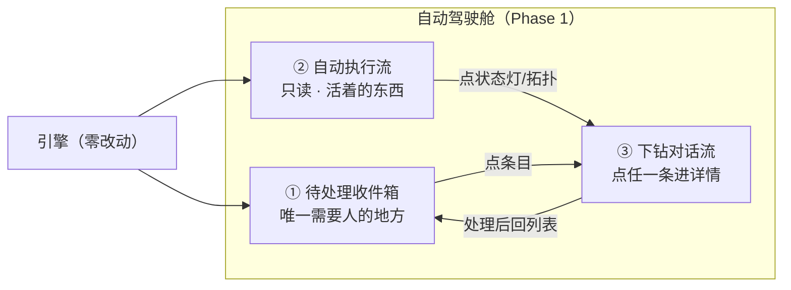
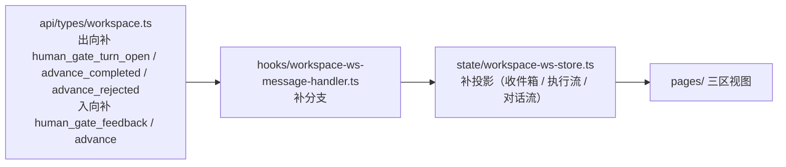
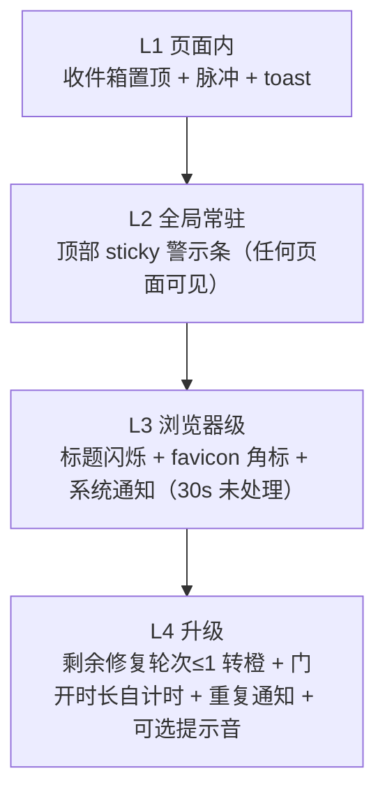

# 设计文档：3.7 UI/UX 改造 —— 自动执行驾驶舱

> **状态**：立项设计 v1.0（用户已拍板决策全录；controller 终验后呈用户审）
> **一句话**：把 aria 工作区引擎的 web 前端从「多面板控制台」改造成「自动执行驾驶舱」——系统自动跑全程，人只在卡壳点被叫醒。

- **设计编号**：DES-2026-09-13-UI37-COCKPIT
- **日期**：2026-09-13
- **版本**：v1.0
- **范围**：aria 工作区引擎的 web 前端（`web/src/`，React + Vite + Zustand + TanStack Router + Tailwind）
- **阶段定位**：五阶段路线 v2.0 的 **3.7 UI/UX 改造**（专项测量轮之后、阶段 4 扩展与退役之前）
- **上游权威**：`cadence/notes/2026-09-03_路线图更新_五阶段路线_v2.0.md`
- **关联 defer 账**：`cadence/reports/workitem-conversational-gate-advance/defer-ledger.md` —— **DEF-1（前端 UI）/ DEF-3（SC 子 session 只读呈现形态）由本设计吸收**；DEF-4/5/6 归阶段 4
- **决策来源**：用户已拍板（本设计只登记决策，不重新论证，不引入未拍板项）
- **修订记录**：v1.0 双审修订（2026-09-13）——落实 oracle + k3 双审 17 条 finding（H1–H3 / M1–M6 / L1–L4）与用户/controller 新拍板 2 条（L4 改双触发、Phase 1 拆 1a/1b）；逐条落点见附录 B

> 本文只定义 UI/UX 的形态、分区、交互动线与验收口径。**不写代码、不改后端、引擎零等待**：Phase 1–4 全部只动 `web/src/`。

## 目录

0. [目标与范式](#0-目标与范式)
1. [设计系统（增量不换血）](#1-设计系统增量不换血)
2. [Phase 1：自动驾驶舱（主战场，分 1a / 1b 两段增量）](#2-phase-1自动驾驶舱主战场分-1a--1b-两段增量)
3. [卡壳提醒体系（四层递进）](#3-卡壳提醒体系四层递进)
4. [Phase 2：编码仪表盘](#4-phase-2编码仪表盘)
5. [Phase 3：计划审批深度](#5-phase-3计划审批深度)
6. [Phase 4：advance / 接管操作收口](#6-phase-4advance--接管操作收口)
7. [非目标与约束](#7-非目标与约束)
8. [风险与缓解](#8-风险与缓解)

附录 A：[事实依据与术语对照](#附录-a事实依据与术语对照) ｜ 附录 B：[自检记录](#附录-b自检记录)

---

## 0. 目标与范式

### 0.1 产品目标

3.7 的目标是让 **aria 工作区引擎的 web 前端 = 自动执行驾驶舱**：

- 用户不必盯着屏幕等状态，也不必记住引擎的阶段机与命令序列；
- 系统自动跑完整个执行链（计划 → 门禁 → 编码 → push），人只在**卡壳点**被叫醒；
- 所有处理动作在界面上就地完成，**全程不需要开命令行**。

### 0.2 核心范式（用户拍板，不得漂移）

> **自动执行为主、异常驱动人工**（exception-driven autopilot）。

系统自动跑全程；人只在四类卡壳点被叫醒并处理：**门禁（human gate）/ 分诊（triage）/ stopped（`stopped_needs_human`）/ 硬错（hard error）**。

由此推导出三条界面公理，后文所有分区与交互都服从它们：

1. **默认无人工输入**：界面的常驻形态是「只读的进行中画面」，不是「等待输入的对话框」。
2. **人的入口唯一**：需要人的东西集中在一处（待处理收件箱），不做分散的、要靠翻找才能发现的入口。
3. **卡壳必须显眼**：卡壳提醒是四层递进的强制体系（§3），不是可选的角标。

### 0.3 四 Phase 与路线图对应（路线图原序）

| Phase | 内容（路线图原序） | 主要承载 | 性质 |
|---|---|---|---|
| **Phase 1a** | ① 对话门聊天界面（**主战场**）· 协议与只读底座 | `web/src/api/types/workspace.ts` + `web/src/hooks/workspace-ws-message-handler.ts` + `web/src/state/workspace-ws-store.ts`；`web/src/pages/ChatWorkspacePage.tsx` 三区只读架子 + app shell 层新增 | typed 协议补齐（**双向**）+ 三区只读（收件箱/执行流/下钻）+ 事实底座 |
| **Phase 1b** | ① 对话门聊天界面（**主战场**）· 就地动作与自动推进 | 三区就地动作、autopilot、四层提醒、设置面板、takeover 接线 | 交互接线（仍只动 `web/src/`） |
| **Phase 2** | ② 编码进展仪表盘 | `web/src/pages/CodingWorkspacePage.tsx` 深化 | 视图深化（只读为主） |
| **Phase 3** | ③ 计划审批视图 | 计划/revision/契约呈现 | 只读呈现（含 DEF-3 吸收） |
| **Phase 4** | ④ advance / 接管操作收口 | 跨两页操作统一 | 交互收口 + 审计视图 |

排序理由（沿用路线图，不重复论证）：UI 在专项测量轮之后，用真实跑证据喂设计；UI 在阶段 4 之前，界面天然只依赖阶段 3 typed 协议，退役旧协议不伤 UI。

**Phase 1 分段（controller 拍板，D4：各段独立增量验收）**：**Phase 1a** = 双向 typed 协议补齐 + 三区只读 + 事实底座（交付「看得到真事实」）；**Phase 1b** = 就地动作 + autopilot + 四层提醒 + 设置 + takeover 接线（交付「能就地动手」）。两段各自跑通真实链后**独立验收**，不合并为一次性验收。Phase 2 / 3 / 4 的划分不变。

### 0.4 验收总口径

> **UI 走通真实全链**：轻语料 + `pi` provider，在界面上完成
> **建会话 → 看计划 → request-change / confirm / advance → 看编码进度 → 看 push**，
> **全程不开命令行**。

- 每个 Phase 结束时做 **增量验证**（该 Phase 的链路片段在真实 provider 上跑通），不做一次性大验收。
- 每个 Phase 的验收都是**真实链**，不接受仅 fixture/单测证据。
- **Phase 1 拆两段独立验收**（controller 拍板，D4）：**1a** 验收「看得到真事实」——双向 typed 协议补齐后，三区（收件箱/执行流/下钻）在真实链上投影正确、只读可用；**1b** 验收总口径的完整一遍——四类卡壳点就地动作 + autopilot + 四层提醒 + takeover 接线在真实 provider 上跑通。两段各自独立过关，不合并验收。
- **双轨边界（Phase 1 验收期间）**：新驾驶舱只覆盖**对话侧**；**编码侧在 Phase 1 验收期间仍走旧 `CodingWorkspacePage`**（§2.8、C4）。

### 0.5 与其他阶段的关系

- **本设计不提前实现 Phase 2–4 的内容**：Phase 2–4 在本文只有契约级描述（分区、视图、交互），实施时各自细化。
- **DEF-1 在本设计补位**：takeover 前端零接入（§0.6 事实 #6）在 Phase 1 接线。
- **DEF-3 在本设计吸收**：SC 子 session（amendment / plan-repair）只读呈现形态落在 Phase 3（§5）。

### 0.6 现状技术事实基线（勘察已证）

以下事实来自本次勘察，是后续设计与实施的地基；**实施时以代码为准，本表用于对齐术语**。

| # | 事实 | 证据位置 |
|---|---|---|
| 1 | 现有两页：`ChatWorkspacePage`（artifacts / review / actions / work-item-plan 四块）与 `CodingWorkspacePage`（timeline / plan-repair / gates / execution-plan / group-progress / reports） | `web/src/pages/ChatWorkspacePage.tsx`、`web/src/pages/CodingWorkspacePage.tsx` |
| 2 | 状态层与 WS 钩子齐全：workspace WS store、coding WS store、重连与重建已存在 | `web/src/state/workspace-ws-store.ts`、`web/src/hooks/useWorkspaceWs.ts`、`web/src/hooks/useCodingWorkspaceWs.ts`、`web/src/state/workspace-chat-rebuild.ts` |
| 3 | 路由已就位：`/workbench` 三工作区 + `/image-create` | `web/src/router.tsx` |
| 4 | workspace WS 后端入向 `WsInMessage` **29 个顶层变体**（含 `Hello` / `Abort` / `Ping` 三条协议生命周期变体）；前端 `WsInMessage`(**27**) / `WsOutMessage`(**22**) 已就位。**`RequestChange` / `HumanTriage` 都不是顶层变体**：前者是 `HumanConfirm { decision, payload }` 的 `decision` 取值（`HumanConfirmDecision`），后者是 `WorkItemPlanCompileRecoveryAction { action, reason }` 的 `action` 取值（`WorkItemPlanCompileRecoveryActionDto`） | `src/web/workspace_ws_types/in_.rs:12`（`WsInMessage`）、`:149-153`（`HumanConfirmDecision`）、`:191-195`（`WorkItemPlanCompileRecoveryActionDto`）、`web/src/api/types/workspace.ts:212,543` |
| 5 | coding WS **无插话入口**（入向 **15** 变体，含 `CodingPing`，无 user_message）；single-candidate Running 阶段拒 `UserMessage`（fail-closed） | `src/web/coding_ws_handler/protocol.rs:152`、`src/web/workspace_ws_handler/tests/single_candidate_scope_rejection.rs` |
| 6 | **takeover 后端闭环已存在**：`POST /api/workspace-sessions/{session_id}/takeover`，幂等建子会话 + `human-gate-takeovers` 落盘；**前端零接入（DEF-1 空位）** | `src/web/app.rs:332`、`src/product/lifecycle_store/workspace.rs:289`；`web/src/` 内 `takeover` 零命中 |
| 7 | 服务端约 116 条路由 | `src/web/app.rs` |
| 8 | 前端**尚未消费**阶段 3 typed 门禁协议：`web/src` 无 `human_gate_turn_open` / `advance_completed` / `advance_rejected`；`remaining_budget` 只存在于后端 `HumanGateTurnOpen` | `src/web/workspace_ws_types/out.rs:129`（`HumanGateTurnOpen` 变体）、`:132`（`remaining_budget: u32` 字段）、`web/src/api/types/workspace.ts` |
| 9 | 门禁三动作枚举 `HumanConfirmDecision` = `Confirm` / `RequestChange` / `Terminate`（`HumanConfirm` 的 `decision` 取值，非顶层变体）；**引擎两套门面分流**：legacy `human_confirm` 支持 `RequestChange` close，SC typed 门**拒绝** `RequestChange`（须改走 `HumanGateFeedback`） | `src/web/workspace_ws_types/in_.rs:149-153`、`src/product/workspace_engine/conversational_gate.rs:911-914` |
| 10 | 门禁卡数据面 = `WorkItemPlanHumanGateSnapshot`（findings / attempts_used / manual_repairs_remaining / trigger / resumable） | `web/src/api/types/workspace.ts:75` |
| 11 | 停点状态 `stopped_needs_human` 已存在 | `src/product/models/workspace.rs:317` |
| 12 | 设计系统基线已存在：`--aria-*` token、`prefers-reduced-motion` 块、`.btn-primary` / `.btn-secondary` / `.aria-chip` / `.aria-card-clay` | `web/src/styles.css:16-38`（token 块）、`:89-100`（reduced-motion）、`:103-140`（组件类） |

**由事实 #6 与 #8 推出的 Phase 1 硬前置**（本文最重要的工程结论，即 **Phase 1a 的地基**）：Phase 1 不是纯前端样式活，必须**先补齐前端 typed 协议层（双向）**——**出向**把阶段 3 已锁定的门禁/advance 事件面接进 `web/src/api/types/workspace.ts` → `workspace-ws-message-handler.ts` → `workspace-ws-store.ts`；**入向**补 `human_gate_feedback` / `advance` 两条前端 `WsInMessage` 变体与发送 helper（后端已有、前端缺，见事实 #4）——然后才做界面重组。后端零改动（事件面已存在）。

---

## 1. 设计系统（增量不换血）

### 1.1 原则

**增量不换血**：不重做设计系统，不引入第二套 token 体系或第二个组件库。现有 `--aria-*` token、组件类与 `prefers-reduced-motion` 处理全部沿用；本设计只做**新增**与**统一**。

### 1.2 沿用现有 token（基线，不改值）

现有暖白底 + 墨色的护眼基调与语义色系保持不变：

| 组 | token | 值 |
|---|---|---|
| 底色/面板 | `--aria-bg` / `--aria-panel` / `--aria-panel-muted` / `--aria-panel-subtle` | `#f5f3ee` / `#ffffff` / `#fbfcfe` / `#f1f5f9` |
| 墨色/线条 | `--aria-ink` / `--aria-ink-muted` / `--aria-line` / `--aria-line-strong` | `#17202a` / `#52616f` / `#dde5ec` / `#c8d3dc` |
| 主色（靛） | `--aria-primary` / `--aria-primary-soft` | `#4F46E5` / `#e0e7ff` |
| CTA（橙） | `--aria-cta` / `--aria-cta-soft` | `#F97316` / `#ffedd5` |
| 语义 | `--aria-success(-soft)` / `--aria-warning(-soft)` / `--aria-danger(-soft)` | `#059669`/`#dcfce7`、`#d97706`/`#fef3c7`、`#dc2626`/`#fee2e2` |

落点：`web/src/styles.css` 的 `:root` 块（事实 #12）。

### 1.3 新增三组 token

新增 token 一律**从现有语义色系派生**，不新增色相，避免与现有语义冲突。

**（1）对话流（conversation）**

| token | 用途 |
|---|---|
| `--aria-conv-user-bg` / `--aria-conv-user-ink` | 人工输入气泡底/字色（取 `--aria-primary-soft` / `--aria-primary`） |
| `--aria-conv-agent-bg` / `--aria-conv-agent-ink` | Agent 输出气泡底/字色（取 `--aria-panel` / `--aria-ink`） |
| `--aria-conv-turn-rail` | 轮次导轨线（取 `--aria-line-strong`） |
| `--aria-conv-turn-active` | 当前轮次高亮（取 `--aria-primary`） |
| `--aria-conv-caret` | 流式光标色（取 `--aria-cta`） |

**（2）拓扑（topology）—— 单元节点六态**

单元节点六态固定为：`running` / `pending` / `blocked` / `done` / `failed` / `awaiting_triage`，**复用语义色系**（不发明新色）：

| 节点态 | 语义色 | 含义 |
|---|---|---|
| `running` | `--aria-primary` | 正在执行（对应 §2.3 状态灯） |
| `pending` | `--aria-ink-muted` | 未开始/排程中 |
| `blocked` | `--aria-warning` | 被依赖挡住 |
| `done` | `--aria-success` | 已完成 |
| `failed` | `--aria-danger` | 失败（需人介入则同时进收件箱） |
| `awaiting_triage` | `--aria-warning` + 脉冲 | 等待分诊（人工卡壳的一种）；**这是 UI 投影态、不是引擎状态**——引擎侧真实信号是 `ReviewGate::UserTriageRequired` / `needs_human` verdict，其路由终点即 `human_confirm` 门（§2.2 分诊条目） |

**`awaiting_triage` 派生规则**：由引擎 `needs_human` verdict（`ReviewGate::UserTriageRequired`，路由终点 `human_confirm`，`src/product/workspace_engine/review/routing.rs:678-681`）投影而来，**不作为独立引擎状态持久化**；同一会话的同一门只投影一条（**同会话同门去重**），与 §2.2 的「门禁等待」条目共用同一门禁上下文。

配套 token：`--aria-topo-node-*`（六态各自的底/边框）、`--aria-topo-edge`（依赖连线，取 `--aria-line-strong`）、`--aria-topo-edge-active`（取 `--aria-primary`）。

**（3）门禁（gate）**

| 门禁态 | 语义色 | 说明 |
|---|---|---|
| **门开**（gate open，等人处理） | `--aria-warning` | 阻塞中，必须显眼 |
| **待确认**（pending confirmation） | `--aria-primary` | 人已动作、等引擎确认 |
| **已过**（passed） | `--aria-success` | 已闭环 |

配套 token：`--aria-gate-open-bg/-border`、`--aria-gate-pending-*`、`--aria-gate-passed-*`。

### 1.4 等宽与数字

- 等宽字体统一使用 **`ui-monospace`**（系统栈，不引外部字体）；
- 适用范围：**commit hash / 命令 / 耗时 / 预算计时 / 节点 id / session id**；
- 数字用量统一 `font-variant-numeric: tabular-nums`，避免倒计时跳动。

### 1.5 硬规则（不可协商）

| # | 规则 |
|---|---|
| R1 | **图标一律 SVG（Lucide），零 emoji**。例外仅一处：§3-L3 的浏览器标题 `🔴待处理×N` 为纯文本标记（标题不支持 SVG），且必须可由设置关闭。 |
| R2 | **触达目标 ≥ 44px**（移动/触控可达；桌面按钮同样遵守，含图标按钮）。 |
| R3 | **焦点环**：所有可交互元素必须有 `focus-visible` 环（沿用现有 `focus-visible:ring-2` 模式）。 |
| R4 | **过渡 150–300ms**，使用现有 `duration-200` 基线；不做长动画、不做布局抖动动画。 |
| R5 | **`prefers-reduced-motion` 全覆盖**：所有新增动画（脉冲、闪烁、流式光标）必须在该媒体查询下降级为静态（现有 `styles.css:89-100` 的块已提供全局兜底，新增动画不得用 `!important` 绕过）。 |
| R6 | **对比度 ≥ 4.5:1**（正文与图标；警示条红底白字按此校验）。 |

---

## 2. Phase 1：自动驾驶舱（主战场，分 1a / 1b 两段增量）

**段落划分（controller 拍板；D4：各段独立增量验收）**：

| 段 | 交付 | 对应小节 |
|---|---|---|
| **Phase 1a** | 双向 typed 协议补齐（出向门禁/advance 事件面 + 入向 `human_gate_feedback` / `advance`）+ **三区只读**（收件箱 / 执行流 / 下钻）+ 事实底座（投影重建、去重规则） | §2.1–§2.4、§2.7 |
| **Phase 1b** | **就地动作**（按门面分流）+ **autopilot** + **四层提醒**（§3）+ **设置** + **takeover 接线** | §2.2 动作列、§2.5、§2.6、§3、§2.8 |

1a 只要求「只读看到真事实」，1b 才要求「能就地动手」；两段各自跑通真实链后独立验收（D4）。

### 2.1 信息架构：三区

Phase 1 把 `ChatWorkspacePage` 从「四块平铺控制台」重组为**三区驾驶舱**，并新增 shell 层（全局警示条）。三区职责严格互斥：



- **① 待处理收件箱**：唯一需要人的地方。
- **② 自动执行流**：只读，展示「活着的东西」。
- **③ 下钻对话流**：点任一条进详情，保留原对话门设计。

### 2.2 区一：待处理收件箱（唯一需要人的地方）

**四类条目**（与 §0.2 卡壳点一一对应），每条带**上下文摘要**与**就地动作**（不跳页、不弹窗、不命令行）：

| 条目类型 | 来源（引擎事实） | 上下文摘要内容 | 就地动作 |
|---|---|---|---|
| **门禁等待** | `HumanGateTurnOpen` / gate snapshot（事实 #8、#10）；**动作按门面分流**（事实 #9） | 门开原因（`trigger` 四变体，§2.4(b)）+ findings 计数 + 预算余量（`remaining_budget`） | **typed 门（SC）**：**反馈** = `HumanGateFeedback`（每次扣一次 manual-repair 预算）；**确认 / 终止** = `HumanConfirm` close（`decision = Confirm` / `Terminate`）。**legacy `human_confirm` 门**：Confirm / `RequestChange` / Terminate 三取值均走 `HumanConfirm` |
| **分诊** | `ReviewGate::UserTriageRequired` / `needs_human` verdict 路由终点即 `human_confirm` 门（`src/product/workspace_engine/review/routing.rs:678-681`）；`awaiting_triage` 是其 **UI 投影态**（§1.3，非引擎状态） | 待分诊节点 + 阻塞原因 + 依赖链片段 | **门禁条目的亚型**，不单独设动作面：复用所属门禁条目的动作（typed 门 = 确认 / `HumanGateFeedback` / 终止；compile 失败恢复走 `WorkItemPlanCompileRecoveryAction`，含 `HumanTriage` 取值，见 §2.4(c)）；**同会话同门去重，只呈现一条** |
| **stopped 接管** | `stopped_needs_human`（事实 #11） | 停点原因 + 已完成进度 + 失败指纹 | **接管**（建子会话，§2.6）——**stopped 条目专属入口**（其他条目不出现接管） |
| **硬错** | 出向事件 `error` / `protocol_error`（`src/web/workspace_ws_types/out.rs:209` / `:212`） | 错误码 + 原文摘要 + 最近一次动作 | **重试** / **终止**（**不提供接管**：takeover 仅接受 `stopped_needs_human` 会话，`Failed` 会话调用返回 **409**，§2.6） |

设计要求：

- 每条目**就地完成动作**（确认/反馈/接管直接在条目上做），展开详情才进 ③；
- 条目**置顶**（新卡壳插到列表顶部），并按严重度排序；
- 处理完的条目移出收件箱（引擎闭环后消失），不做「已完成」堆积；
- **接管入口唯一**：只有 stopped 条目呈现「接管」（§2.6）；硬错条目**不提供接管**——takeover REST 只接受可恢复的 `stopped_needs_human` 会话，`Failed` 等状态返回 **409 `workspace_session_takeover_not_allowed`**（`src/web/handlers/workspace_session.rs:83`、`src/web/error.rs:54`）。**409 呈现路径**：条目内联错误条展示后端 `code` + `reason`，接管按钮保持置灰并附原因文案，不静默失败、不自动重试；
- **门面不得混用**（事实 #9）：typed 门的反馈入口发 `HumanGateFeedback`，**不得**发 `HumanConfirm{RequestChange}`（引擎会明确拒绝，见 §2.4(b)）；`HumanConfirm{RequestChange}` 只对 legacy 门合法。

### 2.3 区二：自动执行流（只读）

**只读，展示「活着的东西」**。不在此区提供任何输入控件（人的入口只在 ①）。

每行（对应一个执行单元/阶段）固定四要素：

| 要素 | 内容 |
|---|---|
| **状态灯** | 复用 §1.3 拓扑六态色；`running` 用主色呼吸灯（reduced-motion 下降为静态实心） |
| **进度** | 阶段进度（当前阶段/总阶段） |
| **耗时** | 已耗时（`ui-monospace` + `tabular-nums`），来源为引擎事件时间戳 |
| **拓扑小图** | 迷你六态节点图（完整版在 Phase 2，§4） |

行为：

- 长时间无事件 → 行进入「静默」视觉（不报警，报警归 §3 的卡壳体系）；
- 点击任意行/状态灯/拓扑小图 → 下钻 ③。

### 2.4 区三：下钻对话流（保留原对话门设计）

点收件箱条目或执行流行 → 进入该会话/该门的**对话流详情**。原对话门设计**保留**，三块组成：

**（a）Agent 轮次卡（流式渲染）**

- 按轮次分卡，轮次导轨（`--aria-conv-turn-rail`）串起；
- `stream_chunk` 事件驱动流式渲染，当前输出位置显示流式光标（`--aria-conv-caret`，reduced-motion 下静态）；
- 轮次内工具调用/事件以紧凑行内事件呈现。

**（b）人工门卡（gate card）**

- **门开原因**：直接映射 `trigger` 的四变体（`native_human_required` / `repeated_fingerprint` / `verification_new_findings` / `repair_budget_exhausted`；即 `HumanReason`，`src/product/work_item_plan_policy/evaluate.rs:83-87`）；
- **findings 逐条展开**：每条含 `class` / `severity` / `message` / `evidence` / `required_action` / `contract_field`（事实 #10）；
- **动作按门面分流**（事实 #9，两套门面不得混用）：
  - **typed 门（SC single-candidate）**：**反馈 = `HumanGateFeedback { command_id, feedback }`**，每次提交消耗一次 manual-repair 预算（`manual_repairs_remaining -= 1`，即 `remaining_budget` 递减）；**确认 / 终止 = `HumanConfirm` close**（`decision = Confirm` / `Terminate`）。对该门面发 `HumanConfirm{RequestChange}` 被引擎明确拒绝：`single-candidate human gate does not support request-change; submit feedback through HumanGateFeedback`（`src/product/workspace_engine/conversational_gate.rs:911-914`）——前端**不得**把反馈按钮接到该动作上；
  - **legacy `human_confirm` 门**：Confirm / `RequestChange` / Terminate 三取值均走 `HumanConfirm`（`RequestChange` 在此门面是合法的 close 语义）；
  - 危险动作需二次确认态（点击后进入「再点一次确认」态，超时自动回落）；
  - 按钮旁常显预算余量（来自后端 `remaining_budget`，事实 #8 / `out.rs:132`）。

**（c）人工输入区（按门面 / 条目拆分）**

**（c-1）门禁上下文的人工输入**（与门禁卡同处）：

| 模式 | 语义 | 对应动作 | 适用门面 |
|---|---|---|---|
| **反馈** | 说明哪里不对，交回引擎修 | typed 门 = `HumanGateFeedback { command_id, feedback }`（每次扣一次 manual-repair 预算）；legacy 门 = `HumanConfirm { decision: RequestChange, payload }` | 两门面都支持，但**动作载体不同** |
| **门禁恢复动作** | 引擎侧 compile 失败后的恢复选择 | `WorkItemPlanCompileRecoveryAction { action, reason }`，`action` 取值 `Continue` / `AbortAndRollback` / `HumanTriage`（`src/web/workspace_ws_types/in_.rs:191-195`） | 属**门禁上下文**（可重开门的恢复路径），不单独开输入区 |

模式切换必须有明确标签，不允许用同一输入框隐式推断意图。

**（c-2）接管（stopped 条目专属入口）**

- 接管**只**出现在 stopped 条目（§2.2），唯一动作载体是 **takeover REST**：`POST /api/workspace-sessions/{session_id}/takeover`（§2.6）；**不**出现在门禁卡。
- **纠正旧稿事实错误**：`HumanTriage` 不是门禁动作、也不是 `WsInMessage` 顶层变体，它是 `WorkItemPlanCompileRecoveryActionDto` 的一个取值（见 c-1），此前与 takeover 并列写属误；本稿按引擎事实拆开。
- 该 REST 只接受 `RunPolicy::AutoIfValid` 且 `resumable` 的 `stopped_needs_human` 会话，其余状态（含 `Failed`）返回 **409 `workspace_session_takeover_not_allowed`**（§2.2 / §2.6）。

**（d）门禁卡渲染契约样例（嵌套代码块示例）**

下面的样例同时演示本文档的代码块嵌套规范（外层 4 反引号、内层 3 反引号）：findings 的 `evidence` 字段本身是 markdown，可能自带代码围栏。

````markdown
### findings[0]

- class: repairable
- severity: medium
- message: 工作项缺少验收命令
- required_action: 为该工作项补充可执行的验收命令
- evidence:

```yaml
work_item: WI-2
acceptance:
  command: null   # 必填缺失
```
````

### 2.5 自动推进开关（autopilot）

**每个会话默认开启**。语义（**锚点严格限定：只有观测到 durable 的 `Confirmed` 才自动发 `Advance`**）：

| 触发点 | autopilot 行为 |
|---|---|
| **观测到 durable `Confirmed`**（门的 close 完成事件，或会话状态投影显示该门已 Confirmed） | 自动发 `Advance`（`WsInMessage::Advance { command_id }`；不再要求人手工点「推进」）——**这是唯一自动推进锚点** |
| **`HumanGateFeedback` 之后** | **只等修复轮的结果**（等下一次门开事件或 Confirmed 事件），**绝不自动发 `Advance`**——反馈尚未产生 Confirmed，提前推进等于跳过引擎判定 |
| **compile 失败导致门重开**（`WorkItemPlanCompileRecoveryAction` 场景） | **回收件箱呈现、不重试**：不自动重发 compile 命令、不自动 advance；由人处理后门才可能再推进 |
| 编码类**组内单元推进** | **引擎已自动**（`src/product/coding_workspace_engine/group_completion.rs:113-116`：当前 Work Item 完成后自动 `advance_to_next_group_unit`），前端**不代发**；`StartCoding` 的自动发出属 **DEF-4 前置子项，留阶段 4**（§7-C5），Phase 1 不实现 |

**判定依据**：`AdvanceCompleted` / `AdvanceRejected` 必须进 store（§2.7）——只有 `AdvanceCompleted`（或会话状态投影已含目标 entry）才算这一段推进闭环；`AdvanceRejected` 回落收件箱并**停止该会话的自动推进**（§8-R4）。

等价于**把矩阵 driver 的人工脚本内置为 UI autopilot**：此前靠脚本手工串联的推进动作，改为由界面在**同一 Confirmed 锚点**上自动发出。

**可配停点**：

- 默认 **每次人工门前必停**（保守默认）；
- 用户可在设置（§3 设置页）调整停点集合（例如「仅硬错停」「仅 stopped 停」）；
- 停点只影响「是否自动发 `Advance`」，**不改变引擎门禁语义**（引擎零改动）。

### 2.6 停点接管（DEF-1 补位）

会话进入 `stopped_needs_human`（事实 #11）时：

1. 收件箱生成 **stopped 接管** 条目（§2.2）；
2. 点「接管」→ 调用**既有** REST：`POST /api/workspace-sessions/{session_id}/takeover`（事实 #6）；
3. 后端幂等创建子会话 + `human-gate-takeovers` 落盘；
4. 返回的子会话**接入 ③ 对话流**（人可在其中继续对话/操作）；
5. **父会话不被修改**（后端已锁定该语义）。

**状态与错误边界**：该 REST 只接受 `RunPolicy::AutoIfValid` 且 gate snapshot `resumable` 的 `stopped_needs_human` 会话（`src/product/lifecycle_store/workspace.rs:289-310`）；其他状态（含 `Failed`）返回 **409 `workspace_session_takeover_not_allowed`**（`src/web/handlers/workspace_session.rs:83`、`src/web/error.rs:54`）。因此**接管入口只在 stopped 条目呈现**（§2.2），409 的呈现路径见 §2.2 设计要求。

**引擎零改动**：这是纯前端接线，补的是 DEF-1 的空位。

### 2.7 前端 typed 协议补齐（Phase 1 硬前置）

依据事实 #8，Phase 1 需要先把阶段 3 typed 事件面接进前端三层：



- **不改后端**：事件已存在（`src/web/workspace_ws_types/out.rs`、`in_.rs`）；
- **不改编码侧**：Phase 1 不新增 coding WS 插话入口（事实 #5，coding WS 无插话入口；Phase 1 的接管走 workspace 侧子会话）；
- **双向补齐**（Phase 1a）：**出向**补 `human_gate_turn_open` / `advance_completed` / `advance_rejected` 等 typed 变体与投影；**入向**补前端 `WsInMessage` 的 `human_gate_feedback` / `advance` 两条变体 + 对应**发送 helper**（前端现有 27 变体缺这两条、后端已有，见事实 #4）——只补类型与发送封装，后端协议零改动；
- `AdvanceCompleted` / `AdvanceRejected` 必须进 store：autopilot 需要据此判定「推进成功」还是「推进被拒」并回落到收件箱（避免静默失败）；
- **`AdvanceRejected` 的重连重放去重（M6）**：`AdvanceRejected` 携带 `command_id`；断线重连时引擎会对**历史非 `Ready`** 的 advance 记录重放拒绝（`ADVANCE_REPLAY_NOT_READY` / `ADVANCE_REPLAY_INCOMPLETE`，`src/web/handlers/coding/advance.rs:13-33`）。前端**必须按 `command_id` 关联**：同一 `command_id` 的重放只消费一次（**已终结的推进不再回落收件箱、不再触发二次提醒**），避免重连后被历史拒绝事件反复打断。

### 2.8 Phase 1 改动点清单（实施边界）

| 段 | 层 | 文件 | 改动 |
|---|---|---|---|
| 1a | 设计系统 | `web/src/styles.css` | 新增 §1.3 三组 token；不改现有 token 值 |
| 1a | 协议 | `web/src/api/types/workspace.ts` | **双向**补 typed 变体：出向门禁/advance 事件面 + 入向 `human_gate_feedback` / `advance`（+ 发送 helper） |
| 1a | 协议处理 | `web/src/hooks/workspace-ws-message-handler.ts` | 补分支与投影（含 `command_id` 去重） |
| 1a | 状态 | `web/src/state/workspace-ws-store.ts` | 收件箱/执行流/对话流三投影 + 跨会话卡壳聚合计数（见下） |
| 1a | 页面 | `web/src/pages/ChatWorkspacePage.tsx`（+ `ChatWorkspacePageParts.tsx`） | 重组为三区（**只读**） |
| 1a | Shell | `web/src/app-shell.tsx`（或 router 根） | §3-L2 全局警示条骨架（含跨会话计数） |
| 1b | 动作 | 收件箱 / 门禁卡组件 | 就地动作（**按门面分流**）+ 二次确认态 + 409 呈现 |
| 1b | autopilot | autopilot 控制 | §2.5（Confirmed 锚点 + 停点配置） |
| 1b | 提醒 | 四层提醒实现 | §3 全量（L3 浏览器级 / L4 双触发） |
| 1b | 设置 | 设置面板（对话框形式，不新增路由） | §3 提醒项配置（含 autopilot 停点集合） |
| 1b | 接管 | 收件箱 stopped 条目 | takeover REST 接线（§2.6） |

**双轨边界（M5）**：Phase 1 新驾驶舱**只覆盖对话侧**；**编码侧在 Phase 1 验收期间仍走旧 `CodingWorkspacePage`**（本设计 Phase 1 不触碰编码侧页面）。旧页面保双轨到 parity（C4）：建议落地**特性开关**方案——开关同时切换对话侧新旧形态与编码侧归属，**默认指向旧形态**，parity 达标后翻默认；不做一次性替换、不留半成品切换。

**L3 聚合数据源**：L2 全局警示条与 L3 标题/favicon 的待处理计数是**跨会话聚合量**（不是单会话投影），需**跨会话卡壳聚合**——数据源为 workspace 会话列表 REST 轮询（或多会话 WS 订阅）后前端归并；**引擎零改动可达**（不需要新增后端事件或接口）。

非目标：不动 `ImageCreatePage`；不动后端；旧页面保留双轨（§7）。

---

## 3. 卡壳提醒体系（四层递进）

用户强调：卡壳提醒**必须明显**。因此设计为四层递进，层层叠加，**任一层都不依赖用户主动查看**。



### L1 —— 页面内

- 收件箱条目**置顶**；
- **脉冲动画**（新条目入场后持续脉冲，直到被查看）；
- `prefers-reduced-motion` 下降级：**去掉脉冲动画，改为高亮边框**（保留醒目度，不用动效）；
- 新卡壳到达时弹 **toast**（沿用现有 toast 基础设施）。

### L2 —— 全局常驻

- **顶部 sticky 警示条**：**红底白字**（`--aria-danger`），摘要 + 「[去处理]」按钮；
- **任何页面可见**（挂在 app shell 层，不在单个页面内）；
- **处理完才消失**：警示条的存续由「未处理卡壳计数 > 0」驱动，不做定时自动隐藏、不可手动关闭；
- **计数是跨会话聚合量**：需对跨会话的卡壳条目聚合（全局 sticky 计数），数据源与实现路径见 §2.8「L3 聚合数据源」。

### L3 —— 浏览器级

- **标题闪烁**：`🔴待处理×N`（此处的 emoji 为 R1 唯一例外，纯文本标记；可经设置关闭）；
- **favicon 角标**：在 favicon 上叠加待处理数量角标；
- **系统通知**（Web Notifications）：
  - 需要授权，**可授权关闭**；
  - 触发时机：**卡壳 30s 未处理**才触发（避免打扰正在处理的人）；
  - 权限被拒 → 降级路径见 §8。

### L4 —— 升级（双触发，用户已批新拍板）

L4 **不再使用「超时前 5min / 预算 < 20%」**（旧稿口径作废），改为**两个独立触发**：

**触发①：剩余修复轮次 ≤ 1 → 转橙 + 重复提醒（次数梯度）**

- 数据源：引擎 `remaining_budget`，即 gate snapshot 的 `manual_repairs_remaining`（`out.rs:132`）——**这是引擎事件面唯一真实可用的预算量**；
- 规则：`remaining_budget` 进入 **≤ 1** 即转橙（`--aria-warning`），并按**次数梯度**提升重复提醒频率（第 1 次 → 第 2 次 → 第 3 次…逐级加密，节流间隔见设置页）；
- 语义：剩余修复轮次见底 = 门即将只剩「确认 / 终止」两条路，是真正的压力点。

**触发②：门开时长前端自计时（默认 10min 无人处理即升级一级）**

- 前端从**门开事件**（`HumanGateTurnOpen`）到达时刻起**自计时**；
- 默认 **10min** 无人处理 → 升级（转橙 + 重复提醒 + 可选提示音）；阈值**可配**（设置页）；
- **引擎零改动**：计时纯前端，阈值不进入引擎（引擎无「门开超时」概念）。

补充：

- **可选提示音**（设置页开关，默认关）；
- 升级只是**提醒升级**，不改变任何引擎语义（不自动终止、不自动代做决策）。

### 设置页（可配）

新增设置面板，可配项：

| 配置项 | 默认 |
|---|---|
| 提示音 | 关 |
| 系统通知 | 开（需浏览器授权） |
| 升级间隔 | 默认间隔（重复通知的节流间隔） |
| L4 门开时长阈值 | **10min**（门开自计时超过即升一级；可配） |
| L4 重复提醒次数梯度 | 逐级加密（第 1 → 2 → 3 次…，节流间隔同上） |
| 标题 emoji 标记 | 开 |
| autopilot 停点集合 | 每次人工门前必停（§2.5） |

设置面板在 Phase 1 以**对话框**形式挂在驾驶舱（不新增路由，避免与 Phase 4 的操作收口冲突）。

---

## 4. Phase 2：编码仪表盘

在 Phase 1 的 ② 区「自动执行流」基础上深化为**编码仪表盘**（主要承载页：`CodingWorkspacePage`）。四项：

| # | 视图 | 内容 |
|---|---|---|
| 1 | **单元拓扑图** | 六态节点（`running`/`pending`/`blocked`/`done`/`failed`/`awaiting_triage`）+ **依赖连线**；连线态区分「已满足 / 阻塞中」 |
| 2 | **依赖链视图** | 沿依赖链展开任一元（上游提供方 / 下游消费方），支撑「为什么被挡」的定位 |
| 3 | **预算门** | 进度条与剩时：**work item 60min / coding 90min**——**该 60/90min 是 driver 约定口径，由前端自计时呈现，不是引擎事件面数据**（引擎不发布这两条预算事件）；临近耗尽按 §3-L4 升级 |
| 4 | **实时日志抽取** | 从 `stream_chunk` 事件抽取实时日志（编码侧为 `coding_stream_chunk`），按节点归并，可筛选 |

约束：Phase 2 以**只读**为主；需要动作时统一走 Phase 4 的收口入口（§6）。

---

## 5. Phase 3：计划审批深度

计划审批视图深化，三项：

| # | 视图 | 内容 |
|---|---|---|
| 1 | **revision diff 对比视图** | **轮次间 markdown diff** + **变更摘要**（回答「这一轮改了什么、为什么改」） |
| 2 | **逐条 capability / 契约核对表** | **provided vs required** 两列对照，逐条标出满足/缺口；缺口可一键跳转到对应 finding |
| 3 | **DEF-3：SC 子 session 只读呈现面板** | **amendment / plan-repair** 子会话的只读呈现（本轮吸收 DEF-3） |

DEF-3 说明：阶段 3 只锁定了 typed transcript/事件面，呈现形态留白；本 Phase 给出只读面板形态（不改子会话语义、不提供子会话内的写操作）。

---

## 6. Phase 4：advance / 接管操作收口

**横跨两页的操作统一**，三项：

| # | 项 | 内容 |
|---|---|---|
| 1 | **快捷键** | 确认 / 反馈 / 接管 / advance 的键盘快捷键，两页一致 |
| 2 | **批量确认** | 多条目批量确认（仅限可幂等、无副作用的动作；危险动作不参与批量） |
| 3 | **历史操作审计视图** | 谁在何时对哪个门/会话做了什么动作，可回查 |

收口原则：Phase 1–3 分散在两页的动作入口，在 Phase 4 统一为同一套操作语义与同一个审计出口；**不重复实现**，只做归一。

---

## 7. 非目标与约束

| # | 约束 | 说明 |
|---|---|---|
| C1 | **引擎零等待** | **Phase 1–4 均不动后端**。所有能力都建立在既有 REST + WS 事件面上。 |
| C2 | **跑动中接管 = 引擎门禁变更，另立项** | 本设计只做「停点接管」（`stopped_needs_human` → 子会话，§2.6）；在运行中插话/改门禁语义属引擎变更，不在本设计范围。 |
| C3 | **ImageCreate 页不动** | `ImageCreatePage` 及 `web/src/components/image-create/*` 不在改造范围。 |
| C4 | **旧页面保双轨到 parity** | `ChatWorkspacePage` / `CodingWorkspacePage` 与新驾驶舱**并存**，直到新形态达到 parity；不做一次性替换、不留半成品切换。**Phase 1 期间新驾驶舱只覆盖对话侧，编码侧仍走旧 `CodingWorkspacePage`**（§2.8）；建议以**特性开关**切换新旧形态（默认旧形态，parity 达标后翻默认），开关方案在 Phase 1a 落地。 |
| C5 | **DEF-4 / DEF-5 / DEF-6 归阶段 4** | `auto_start_coding` 显式语义 / 多仓 coding / 旧协议退役门均不在本设计范围。 |
| C6 | **不新增 Provider / CI / 持久化评估语料** | 本设计是纯呈现层与操作层改造。 |
| C7 | **编码侧不新增插话入口** | 事实 #5：coding WS 无插话入口且 single-candidate Running 拒 `UserMessage`（fail-closed）；本设计不试图绕过该约束。 |

---

## 8. 风险与缓解

| # | 风险 | 缓解 |
|---|---|---|
| R1 | **WS 重连后状态重建**：驾驶舱三区依赖完整投影，断线重连后可能出现收件箱/执行流空窗 | **复用现有 `workspace-chat-rebuild`**（事实 #2）；重连后按事件面重建三区投影，重建期间显示「重建中」态而非空态 |
| R2 | **流式性能**：长会话 + 高频 `stream_chunk` 导致渲染卡顿 | 长会话**虚拟化**（只渲染视口内轮次）；流式更新按帧合并；日志抽取与对话流渲染解耦 |
| R3 | **系统通知权限被拒** | 明确降级路径：L3 的系统通知失效 → 自动退化为 L1+L2（页面内 + 全局警示条），并**不因权限被拒而丢提醒**；设置页提示如何恢复 |
| R4 | **autopilot 误推进行为边界** | **只在观测到 durable `Confirmed` 后才自动发 `Advance`**（§2.5）；`HumanGateFeedback` 后只等修复轮结果、**绝不自动 Advance**；compile 失败门重开 → 回收件箱、不重试；**停点配置默认保守**（每次人工门前必停）；`AdvanceRejected` 回落收件箱并停止该会话的自动推进，重连重放按 `command_id` 去重（§2.7）；不提供「无停点全自动」默认 |
| R5 | 卡壳提醒过载（多门同时打开） | 收件箱按严重度排序 + 标题/角标只显示计数；L4 重复通知按设置页节流间隔限流 |

---

## 附录 A：事实依据与术语对照

### A.1 术语

| 术语 | 含义 | 来源 |
|---|---|---|
| **驾驶舱 / 自动执行驾驶舱** | 本设计的整体形态：自动执行为主、异常驱动人工 | 用户拍板 |
| **卡壳点** | 门禁 / 分诊 / stopped / 硬错 四类需要人的点 | §0.2 |
| **收件箱** | 待处理卡壳条目的唯一集合 | §2.2 |
| **autopilot** | 自动推进开关（**仅在观测到 durable `Confirmed` 后自动发 `Advance`**；`HumanGateFeedback` 后只等修复轮结果；组内单元推进由引擎自动、前端不代发） | §2.5 |
| **停点** | autopilot 的停靠点，默认每次人工门前必停 | §2.5 |
| **接管** | 对 `stopped_needs_human` 会话调 takeover REST 建子会话（**只在 stopped 条目**呈现；其他状态 409） | §2.6 / DEF-1 |
| **门面（facade）** | 引擎两套人工门面：**legacy `human_confirm`**（`Confirm`/`RequestChange`/`Terminate` 均走 `HumanConfirm`）与 **SC typed 门**（反馈走 `HumanGateFeedback`，`HumanConfirm{RequestChange}` 被拒） | §2.2 / §2.4(b)、事实 #9 |
| **门开 / 待确认 / 已过** | 门禁三态（warning / primary / success） | §1.3 |

### A.2 事实 → 设计映射速查

| 事实（§0.6） | 用在哪 |
|---|---|
| #1 现有两页四块/六块 | §2.1 重组对象、§4 深化对象 |
| #2 状态层齐全 + workspace-chat-rebuild | §2.7 协议补齐、§8-R1 重连重建 |
| #3 路由 `/workbench` + `/image-create` | §2.8 shell 层、C3 不动 ImageCreate |
| #4 workspace WS 入向 29 变体、前端 `WsInMessage` 27 / `WsOutMessage` 22；`RequestChange` / `HumanTriage` 是取值而非顶层变体 | §2.2 条目来源、§2.4 动作载体、§2.7 双向补齐、附录 A.1 门面 |
| #5 coding WS 无插话入口（入向 15 含 `CodingPing`） | C7、§2.7 |
| #6 takeover 后端闭环、前端零接入 | §2.6 DEF-1 补位、§2.2 409 呈现 |
| #7 约 116 路由 | C1 引擎零等待的依据 |
| #8 前端未消费 typed 门禁协议、`remaining_budget` 在后端（`out.rs:132`） | §2.7 硬前置、§2.4 预算余量、§3-L4 触发① |
| #9 `HumanConfirmDecision` 三取值 + 两套门面分流 | §2.2 就地动作、§2.4(b) 门卡动作、附录 A.1 门面 |
| #10 gate snapshot | §2.4 findings 逐条展开 |
| #11 `stopped_needs_human` | §2.2/§2.6 |
| #12 设计系统基线 | §1 增量不换血 |

## 附录 B：自检记录

### B.1 双审修订落实清单（oracle + k3 双审 17 条 finding + 新拍板 2 条，逐条无遗漏）

| finding | 要点 | 落点 |
|---|---|---|
| **H1** | 门面分流：`RequestChange` 只是 `HumanConfirmDecision` 取值、`HumanTriage` 只是 `WorkItemPlanCompileRecoveryActionDto` 取值，均非 `WsInMessage` 顶层变体；legacy `human_confirm` 支持 `RequestChange` close，SC typed 门拒绝（`conversational_gate.rs:911-914`）；门卡动作按门面分流（typed 反馈 = `HumanGateFeedback` 且每次扣 manual-repair 预算；Confirm/Terminate = `HumanConfirm` close） | §0.6 事实 #4 / #9、§2.2 表 + 设计要求、§2.4(b)、§2.4(c-1)、附录 A.1「门面」 |
| **H2** | autopilot 锚点：仅在观测到 durable `Confirmed`（close 完成事件 / 会话状态投影）后才自动发 `Advance`；`HumanGateFeedback` 后只等修复轮结果、绝不自动 Advance；compile 失败门重开 → 回收件箱、不重试 | §2.5 表 + 判定依据、§8-R4、附录 A.1 |
| **H3** ★ | **用户已批新拍板**：L4 删「超时前 5min / 预算 < 20%」，改**双触发**——①剩余修复轮次 ≤ 1 转橙 + 次数梯度重复提醒（数据源 `remaining_budget`）；②门开时长前端自计时（默认 10min、阈值可配、引擎零改动） | §3-L4 全节 + §3 mermaid 标签、§3 设置页表（阈值/梯度两行）、§4 预算门标注 |
| **M1** | 硬错条目删「接管」动作（takeover 仅接受 `stopped_needs_human`，`Failed` 会话 409 `workspace_session_takeover_not_allowed`）；补 409 呈现路径 | §2.2 表 + 设计要求、§2.6「状态与错误边界」 |
| **M2** | 删「编码完成自动接下段」；补说明：组内单元推进引擎已自动（`group_completion.rs:113-116`），`StartCoding` 自动发 = DEF-4 前置子项留阶段 4 | §2.5 表、附录 A.1「autopilot」 |
| **M3** | 分诊条目补引擎锚点与派生规则（`ReviewGate::UserTriageRequired` / `needs_human` verdict → `human_confirm` 门，`routing.rs:678-681`；分诊 = 门禁条目亚型、同会话同门去重只一条）；§1.3 `awaiting_triage` 注明 = UI 投影态、非引擎状态 | §1.3 表格行 + 派生规则段、§2.2 表 |
| **M4** | §2.4(c) 拆开：`HumanTriage`/恢复动作归门禁上下文；takeover 归 stopped 条目专属入口 | §2.4(c-1) / (c-2) |
| **M5** | 点名双轨机制：Phase 1 验收期间编码侧走旧 `CodingWorkspacePage`（新驾驶舱只覆盖对话侧）；旧页面保双轨到 parity（特性开关方案写入） | §0.4、§2.8「双轨边界」、§7-C4 |
| **M6** | `AdvanceRejected` 重连重放去重：按 `command_id` 关联（引擎对历史非 Ready advance 重放 `ADVANCE_REPLAY_NOT_READY` / `ADVANCE_REPLAY_INCOMPLETE`，`handlers/coding/advance.rs:13-33`） | §2.7 末条 |
| **L1** | §2.4(b) trigger 映射补第 4 变体 `verification_new_findings`（`evaluate.rs:83-87`） | §2.4(b) 第 1 条 |
| **L2** | 双向补变体：入向发送需补 `human_gate_feedback` / `advance` 的前端 `WsInMessage` 变体 + 发送 helper | §0.6 Phase 1 硬前置段、§2.7 mermaid + 双向补齐条、§2.8 1a 协议行 |
| **L3** | 聚合数据源：全局 sticky 计数需跨会话卡壳聚合（REST 轮询或多 WS 订阅，引擎零改动可达） | §3-L2 末条、§2.8「L3 聚合数据源」 |
| **L4** | 数字勘误：coding 入向 **15** 变体（含 `CodingPing`）；前端 `WsInMessage` **27** / `WsOutMessage` **22**；`remaining_budget` 在 `out.rs:132`；`styles.css` token 块 **16-38** | §0.6 事实 #4 / #5 / #8 / #12、§3-L4 触发①、§4 预算门 |
| **k3 补遗 a** | §2.4(c) 接管只保留 takeover REST（去掉与 `HumanTriage` 并列的错误写法） | §2.4(c-2) |
| **k3 补遗 b** | 硬错来源改引出向事件 `error` / `protocol_error`（`out.rs:209` / `:212`） | §2.2 表「硬错」行 |
| **Phase 拆分** ★ | **controller 拍板**：Phase 1 重切 **1a**（双向协议补齐 + 三区只读 + 事实底座）/ **1b**（就地动作 + autopilot + 四层提醒 + 设置 + takeover 接线），各段独立增量验收（D4）；Phase 2/3/4 不变 | §0.3 表 + 分段段、§0.4、§2 段划表、§2.8 清单「段」列 |

★ = 新拍板 2 条（H3 = L4 双触发；Phase 1a/1b 拆分）。

### B.2 数字勘误澄清（1 条）

- 双审结论文本中「后端 workspace 入向 26」经与 oracle 复核为**转述误差**：oracle finding 原文与实测均为 **29** 个顶层变体（`in_.rs` 的 `WsInMessage`，`UserMessage` 起、`Ping` 止，含 `Hello`/`Abort`/`Ping`）。本稿按 **29** 落笔（§0.6 事实 #4）；其余 L4 勘误项（coding 15 / 前端 27+22 / `remaining_budget` ← `out.rs:132` / token 块 16-38）照原文落实。

### B.3 结构与口径自检

- [x] 分节完整：§0–§8 全，附录 A/B 为辅助；Phase 1 已按 1a / 1b 重切（§0.3、§2 段划表、§2.8「段」列）。
- [x] 决策与用户拍板一致：范式（自动执行为主、异常驱动人工）、四 Phase 原序（Phase 1 拆 1a/1b，D4）、验收总口径（轻语料 pi 全链、不开命令行、分段增量验证）、设计系统三组新增 token、四层提醒（L4 为新拍板双触发）、Phase 1 三区、autopilot 默认开 + 默认门前必停、停点接管接线既有 takeover REST、Phase 2–4 四项/三项/三项、约束 C1–C7、风险 R1–R5。
- [x] 代码块嵌套：§2.4(d) 使用外层 4 反引号 + 内层 3 反引号。
- [x] 术语与现有 token/页面名对齐：`--aria-*`、`ChatWorkspacePage`、`CodingWorkspacePage`、`ImageCreatePage`、`workspace-ws-store`、`workspace-chat-rebuild`、`stream_chunk`/`coding_stream_chunk`、`stopped_needs_human`、`remaining_budget`、`HumanGateFeedback` / `HumanConfirm` / `HumanTriage`。
- [x] 引擎零等待：全文无后端改动项（新增内容均为前端投影/计时/聚合与既有 REST+WS 消费）；§2.7 明确「不改后端」。
