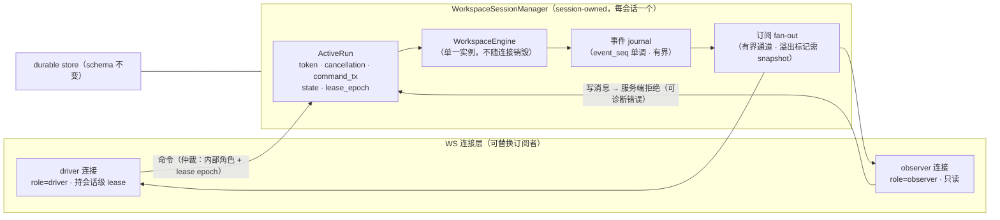

# 设计文档：3.8 驾驶舱全程化与连接韧性

> **状态**：立项设计 v1.0（三方决议承接版；controller 终审 + 双审修订后进 writing-plans）
> **一句话**：把 3.7「自动执行驾驶舱」从「对话门后半程」推到**全程**（前半程生成入口 / Provider 配置 / 流式进度入 cockpit），并把「连接」与「运行」从纠缠中解出来（断连不再污染运行终态、恢复链可达、归因一次复现闭环）。

- **设计编号**：DES-2026-09-16-P38-COCKPIT-RESILIENCE
- **日期**：2026-09-17（文件名沿用立项输入包 2026-09-16 序列）
- **版本**：v1.0
- **范围**：aria 工作区引擎——P1 纯前端（`web/src/`，延续 3.7-C1 安全面）；P2/P3 触 workspace WS 与引擎恢复链（`src/web/workspace_ws_handler/`、`src/product/workspace_engine/`、`workspace_ws_types/`），**正式破除 3.7-C1**（代价声明见 §6.3）
- **决议权威**：`.superpowers/sdd/2026-09-04_计划文档_3.6全量收敛轮_v1.0/p38-tripartite-decision.md`——本设计逐条承接其 Q1-Q5 / 范围修正 4 条 / 纪律 4 条，对照表见附录 B
- **素材**（全部实读）：立项输入包 v0.9（`cadence/designs/2026-09-16_立项输入包_3.8驾驶舱全程化与连接韧性_v0.9.md`，引用「输入包:§N/M-x」）；断连 RCA（`p4-disconnect-rca.md`，引用「RCA:§N」）；oracle 裁决（`p38-oracle-verdict.md`）；ter 可行性（`p38-ter-feasibility.md`）；3.7 设计（C1-C7 见其 §7）；主台账（引用「台账:LNN」）
- **关联 OpenSpec change**：`openspec/changes/cockpit-fullcourse-connection-resilience/`（proposal / design / specs×3 / tasks，本设计的契约化落地）

## 目录

0. [目标与范式](#0-目标与范式)
1. [背景事实（证据基线）](#1-背景事实证据基线)
2. [P1 前端补全：驾驶舱全程化](#2-p1-前端补全驾驶舱全程化)
3. [P2 连接解耦：run 生命周期与连接脱钩](#3-p2-连接解耦run-生命周期与连接脱钩)
4. [P3 恢复链：守卫与误标修复](#4-p3-恢复链守卫与误标修复)
5. [P4 清尾：条件项与杂项清算](#5-p4-清尾条件项与杂项清算)
6. [非目标与约束](#6-非目标与约束)
7. [风险与缓解](#7-风险与缓解)
8. [验收](#8-验收)
9. [执行序与工作量](#9-执行序与工作量)

附录 A：[术语](#附录-a术语) ｜ 附录 B：[决议承接对照表（自检）](#附录-b决议承接对照表自检)

---

## 0. 目标与范式

### 0.1 产品目标（三个主攻面）

3.8 = 3.7「自动执行驾驶舱」范式转型的未竟部分，2026-09-16 全天验收暴露的三条结构性欠账（输入包:§1）：

| 主攻面 | 一句话 | 承载 |
|---|---|---|
| **前半程入口** | 生成发起 / Provider 配置 / 生成过程可视从 legacy 补进 cockpit，驾驶舱覆盖**全程** | P1（纯前端） |
| **连接韧性** | 断连与运行生命周期解耦——断连不再污染运行终态、被动连接不再盲区、归因缺口一次复现闭环 | P2（引擎专项）+ P3a |
| **恢复链** | 断连/中止后的快照门 confirm 可达（0429 形态）、投影层不信失配快照（0017 形态） | P3（P3a 先行 + P3b 随 P2 族） |

### 0.2 范式延续与扩展

3.7 范式 = **自动执行为主 + 异常驱动人工**（用户拍板，台账:L455），3.8 **不改范式、不改任何已验收交互面语义**（红线，§6.1）。3.8 做的是该范式的自然延伸：异常驱动人工要求「自动执行的部分可见」——前半程生成发生在 legacy、cockpit 接手时生成已结束（输入包:§2-M4），用户被迫在两个形态间换脸盯进度，这正是 M1-2「换脸割裂」的根源。P1 把「可见」补到全程；P2/P3 把「自动执行」从「连接存活」的隐式前提中解放出来——连接是可替换的订阅者，运行是 session 持有的 durable 事实。

### 0.3 主攻面与 Phase 对应

| Phase | 内容 | 性质 | 引擎改动 |
|---|---|---|---|
| **P1** | 生成入口 + Provider 配置 + 流式进度区 + 形态路由终态化（Q1a） | 前端补全 | **零**（延续 C1 安全面） |
| **P2** | session-owned run manager + driver/observer 角色与 lease + close 不写终态 + cursor 重订阅与广播（RCA §5 四条；Q2a） | 引擎专项重构 | **破除 C1** |
| **P3a** | 连接级归因日志 + 投影层终态守卫（Q3：批后首批） | 安全/止血包 | 服务端连接日志（小）+ 前端守卫 |
| **P3b** | phase 回门节点 + REQ-CG-04 补句（Q3：P2 族内最前；M5-2 吸收边界见 §4.3） | 恢复链修复 | 引擎恢复链 |
| **P4** | driver readback 前置 + 跨会话批量（Q4：条件项）+ 杂项清算 | 清尾 | 视条件项 |

### 0.4 明示点（呈报用户，共三处）

以下三点为三方决议明文要求向用户明示的内容（决议文件头 + oracle 总裁决条件清单），实施与验收文案**必须保持同口径**：

1. **Q1 默认表演化（R-1）**：P1 落地后，未显式设置的 story/design 会话默认路由由 legacy 演化为 cockpit——这是对 09-16 用户裁决「类型感知默认」（台账:L492）行为面的**变更**。定性：属「过渡形态的既定终态」而非重定义（C4 显式设置尊重 / 开关 / 回滚红线全保留），但**必须明示**，防止验收期被指「暗改已验收行为」。
2. **M1-5 处置 = 显式 defer**：arch-code 反代入口误用定性为「用户侧访问配置，非产品缺陷」（决议 §三.1）；处置 = 文档指引「用 `127.0.0.1:4317` 直连」，**不做**入口自检条目（oracle 倾向的最小 P1 条目被 controller 裁为 defer）。
3. **P2 广播边界与 lease 粒度**：P2 范围 = workspace WS 解耦 + 广播；coding WS 广播 = 条件扩展（§3.6）；lease 粒度 = 会话级（§3.4）；P2 工作量按 ter 重估 84-130h（实施）/ 96-150h（含流程）排期（决议 §一，**否决输入包 2-3 天估算**）。

### 0.5 验收总口径

沿用 3.7 REQ-UI37-12 双层范式：**人工验收只认真实链，自动化替身只做单测/回归**。3.8 特有的断连/多连接矩阵（RCA §6 四条）**全量引用、不可因预估压力裁剪**（纪律 R-4，§8.1）。分层验收口径见 §8。

---

## 1. 背景事实（证据基线）

> 事实全部来自 2026-09-16 全天验收 + ter RCA 勘察 + ter/oracle 实读抽验；实施时以代码为准，本表用于对齐术语与证据链。行号引用以各源报告实读为准。

### 1.1 验收实录（2026-09-16，输入包 §2-M1）

| # | 发现 | 事实与出处 |
|---|---|---|
| M1-1 | **四次断连死链** | 验收期间至少四处 `aborted_by_disconnect` 现场：①0408（冻结 tab 工件，timeline node 009，台账:L468）②0429（断连中止→快照门恢复→confirm 被引擎拒 `WORK_ITEM_PLAN_HUMAN_GATE_STAGE_INVALID`，UI 预检:V2/发现④，台账:L490）③0437（reviewer 完成后 218ms 内被误标，RCA:§3.3）④用户口述一次（durable 无第二条 marker，归因需连接级日志，RCA:§3.4）。体验后果 = 会话在 UI 上呈现「运行已中止」死链，门操作不可达或被拒 |
| M1-2 | **换脸割裂** | story/design 生成在 legacy、plan 门在 cockpit，用户需 localStorage 手动切换（台账:L492 用户裁决 A 原文）；已按「类型感知默认」两轮 fix 缓解（d0831dd5+d99fbb6e，台账:L493/L495），但路由仍是过渡形态（终态化 = Q1 → §2.4） |
| M1-3 | **入口分散** | cockpit 对 story/design 会话**无生成入口**（台账:L494⑤，backlog 原文「cockpit 补生成按钮=C 方案 3.8」）；「开始生成」仅在 legacy |
| M1-4 | **进度不可见** | 生成过程在 cockpit 无可视：三区驾驶舱为对话门链路设计，生成中的会话无流式呈现（§2.3） |
| M1-5 | **arch-code 入口误用** | 反代入口 WS 通（流程能走）但 REST 404 轮询 + Artifact 空白 + Monaco 挂；`127.0.0.1:4317` 直连修复（台账:L494①）。**处置 = 显式 defer**（§0.4-2） |

### 1.2 RCA 实锤逐条（输入包 §2-M2，报告 p4-disconnect-rca.md）

| # | 缺口 | 事实（RCA 实证） | 3.8 承接 |
|---|---|---|---|
| M2-1 | **stale-close 误杀（主嫌，已热修）** | `useWorkspaceWs` 60s 服务端静默自关（15s 扫描，`close(4000)`）把 `human_confirm` 门等待判为静默（不在 `ACTIVE_PROVIDER_STAGES`，`workspace-ws-message-handler.ts:37`）。热修 af4f7ccf 已闭环（human_confirm+active 节点守卫 / visibilitychange 双向 ping / 回前台立即重连 / 真死连自关保留）；v16h 部署后用户最终链验证通过（台账:L497）。**注意 R-2 口径纪律**：RCA:§4 对 stale-close 与 0429/0437 的直接因果持保留口径（测距自 durable 写时刻），最终归因依赖 M2-4 归因日志一次复现闭环——**闭环前不得宣称主嫌已根治**，热修表述 =「消除已证实的前端断连源」 | 热修已在线；归因闭环归 P3a |
| M2-2 | **socket 清理误标 run 终态** | WS 读循环结束时 socket-local 清理仍持有 `current_run` → `append_aborted_by_disconnect` + `transition_to_prepare_context_after_disconnect`（活动节点标 Failed「连接断开，运行已中止」，durable session status 置 open；`lifecycle.rs:845-879`、`socket.rs:769-806`）。定性：**审计/状态整流结果，不是 provider run 被 cancel 的证明**（`abort_workspace_run` 调用已移除，`socket.rs:776-781`），但展示语义上覆盖了业务终态（0429 真实业务结局 = `validation_reject` 被覆盖；0437 门刚开 104ms 被覆盖） | P2 架构吸收（§4.2） |
| M2-3 | **服务端 idle 90-95s 独立风险** | 默认 90s 阈值 + 5s 扫描 + 空 close frame（客户端观测 1005/wasClean=true）；`last_seen.elapsed() > timeout && !is_active_run()` 才关（`socket.rs:114-133`）。对本案两现场已证伪为直接原因（32s/0.22s ≪ 90s 且 drive guard 在场）；但作为独立风险仍在：无 drive 的静默窗口 + 浏览器后台 timer 节流叠加可造真断连（3.6 F7-B 余留，台账:L267-268/L466） | P2 后由「重连不污染终态」无害化（§5.3 结项口径） |
| M2-4 | **断连起点归因缺口** | durable 只记录断连清理的**结果**，无 close code/reason/connection id/触发者；「谁先关闭连接」不能诚实下结论（RCA:§3.3/§7）。RCA:§5-1 最小修法 = 服务端每 WS 生成 connection_id + 记录 receiver 退出类型，前端记录 onclose code/reason/wasClean/visibilityState | P3a 首批（§4.1，载体中性化修正见 D9） |
| M2-5 | **被动连接实时事件盲区（广播缺失）** | coding WS 每连接私有通道：driver 启动的编码运行，被动连接收不到实时事件（driver 1122 chunk vs 页面 0 行，台账:L471）；observer 与 driver 共用同一 endpoint 无身份区分（RCA:§1.2） | coding 侧 = P2 条件扩展（§3.6）；workspace 侧 = P2 广播（§3.5） |

### 1.3 快照门三形态（输入包 §2-M3）

| 形态 | 事实 | 出处 | 3.8 承接 |
|---|---|---|---|
| **0017**（投影层无引擎终态守卫） | 引擎 stage=completed 的停摆会话，前端快照门投影仍呈现可操作；confirm 发出后被 `INVALID_MESSAGE_FOR_STAGE` 拒，前端正确内联 hard_error。与 1b「observer 快照最多 15 秒陈旧」同族的**长效陈旧**，非 P4 引入 | UI 预检:发现①；台账:L489 | P3a 终态守卫（§4.1-②） |
| **0429**（恢复链 phase 不回门节点） | 修订轮 provider 运行中 driver 断连 → `aborted_by_disconnect` → 快照门 resumable=true 重连渲染正确——但 confirm 到引擎后被 `WORK_ITEM_PLAN_HUMAN_GATE_STAGE_INVALID` 拒（stage=human_confirm 却拒 human_confirm：**phase 停在 Evaluate 未回门节点**）。与 3.6 rep1b-resume defer 项同根（approval compile 失败后 active_node 不回滚到门节点，台账:L290） | UI 预检:V2/发现④；台账:L490 | P3b phase 回门（§4.3） |
| **0437**（断连误标覆盖门呈现） | reviewer 完成 → `human_confirm` 开始（15:06:45.413）→ 104-218ms 内节点被标「连接断开，运行已中止」+ `aborted_by_disconnect` 落盘——门刚开即被 socket 清理的展示整流覆盖（M2-2 亚秒现场） | RCA:§3.3；台账:L496 | P2 close 语义（§3.2-③） |

三形态共同点：**前端以「投影存在未关闭门」为判据信了快照，引擎侧终态/相位与投影失配时用户撞协议错误**。

### 1.4 现状技术基线（ter 实施抽验，p38-ter-feasibility §1.2）

| 落点 | 已实证事实 | 实施含义 |
|---|---|---|
| 主 WS | `useWorkspaceWs` 已有 hello / `sendStartGeneration` / `selectProvider` / 25s ping / 流式消息处理；af4f7ccf 后已有 visibilitychange ping + 前台重连 | P1 直接复用，不另开生成 socket |
| cockpit | `ChatCockpitPage` 已挂 `useWorkspaceWs`、渲染 `TimelineNodeList` + `ChatEntryList`；facade 只接 human-confirm/feedback/advance | P1 缺的是「接线和形态完整性」，非引擎能力 |
| Hello/cursor | wire 带 `last_seen_node_id`（`in_.rs:26-29`）但 inbound 仅异步下发完整 `session_state`，**未消费 cursor** | P2 的 cursor 是新能力，不得误报为已实现 |
| run 与 engine | `WorkspaceRunRegistry` 按 session 存活跃 run；但 `current_run`/`next_run_id`/engine/outbound channel 都由 socket 建立，每连接 `WorkspaceEngine::new_persistent` | P2 必须把 engine/run/事件源移到 session manager，不能只给 registry 加字段 |
| 事件发送 | engine event forwarder 把事件转入本 socket 的 `outbound_tx`；连接关闭 abort forward/send task；provider task 持有该 sender | P2 广播 = 把事件源从 socket 生命周期抽离 |
| serde | `WsInMessage` 为 `#[serde(tag="type")]` 枚举且**无 `deny_unknown_fields`**（oracle 实读 `in_.rs:26-29`）→ Hello 新增 `Option` 字段**双向兼容**（旧→新：缺席=None ✓；新→旧：未知字段被忽略 ✓） | Q2a 双字段容忍的实锤基础 |
| driver 脚本族 | 无 role hello 发送点 6 处：`run_campaign.mjs:567`、`story_run_campaign.mjs:130`、`coding_run_campaign.mjs:782/855`、`workitem_run_campaign.mjs:2525`、`workspace_ws_types/tests.rs:562` + 前端两处；**脚本族不经部署通道**（从 worktree 直连在役服务端） | Q2c 一刀切 = 4+ 脚本族 flag-day，被否决的实锤理由 |
| 断连清理 | socket cleanup 移除 registry token 后调 `append_aborted_by_disconnect` + `transition_to_prepare_context_after_disconnect`；lifecycle 把活动节点标 Failed（`lifecycle.rs:845-879`） | 既是 0437 覆盖点，也是 P2 close 语义的准确落点 |

---

## 2. P1 前端补全：驾驶舱全程化（引擎零改动，延续 C1）

> 决议 Q1(a)：**类型感知路由保留为终态（含 fix r1/r2 语义）**；P1 落地后默认表演化（§0.4-1 明示点）。P1 可独立先行；工作量按 ter 重估 17-28h 全量 / 10-15h 薄纵切（决议否决「约 1 工作日」乐观口径）。

### 2.1 生成入口（M1-3 / 台账:L494⑤）

cockpit 对 **story/design（及 plan 未开始态）** 会话提供「开始生成」入口与发起流：

- **复用既有链路**：接入 legacy 已有的 `ChatInputBar` 与 `handleStartGeneration()` 语义（经 `useWorkspaceWs` 的 `sendStartGeneration` 发出 `start_generation`）；**维持 legacy 全部发起语义**——stage 守卫（仅可发起阶段可达）、连接状态（未连接禁发）、recoverable run（存在可恢复运行时的提示路径）、optimistic entry（发起后乐观条目）。
- **禁止清单**（ter §1.1）：不另开「cockpit generation socket」、不复制第二份「cockpit provider state」、不新建第二套流式状态机——`handleWorkspaceWsMessage` 已把 `stream_chunk`/`message_complete`/`stage_change` 投影到 workspace store，cockpit 已消费该 store。
- 入口形态：三区架构不动——生成发起控件挂在 ③ 下钻对话流顶部（空会话/未开始态）与 ① 收件箱的「进行中」空态引导，② 执行流照常只读。

### 2.2 Provider 配置（M1-5 证据链 / 台账:L494②③）

消除「建错只能另改」（0437 现场：Provider=codex 待改 pi，无 cockpit 入口）：

- **复用既有 `ProviderConfigPanel`** 与 store 语义（author/reviewer 选择、reviewer 开关、permission、rounds）——单一状态源，禁止 cockpit 侧第二份拷贝。
- **暴露时机**：仅会话可编辑阶段（未开始 / 可配置窗口）暴露配置面；进入运行后只读呈现当前 Provider（运行中改配置 = 引擎不支持，不伪装）。
- **默认 Provider**：会话创建/发起入口提供默认 Provider 选择（含全局默认记忆，localStorage 级，不进引擎），使「发起前选对」成为 cockpit 内闭环动作。

### 2.3 流式进度区（M1-4 / 输入包 §2-M4）

**形态裁定**（输入包附录未决项，oracle 预判分歧 #6 纯设计题；本设计钉死）：

- **复用三区执行流 + 下钻对话流**，不新建独立「生成进度面板」：生成中的会话在 cockpit = ② 执行流（timeline 阶段推进）+ ③ 对话流（`stream_chunk` 流式渲染，既有虚拟化）照常投影，**补齐的是「生成中」可辨识运行态**——运行中状态徽标（provider/阶段/已耗时）、空会话边界（尚无产物 ≠ 故障）、失败边界（provider 失败可辨识呈现，不静默）、完成边界（产物可达/门可达）。
- **约束**（oracle 排序审）：P1 流式进度区**只消费既有 WS 事件面**。若实施中发现事件面不足（如需要 token 级进度计量或跨 tab 实时），该子项**升级移入 P2 契约**重估，P1 并行度相应降级——不私扩后端事件面。
- **薄纵切前提**（ter §6）：薄纵切承诺 10-15h 的前提 = 「现有 ChatEntryList + timeline 已满足流式可见」被真实 UI 验证；若验收要求全新 token 仪表/跨 tab 实时观察/回放，立即停止称其为 P1 薄切并另行估算。

### 2.4 形态路由终态化（Q1a + M1-2）

**终态路由判定表**（P1 落地后生效）：

| 优先级 | 条件 | 形态 | 说明 |
|---|---|---|---|
| 1 | 显式设置 `aria.chat.cockpit = legacy` | **legacy** | C4 回滚通道，红线不动 |
| 2 | 显式设置 `= cockpit` | **cockpit** | |
| 3 | 未设置 + 已知类型（story / design / plan，**含未开始态**） | **cockpit** | **默认表演化**（R-1 明示点）：story/design 由 legacy→cockpit；plan 未开始态由 legacy→cockpit（目标态：P1 落地后 cockpit 具备开始按钮（§2.1，现状无生成入口 = M1-3），「空 plan 必须 legacy」前提届时删除） |
| 4 | 未设置 + 未知/缺失 `workspaceType` | **legacy** | 安全兜底，不抖动 |

**守卫清单（全部保留，删前提不删安全性——ter §5）**：

1. **显式选择优先**：`aria.chat.cockpit` 显式取值压倒一切默认（C4）；
2. **跨会话归属守卫**：页面仅在 store 的 `sessionId === route sessionId` 时读取 `workspaceType`/timeline——前一 plan session 首帧不得把 story 错进 cockpit（d0831dd5 fix r1 语义，不得删除）；
3. **未知类型安全 legacy**：`workspaceType` 缺失/未知时不抖动、不误入 cockpit；
4. **首帧定形态**：默认表演化后，未设置会话**首帧即进 cockpit**，消除现行「未开始 plan 先以 legacy 打开连接、收状态后因默认变更 unmount 并 `close(1000)` 重连」的形态切换（ter §5.2——对连接生命周期更干净）；
5. **测试迁移**：当前按「默认 legacy」编写的页面测试（类型感知三轮防回归用例）随默认表演化**同步迁移断言，不得删除用例过关**；显式 legacy 用例全部保留并新增（回滚通道锁定）。

**legacy 页面不删**：删除 legacy/清掉显式回滚开关/迁移全部 legacy-only 测试属阶段 4 退役门与 parity 证明（决议 Q1 依据 1：输入包 §4-2「P1 完成只是解锁退役门评估，不执行退役」），3.8 不越权消费。

### 2.5 P1 验收口径

- **薄纵切（明早用户可验证，ter §6 口径）**：未显式设置默认 cockpit（含 story/design）+ cockpit 复用既有 Provider 配置与 `start_generation` + 复用 timeline+对话流证明生成过程可见 + **一条真实链：cockpit 内选 Provider → 开始 story/design 生成 → 看到流式/阶段推进 → 到达门**。全程不引入 P2 兼容层或新后端契约。
- **全量**：story/design + plan 真实链 UI 全程——cockpit 内发起（含 Provider 选择）→ 流式进度可视 → 门点确认 → advance → coding → 落地，**全程不开命令行、不切 legacy**（沿用 REQ-UI37-12 双层范式：自动化替身只做回归，人工只认真实链）+ 显式 legacy 回滚演练（翻开关回旧形态可用）。
- **红线自查**：3.7 已验收交互面（§6.1 清单）语义零改动；任何路径不得因 `workspaceType` 尚未到达而错误使用另一 session 的状态。

---

## 3. P2 连接解耦：run 生命周期与连接脱钩（引擎专项）

> RCA:§5 根治四条 + ter §4 技术坑缓解 + oracle 排序裁定。**P2 不是 2-3 天的补丁**（决议否决输入包估算）：按 ter 重估 84-130h 实施 / 96-150h 含流程，专项排期。排序纪律（决议 §三.4）：**session-owned manager = 共同前置，核心串行 + 外围并行；否决「四条独立并行」**——run/engine 所有权是角色、close 语义、广播的共同前置，四名实施者各改一条合并 = 放大 merge/race 风险。

### 3.1 架构总图：WorkspaceSessionManager



与现状的结构性距离（ter §1.1/§1.2）：当前每次 `handle_workspace_socket` 新建 engine、`engine_tx/rx`、socket-local `current_run`/`next_run_id`、单连接 `outbound_tx`；provider task 虽向全局 registry 登记 run，但其 engine 与全部事件输出仍绑在创建它的 socket，连接关闭还会中止该 socket 的 event-forward task。P2 把这四样全部移入 manager。

### 3.2 RCA §5 根治四条的落地

| RCA §5 条 | 落地设计 | 验收锚 |
|---|---|---|
| ① **run = session-owned durable entity** | manager 唯一持有 `ActiveRun { token, cancellation, command_tx, state, lease_epoch }` 与单一 engine 实例；socket 只持有 attachment（connection_id + 订阅），**绝不拥有 run**；run 的开始/abort/命令/完成/lease 释放进入 manager 内**单一原子临界区**，以 token + lease epoch 比较后生效；supersede 的显式语义保留并扩展（observer/stale driver 不得触发）；engine 创建一次、运行期间不随连接销毁；**内存回收点 = 终态 + 无订阅者**；进程重启从 durable 重建，**in-flight provider run 不虚称跨进程连续**（按恢复链处置，可恢复 state 与不可恢复运行分开） | RCA §6-④ |
| ② **驱动/观察者协议显式化** | Hello 增可选 `role` 字段（driver/observer）；缺席归一（§3.3）；observer 不可发送改变 run 的消息（服务端拒绝 + 可诊断错误码，不是前端藏按钮）；driver 断开只撤销 lease / 记录状态，**不取消、不改写 run** | RCA §6-④ |
| ③ **连接关闭不写 `aborted_by_disconnect`** | 断连清理路径删除 terminal mutation：不写 `aborted_by_disconnect`、不把活动节点标 Failed、不触发 `transition_to_prepare_context_after_disconnect` 整流；只有 **provider token 实际被取消 / provider 失败 / 明确人类 abort** 才写对应真实终态；run 完成与 close 并发**只产生一个真实 terminal reason**（显式 abort、新 run supersede 等既有取消路径照旧） | RCA §6-②③ |
| ④ **重连 cursor 重订阅 + 广播** | §3.5；顺带根治 workspace 面被动连接盲区（M2-5 的 workspace 半边）；coding 面 = 条件扩展（§3.6） | RCA §6-①③ |

### 3.3 wire 兼容：Q2(a) 双字段容忍 + 服务端缺席归一

**决议 Q2(a)**：Hello 增 `role` 可选字段，双字段容忍；**服务端缺席 role 归一为显式内部常量**；阶段 4 退役门评估是否收紧为必填（ter 关切的未来硬化路径，预注册不预执行）。

1. **容忍基础（oracle 实读）**：`WsInMessage` 无 `deny_unknown_fields` → `Option<Role>` 双向兼容：旧客户端（driver 脚本族 + 旧前端）→ 新服务端：缺席 = None ✓；新客户端 → 旧服务端：未知字段被 serde 忽略 ✓。历史 `ws.jsonl` 证据文件是日志而非服务端输入，不受影响。
2. **缺席语义 = legacy driver 等价**：所有现存脚本本来就是 driver（`run_campaign.mjs:567`、`story_run_campaign.mjs:130`、`coding_run_campaign.mjs:782/855`、`workitem_run_campaign.mjs:2525`、`workspace_ws_types/tests.rs:562`），唯一的 observer = `workspace-observer-store`（随 P2 前端尾巴在同次部署声明 `role=observer`）。缺席归一与其真实用途一致，破坏面 ≈ 零。
3. **实现纪律（oracle 让步框架「wire 层不让实现层让」）**：缺席 role 在**服务端入口处**归一为内部显式常量（如 `Role::LegacyDriver`）；命令仲裁代码**只认内部角色**——legacy 分支不外溢到仲裁逻辑（回应 ter 的实现复杂度反对：不维护双分支仲裁）。
4. **否决 Q2(c) 一刀切的实锤**：脚本族不经部署通道（worktree 直连在役服务端），rust-embed 同部署只覆盖内嵌前端；(c) = 4+ 脚本族 flag-day 同步升级 + 与在役 v16h 二进制部署顺序耦合，而 RCA §6 验收矩阵恰恰依赖这些 driver 真跑。否决 Q2(b) 握手协商：单仓同部署、无长尾第三方客户端生态，能力协商解决不存在的问题。
5. **cursor 字段同纪律**：Hello 增可选 `after_event_seq`（§3.5），与 `role` 同批、同双字段容忍纪律；既有 `last_seen_node_id` 保留现状（继续被忽略，不承诺语义）。

### 3.4 lease 粒度裁定：会话级单活性 driver

（决议 §三.3 要求设计文档前必钉；本节为裁定）

- **裁定**：lease = **会话级、至多一个活性 driver 授权**——由连接持有，随连接关闭撤销（只撤 lease/记录状态，不取消 run）；新连接可**显式接管** lease（epoch 递增，旧 epoch 迟到写被拒）；observer 无 lease。
- **理由**：①生产现实 = 单会话单 driver（用户裁决④「生产单会话至多一个开态门」同族），无双 driver 并存用户故事；②仲裁简单性——manager 只需在 (token, lease_epoch) 上做单一判等，无需多写者仲裁；③与 supersede 显式语义兼容（supersede 是 run 级换代，lease 是连接级授权，二者正交）。
- **否决连接级多 driver lease**：需要多写者冲突仲裁与 lease 组合矩阵爆炸（ter §4.3 的「lease 过期、并发 driver 抢占、刷新后迟到消息」逐项测试面再乘并发数），解决不存在的需求。
- **必须逐项测试的边界**（ter §4.3）：lease 过期、并发 driver 抢占、刷新后原 tab 迟到消息被拒、driver 重连获取可写 lease。

### 3.5 cursor 重订阅与 session 级广播

**现状缺口**（ter §1.2/§4.4）：`last_seen_node_id` 只是 wire 字段（handler 完全忽略）；node id 不能表达同一 node 内多 stream chunk/stage change/permission/choice 事件的顺序；关闭 socket 会 abort event forward task——新连接拉一份 `session_state` 不足以恢复未落盘的流式瞬态。

- **event_seq**：定义 **session-scoped 单调 `event_seq`**（不复用 node id 作 cursor）；Hello 提交 `after_event_seq`（可选字段，§3.3-5）。
- **journal**：manager 保存**有界**事件 journal；cursor 过旧/存在缺口 → 先发**带 cursor 的完整 snapshot** 建基线，再续后续事件；客户端按 seq 去重、以 snapshot 建基线。
- **stream chunk 策略**：journal 至 run 完成，或 snapshot 携带当前累计文本——二选一由实施定（writing-plans 层），**验收同口径**：断线重连后流式呈现不丢不重，不得「承诺可回放却只回放 timeline」。
- **慢订阅者**：有界 subscriber channel，溢出后标记「需 snapshot」降级重取，**不得反压 provider**。
- **出站泵归属**：每连接只管自己的出站泵；关闭任一连接不影响 run、engine 或其他 attachment（多连接并发矩阵最小集 = ter §4.5：observer 关闭零影响 / observer 写被拒 / driver 关闭 run 持续 / driver 重连获取可写 lease / 旧 epoch 写被拒 / run 完成与 close 并发只产生一个真实 terminal reason）。

### 3.6 广播边界：workspace 先行，coding 条件扩展

（决议 §三.2 controller 补裁）

- **P2 范围 = workspace WS 解耦 + 广播**（`workspace_ws_handler` / run 所有权面）。
- **coding WS 广播 = P2 条件扩展**：M2-5/M5-1 的现场在 coding WS（`coding_ws_handler`，台账:L471），RCA §5 根治设计覆盖的是 workspace 面——**不许以「顺带」模糊带过**。裁定：P2 主体（manager/角色/close/cursor）若在 3.8 窗口内滑出，coding 广播 **defer 至阶段 4 前夜并显式登记 backlog**（M5-1 已挂一轮，再 defer 须用户可见——呈报明示）；若 P2 主体落地且余量足够，coding 广播作为条件扩展项单独估时（届时按 ter §3.2「cursor 重订阅+广播 24-36h」口径对 coding 面单独重估，不蚕食 P2 主体）。coding 侧 UI 启动入口已缓解盲区的用户面（3.7-P4 A 链浏览器启动 runner→实时日志已通）。

### 3.7 排序与并行纪律

- **族内串行链**（决议 §三.4，否决四条独立并行）：manager 骨架（3.2-①）→ 角色仲裁 + close 语义（3.2-②③）→ cursor/广播（3.2-④）。P3b phase 回门 = **族内最前**（§4.3）。
- **P1 ∥ P2 并行成立，但「无文件交集」修正为「主体零交集 + 一个点名交集需排序」**（oracle 排序审）：P2 条④的前端落地必触 `web/src` WS 客户端层（hello 新字段/types/重连逻辑），与 P1 流式进度区可能同触 `useWorkspaceWs` 族——**排序钉：P1 先落，P2 前端尾巴随后**；P2 引擎主体与 P1 真并行。
- **并行前提**：P1 流式进度区消费既有 WS 事件面（§2.3 约束）；测试面分离（P1 走 vitest、P2 走 cargo）；k3 审查带宽按 P 串行排（SOP 不变）。

### 3.8 存量数据与降级回滚（C1 破除代价声明补两条，决议 §三.3）

1. **卡死 session 攒账处置口径**（0166/0167/0168/0199/0277 + 0429）：P2/P3b 落地后**不回写、不修复历史 durable**（事件前缀不可变红线）；处置 = 以新二进制对每个存量 session 做**复活验证**——快照门 confirm 可达（复活，链继续）或获得明确可诊断拒绝（真实契约缺口则 compile 正确拒 = 产品正确行为，session 以可诊断终态化关闭）；结果逐个记入 defer-ledger，**不承诺全部复活**。0429 由 P3b 验收点名承接（Q5 移交的 C 正向门关闭）；其余五个（0166/0167/0168 = 4 号修法卡死族、0199 = plan 契约缺口门开、0277 = driver kill 楔死测试工件）随复活验证逐个定性。
2. **降级回滚口径**：**回退安全**，理由三条——①P2 **不改 durable schema 结构**，只改写入行为（不再写 `aborted_by_disconnect` 审计节点/不再标 Failed/不再整流回 prepare_context），旧二进制读新数据无 schema 断裂；②wire 双字段容忍保证新旧二进制与脚本族任意组合不炸（§3.3-1）；③存量历史标记保留为历史，新二进制不因其存在误判。**回退代价** = 恢复旧行为面（重新引入误标与恢复链缺口，回到 v16h 行为），无数据迁移需求。P2 关闸证据含一次**回退读验证**（旧二进制对新数据读会话状态无错）。

### 3.9 工作量与「不可交付半成品」纪律

| 项 | ter 重估 |
|---|---|
| run=session-owned manager | 22-34h |
| 角色与 lease（wire/类型/脚本/矩阵） | 14-22h |
| close 不写终态（语义回归面） | 8-14h |
| cursor 重订阅 + 广播 | 24-36h |
| 并发/断连验收矩阵与集成 | 16-24h |
| **合计** | **84-130h（10.5-16.25 有效工作日）；含 OpenSpec 契约/审查/真实矩阵预留 96-150h** |

**纪律**（ter §6/§7，决议采纳）：P2 任一子项**不单独交付半成品**——只做 driver/observer、lease、cursor、广播中一项会制造更危险的双所有权；明早窗口不承诺 P2 任何半成品，连接中断时不得把 P1 纵切宣传为「连接韧性已验收」。

---

## 4. P3 恢复链：守卫与误标修复

> 决议 Q3：采纳 ter 拆分结构 + oracle 两处修正。**P3a = OpenSpec 批准后首批实施**（非批前；af4f7ccf 纯前端热修合法例外已发生，不追溯）；**socket 误标修复随 P2 架构吸收，不独立先行**；**phase 回门 = P2 族内最前**。

### 4.1 P3a：先行安全/归因包（批后首批，ter 估 10-16h）

**① 连接级归因日志（M2-4 根治）**——RCA §5-1 方向 + ter 关键修正（**归因载体中性化**）：

- **中性载体裁定**：RCA §5-1 原文「同 connection_id 写入 `aborted_by_disconnect` detail」与 P2 目标「close 不写 `aborted_by_disconnect`」**不能同时作为终态设计**。裁定：归因记录 = **中性连接诊断记录**，与业务 timeline terminal reason 分离，不把断连事实重新编码为「运行已中止」。
- **服务端**：每 WS 生成 `connection_id`；记录 receiver 退出类型（close frame code/reason、EOF、error）、是否 `CloseDueToIdleTimeout` 触发、session、当前 run/token、drive depth、最后双向 activity 时间。
- **前端**：记录 `onclose` 的 code/reason/wasClean、`document.visibilityState`、最后 pong/server-message 与最后 ping 时间（进 protocolDiagnostics 诊断面）。
- **过渡期衔接**（P3a 落地 → P2 落地前）：断连清理仍按现行行为写 `aborted_by_disconnect`（误标修复随 P2），此时**同 connection_id 写入其 detail** 供关联归因——一次复现即可闭环 M2-4 对 0429/0437 的归因定案（R-2 解锁点）；P2 落地后该写入随架构消失，中性记录成为唯一连接级事实源。
- **归因闭环判据**：一次复现即可唯一判定 close 起点 ∈ {server-idle, 前端 4000 自关, 页面卸载 1000, 代理/TCP, 浏览器 discard}。

**② 快照门投影终态守卫（0017 形态根治，纯前端）**：

- 投影层对引擎 stage/相位加守卫：引擎 stage 已终态（completed/failed 等非门等待态）或门相位与投影失配时，快照门控件呈现**不可操作**（锁定 + 原因说明），不提供 confirm/反馈的可达发送路径——前端不再信「投影存在未关闭门」。
- 守卫是**前端投影行为**：不改变引擎拒绝语义（引擎仍拒，前端不制造撞墙路径）；引擎真实门开（stage=human_confirm 且相位一致）不受守卫误伤（反例必测）。

### 4.2 socket 误标修复：随 P2 架构吸收（默认不独立先行）

决议 Q3 修正二：输入包「可先行独立热修」不成立为默认——0429 现场证明误标发生在两种相位（run 已业务终态 `validation_reject` 被覆盖 / run 存活门刚开 104ms 被覆盖），正确的最小守卫需要区分这两种相位 = 正是 P2 的 run ownership 知识；半版热修（只删标记不动 stage 迁移）会引入**第三种行为态**（断连后 run 悬挂无呈现亦无恢复路径）。

**让步开口保留**：若实施者给出满足判据「**不引入第三态**」（= 仅跳过覆盖动作，不动 stage 迁移/恢复语义）的最小守卫，可并入 P3a 先行包——默认不并，并入须在实施计划中先证明判据。

### 4.3 P3b：phase 回门节点 + REQ-CG-04 补句（P2 族内最前，ter 估 12-18h）

**phase 回门（M5-2 核心子项，0429 形态唯一根治）**：

- approval compile 失败与修订中止（含断连中止）后，引擎将 **phase/active_node 回滚到门节点**：快照门呈现与 human_confirm 消息判定重新一致，confirm/feedback 无需用户撞 `WORK_ITEM_PLAN_HUMAN_GATE_STAGE_INVALID`。
- 回滚**不得改写已持久化事件前缀**（以新迁移/状态写实现，不改历史）——引擎事件不可变红线延续。
- 触达文件属恢复链（`conversational_gate` / `compile/single_candidate` / `workspace_single_candidate` 家族）；契约变更以 `work-item-plan-conversational-gate` 的 MODIFIED requirement 表达（REQ-CG-04/05，见 OpenSpec change）。

**REQ-CG-04 补句（人工权威升级语义显式化，3.6 登记 backlog L301 随本 change 兑现）**：approve/terminate 关门与后续 compile 判定携带显式人工权威升级语义——close CAS 授权判据 = `status ∈ WaitingForHuman ∧ phase ∈ {Approval, Evaluate} ∧ 门快照在场` 三 conjunct；approve 关门锁内升级 phase=Approval 并同步内存相位（compile 以同步后相位判 auto_confirm）；terminate 不提升。该语义为 4f34ba58 死锁修复（已实施）的**契约化显式表达，零行为变更**。

**M5-2 四号修法包吸收边界**（决议 §三.3 要求设计文档前必钉；本节为裁定）：

| M5-2 子项 | 处置 | 依据 |
|---|---|---|
| ① REQ-CG-04 人工权威升级语义显式化补句 | **吸收**（随本 change MODIFIED requirement 落地；原 backlog 状态「待用户批」由本次三方决议授权 + controller 呈报闭环） | 补句与 phase 回门同触 REQ-CG-04/05 契约文本，拆开无意义 |
| ② `complete_human_gate_revision` 不清 approval 三元组 → confirm → compile 拒 → feedback 修订 → 再 confirm 落吸收态 Failed（缺陷函数实在 `src/product/lifecycle_store/workspace_single_candidate.rs:323`；落吸收态 Failed 的写入点 = `compile/single_candidate.rs:662-673` 的 `record_single_candidate_compile_failure`） | **不吸收**：显式留 4 号修法包 backlog | 与 0429 恢复阻断不同链（compile 拒后人为二次决策链的状态污染，非相位不回门）；需独立复现矩阵与吸收态语义设计；3.8 不因 P3 验收裁剪它，也不并账吞掉它 |
| ③ approval compile 失败/修订中止后 phase/active_node 不回门节点 | **吸收**（全量：两触发路径都修，共享同一回滚机制） | 0429 形态唯一根治；解锁 Q5 移交的 C 正向门关闭；台账:L290 rep1b-resume defer 同根闭环 |

### 4.4 P3 验收口径（三形态复现矩阵 + 归因）

| 形态 | 验收 |
|---|---|
| 0017 | 终态会话的门在 UI 不可操作（锁定呈现，无 protocol error 可撞）——P3a 落地即可验 |
| 0429 | 断连/compile 拒后快照门 confirm 后**门真实关闭**（或明确可诊断拒绝而非 STAGE_INVALID 死拒）——P3b 落地验；同时承接 Q5 移交的 3.7-C 挂账「正向门关闭」 |
| 0437 | 制造断连后业务终态不被覆盖——随 P2 close 语义验（RCA §6-②③） |
| 归因 | RCA §6-③ 四种 close 各一次唯一归因——P3a 半链（中性记录）+ P2 全链（terminal reason 各自正确） |

---

## 5. P4 清尾：条件项与杂项清算

### 5.1 driver readback 修复（M5-4，必做且前置）

`workitem` driver `stage3_group_snapshot_readback` 报 `elapsedMs is not a function`（driver 脚本自身 JS bug，两处独立复现，不影响产品链）。**决议 Q4：必做且前置**——它挡 RCA §6 验收矩阵的 driver 种子效率；修复零依赖、2-4h，排首批窗口（与 P3a 同批）或 P2 族期间插入，不绑定 P2 合并窗口。验收 = readback 复跑零错。

### 5.2 跨会话批量（M5-3，P2 条件项）

收件箱跨会话多选批量确认（解除用户裁决④「生产单会话至多一个开态门 ⇒ 批量至多单项生效」限制）。**条件项**：P2 落地则做；P2 滑出 3.8 窗口则整体 defer 至阶段 4 前夜（呈报明示）。依赖**不是泛称「通道」**，而是两条具体机制（oracle 排序审）：

1. **命令仲裁安全**：无 driver/observer 显式角色时，收件箱批量连接与用户已开 cockpit tab 连接同为无差别可命令连接，触发 run 时走 supersede 路径（`abort_active_run`，RCA:§1.2）竞态无防护——依赖 P2 的角色仲裁 + lease；
2. **被动观察一致性**：批量结果对其他 tab 的可见性依赖 P2 的 session 级广播。

验收 = 两个真实会话各有开态门时，跨会话批量确认各自**恰一次**生效；P2 滑窗时按条件项纪律 defer 并登记。

### 5.3 杂项清算（M5-6 清点表，决议 Q4 措辞修正）

**timer 节流结项口径（oracle 措辞修正，决议采纳）**：不是「方向一致不修」，而是「**P2 重连重订阅架构使其无害化**」——RCA:§4 链条：节流只在 >90s 全向静默才可能成为真根因；P2 后瞬断不污染终态、重连重订阅恢复呈现。这是架构吸收，文档如实表述，避免给后续会话留下「明知风险不修」的误读。

其余逐项处置（验收 = 清点表逐项「已修 / 已 defer + 理由」）：

| 项 | 处置方向 |
|---|---|
| 浏览器后台 timer 节流叠加（台账:L466） | P2 无害化口径登记（上述）；不单独修 |
| vite dev 重载循环（台账:L464②） | defer（生产 rust-embed 稳定；开发环境工件） |
| L1 toast 活抓未取得（台账:L468） | defer（jsdom 覆盖 + shell 挂载实证，冻结窗口不可得——证据不可得性如实留档） |
| 7 页面 mock 工厂缺 `newCommandId` / turn 完成后旧 id 重交被 Replayed 吞（台账:L465） | 修（测试基建缺陷，P1 测试迁移同批顺手清，不单独立项） |
| 0017 hard_error 污染条目说明（台账:L489） | 文档处置（操作手册已注明「0017 协议错误条目 = 预期」；终态守卫落地后该形态不再新增） |
| 截图调用冻结吞点击（UI 预检:发现③） | defer（测试工件） |
| M1-5 arch-code 反代入口 | **显式 defer**（§0.4-2：用户侧访问配置；文档指引 127.0.0.1:4317 直连） |

---

## 6. 非目标与约束

### 6.1 红线：3.7 已验收交互面语义零改动（决议 §四）

以下 3.7 已验收语义在 3.8 **只做加法（新入口/新守卫），不重定义**：快捷键映射、批量确认同会话单门语义（用户裁决④）、审计三层、四码归因、ConfirmTwiceButton 与 GateFeedbackEditor 归一、返回父级双链、autopilot Confirmed 唯一锚点、四层提醒体系、双轨开关语义。**默认表演化**（§2.4）不属重定义——是 09-16 裁决过渡形态的既定终态演化，但按 R-1 明示。

### 6.2 阶段 4 边界不抢先

多仓 coding、旧协议退役门、`auto_start_coding` 显式语义（DEF-4/5/6）仍归阶段 4（五阶段路线 v2.0；3.7 设计 §7-C5）。3.8 P1 完成只是**解锁**退役门评估，不执行退役；Q2(a) 的「role 收紧为必填」评估挂退役门时点；legacy 删除不在 3.8（§2.4）。

### 6.3 C1 正式破除的代价声明（决议 §四 + §三.3 补两条）

3.7-C1 = 「Phase 1-4 均不动后端」。3.8 **P2/P3 正式破除 C1**（引擎契约与协议变更：Hello `role`/`after_event_seq` 可选字段、run 所有权模型、断连终态语义、恢复链相位）。代价与纪律：

1. **OpenSpec change 先行**（先例 = 3.7 流程；本 change 即其兑现）——P3a 含服务端改动，**必须批后实施**（R-3；af4f7ccf 纯前端例外已发生，不追溯）；
2. **wire 兼容口径** = Q2(a) 双字段容忍 + 缺席归一（§3.3）；
3. **durable 语义迁移口径** = 不改 schema、不回写历史、存量复活验证（§3.8-1）；
4. **契约审查轮参照 3.6 F3 强度**；
5. **P1 保持 C1**（纯前端），使 3.8 内部仍有「零引擎改动可交付」的安全面；
6. **卡死 session 处置口径**（补一）：§3.8-1；
7. **降级回滚口径**（补二）：§3.8-2。

### 6.4 其余约束

| # | 约束 |
|---|---|
| C4' | 双轨红线延续：显式设置尊重、开关/回滚语义保留（用户裁决 A 契约红线不动，台账:L492） |
| C6' | 不新增 Provider / CI / 持久化评估语料（3.7-C6 延续） |
| C7' | 编码侧不绕过「single-candidate Running 拒 UserMessage」fail-closed 语义——P2 只做连接身份与所有权，**不改插话语义**（3.7-C7 延续） |
| C8' | 跑动中接管/门禁语义变更仍另立项（3.7-C2 延续；P2 的 lease 是连接授权，不是门禁语义） |
| C9' | M1-5 显式 defer（§0.4-2 / §5.3 表末行）——证据链断点的显式处置，不留沉默项 |

---

## 7. 风险与缓解

| # | 风险 | 缓解 |
|---|---|---|
| R'1 | **口径纪律（决议 R-2）**：归因日志落地并经一次复现闭环前，任何文案宣称「断连主嫌已根治」 | 全程文案纪律：热修表述 =「消除已证实的前端断连源」；P3a 验收含 R-2 口径检查项；闭环判据见 §4.1-① |
| R'2 | **先行包时点（决议 R-3）**：P3a 滑向 OpenSpec 批准之前 = 3.8 自己破自己的纪律先例 | 本设计 + OpenSpec change 批准后才开工 P3a；af4f7ccf 例外不追溯、不复制 |
| R'3 | **P2 结构风险**：run 注册与 token 竞态（socket-local `current_run` 与 registry 双层所有权交错）、engine 实例随 socket 重建（旧 engine 运行中 + 新连接快照 engine 并存）、命令仲裁（无角色时任一连接可发业务命令） | ter §4.1-4.3 缓解逐条落地：manager 唯一持有 ActiveRun + 单一原子临界区 + token/epoch 判等；engine 移入 manager 创建一次 + 明确内存回收点 + 重启诚实口径；角色归一 + 仲裁只认内部角色 + lease 边界逐项测试 |
| R'4 | **cursor/广播被低估**：「多发一份消息」无法满足断线回放与顺序保证 | event_seq 单调 + 有界 journal + snapshot 基线 + 慢订阅者降级（§3.5）；stream chunk 策略二选一但验收同口径 |
| R'5 | **P2 半成品双所有权**（最危险失败模式） | 不可交付半成品纪律（§3.9）；P2 子项不单独上线；验收矩阵四条全量为 done 定义（R-4 不可裁） |
| R'6 | **wire 破坏面** | Q2(a) 破坏面 ≈ 零（serde 实读 + 脚本族缺席=driver 等价）；Q2(c) flag-day 风险被否决规避；新增字段全部走可选+归一纪律 |
| R'7 | **P1 工期风险**：「约 1 工作日」被否决后的真实区间 17-28h；乐观项是「全程」二字的测试迁移与 parity 走查 | 薄纵切 10-15h 先交付明早可验证面；全量独立验收；类型感知三轮防回归用例随默认表演化同步迁移（不删用例） |
| R'8 | **默认表演化验收争议（R-1）** | 明示点呈报（§0.4-1）；定性=过渡形态既定终态；C4 回滚通道保留 + 显式 legacy 回滚演练进 P1 验收 |
| R'9 | **形态切换引入连接重建**：首帧定形态改造触及路由×WS 生命周期交界 | 守卫清单五条（§2.4）+ 专项回归（无中途 unmount+close(1000)+重连） |
| R'10 | **P2 滑窗**：84-130h 专项在 3.8 窗口内排不下 | 条件项纪律：coding 广播 defer（§3.6）、跨会话批量 defer（§5.2）、呈报明示；RCA §6 矩阵仍不可裁（滑窗 = 整体 defer，不是裁矩阵） |
| R'11 | **3.7 语义回归**：P1/P2 前端尾巴触 cockpit 既有面 | §6.1 红线清单进每工作包验收；P1 验收含 3.7 交互面回归自查 |

---

## 8. 验收

### 8.1 RCA §6 断连验收矩阵（P2 done 定义，全量引用、不可裁剪——决议 R-4）

> 以下四条为 RCA 报告 §6 原文全量引用；**不得因预估压力裁剪**——砍矩阵 = 砍立项依据。

1. **Chrome 用官方 intensive-throttling 测试 flag，tab 隐藏后运行超过阈值**；断言每个 25 秒应用 ping 的实际间隔、服务端是否发 idle close、run 是否持续且无 `aborted_by_disconnect`。
2. **human-gate revision 期间让 provider 静默超过 60 秒**；断言前端不自行发送 close 4000、服务端不会 idle close、完成后状态是业务结果而非断连覆盖。
3. **人为 server idle、浏览器 `ws.close(4000)`、页面卸载 1000、TCP drop 各跑一次**；断言新日志能唯一归因，且其 durable terminal reason 分别正确。
4. **多连接场景：driver + cockpit observer**；关闭 observer 必须零影响 driver run；driver close 只影响订阅/lease，run 必须持续。

### 8.2 分层验收清单

| 层 | 包 | 口径 |
|---|---|---|
| 人工（真实链） | P1 薄纵切 | §2.5 薄纵切口径（cockpit 内选 Provider→开始→流式→门） |
| 人工（真实链） | P1 全量 | §2.5 全量口径（story/design+plan 全程 cockpit 不切 legacy 不开命令行）+ 显式 legacy 回滚演练 |
| 人工（真实链） | P2 | §8.1 四条矩阵真跑（driver 种子依赖 §5.1 readback 修复）+ 回退读验证 |
| 复现矩阵 | P3a | 0017 形态：终态会话门不可操作；归因半链：四种人为 close 中性记录唯一归因 |
| 复现矩阵 | P3b | 0429 形态：快照门 confirm 后门真实关闭（或明确可诊断拒绝）；承接 Q5 移交的 3.7-C「正向门关闭」 |
| 复现矩阵 | P2（含 0437） | 制造断连后业务终态不被覆盖（矩阵②③） |
| 清点表 | P4 | 跨会话批量（若做）两真实会话各恰一次；杂项逐项「已修/已 defer+理由」 |
| 口径检查 | 全程 | R-2 文案纪律检查（归因闭环前无「根治」宣称）；3.7 交互面语义零改动自查 |

### 8.3 SOP 沿用

实施链 = ter-task 优先 → glm53-task 备用（台账:L462）；k3 审 → 部署三对账 → 真实链验收（台账:L488/L497）；P1 走 vitest、P2 走 cargo，测试面分离。

---

## 9. 执行序与工作量

### 9.1 总排序（决议 §五）

```
设计文档 v1.0 + OpenSpec 四件套（本文）
  → 双审（k3 接地 + oracle 裁决）→ 修订
  → writing-plans → 双审
  → 实施：首批 = P3a + P1 薄纵切（明早用户可验证）
          （driver readback 前置小修同批）
  → 明早呈报（决议 + 三明示点 + 验证入口）【controller】
  → P1 全量 → P2 专项（P3b 族内最前）→ P4（持续推进）
```

### 9.2 工作包与工作量（ter 重估口径，决议采纳）

| 包 | 内容 | 估算 |
|---|---|---|
| WP1 首批 | P3a（归因日志 + 终态守卫）+ driver readback 前置 | 10-16h + 2-4h |
| WP2 首批 | P1 薄纵切（默认表演化 + 生成入口 + Provider 配置 + 流式可见） | 10-15h |
| WP3 | P1 全量（plan 未开始入口 + 运行态完整呈现 + 路由回归全量） | 增量至 17-28h 全量口径 |
| WP4 | P2 族：**P3b 最前**（phase 回门 + REQ-CG-04 补句 + 存量复活验证）→ manager 骨架 → 角色+lease → close 语义 → cursor+广播 | P3b 12-18h；P2 主体 84-130h（含流程 96-150h） |
| WP5 | P4：跨会话批量（P2 条件项）+ 杂项清点表 | 视条件项 |

并行纪律：WP1 ∥ WP2（首批同窗）；WP3 与 WP4 引擎主体真并行（§3.7 点名交集 = P2 前端尾巴在 P1 后）；WP4 族内串行。

---

## 附录 A：术语

| 术语 | 含义 | 来源 |
|---|---|---|
| **驾驶舱 / cockpit** | 3.7 三区自动执行驾驶舱（收件箱/执行流/下钻对话流）；3.8 将其从「对话门后半程」推到全程 | 3.7 设计 |
| **类型感知默认** | 09-16 用户拍板的过渡形态路由（显式设置优先；未设置 plan→cockpit、story/design→legacy）；3.8 终态化 = 机制保留 + 默认表演化 | 台账:L492-495；Q1(a) |
| **默认表演化** | P1 落地后未显式设置的已知类型（story/design/plan 含未开始态）默认路由全部演化为 cockpit（R-1 明示点） | §2.4 |
| **session-owned run manager** | run（engine/token/provider-drive/状态机/终态原因）由 session 级 manager 唯一持有，连接只是可替换订阅者 | RCA:§5 |
| **driver / observer** | 连接的显式角色：driver 持会话级 lease 可发命令；observer 只读，写被服务端拒绝 | RCA:§5；Q2(a) |
| **lease（会话级）** | 至多一个活性 driver 授权，由连接持有、关闭撤销、可显式接管（epoch 递增）；不取消不改写 run | §3.4 |
| **event_seq / journal** | session-scoped 单调事件序号与有界事件日志，支撑 cursor 重订阅与回放 | §3.5 |
| **中性归因记录** | 连接级诊断事实（connection_id/close code/reason/退出类型/活性时间），与业务 timeline terminal reason 分离 | §4.1；ter 关键修正 |
| **P3a / P3b** | P3 拆分：P3a = 归因日志 + 终态守卫（批后首批）；P3b = phase 回门 + REQ-CG-04 补句（P2 族内最前） | Q3 |
| **4 号修法包（M5-2）** | 恢复链缺陷族：REQ-CG-04 补句 / approval 三元组清理缺陷 / phase 回门——3.8 吸收 ①③，② 留 backlog | §4.3 |
| **形态路由守卫** | 跨会话归属校验 / 未知类型安全 legacy / 显式设置优先 / 首帧定形态 | §2.4 |
| **卡死 session 攒账** | 0166/0167/0168/0199/0277（+0429）：门开挂起等待修复的存量会话，处置 = 复活验证不回写 | §3.8-1 |

## 附录 B：决议承接对照表（自检）

> 逐条对照 `p38-tripartite-decision.md`；每行决议 → 本设计落点。**无沉默项。**

### B.1 总决议（§一）

| 决议 | 落点 |
|---|---|
| 3.8 立项通过，P1 前端补全先行（明早可验证薄纵切） | §2.5 薄纵切、§9.1 首批 |
| P2 按专项重估排期（84-130h/96-150h），否决 2-3 天估算 | §3.9、§0.4-3 |
| P3a = OpenSpec 批准后首批实施 | §4.1、§9.1 |
| P4 跨会话批量 = P2 条件项 | §5.2 |

### B.2 开放问题决议 Q1-Q5（§二）

| # | 决议 | 落点 |
|---|---|---|
| Q1 | **(a) 类型感知路由保留为终态**（含 fix r1/r2 语义）；默认表演化向用户明示（R-1） | §2.4（终态判定表 + 守卫清单含 r1/r2 语义）、§0.4-1 明示点、§7-R'8 |
| Q2 | **(a) 双字段容忍**（Hello 增 Option role）+ 服务端缺席归一为显式常量；阶段 4 退役门评估收紧必填 | §3.3（容忍基础/缺席语义/实现纪律/否决 (c) 实锤/退役门硬化路径预注册）；cursor 字段同纪律 §3.3-5 |
| Q3 | **采纳拆分**：P3a 批后首批（af4f7ccf 纯前端例外不追溯）；socket 误标随 P2 不独立先行（0429 证明最小守卫需 run ownership 知识）；phase 回门 = P2 族内最前 | §4.1（批后首批+例外口径）、§4.2（随 P2 + 让步判据「不引入第三态」）、§4.3（族内最前）、§9.2 WP4 |
| Q4 | **driver readback 必做且前置**（RCA §6 矩阵种子效率）；跨会话批量 = P2 条件项（滑窗 defer 阶段 4 前夜）；timer 节流结项口径 = 「P2 架构无害化」非「不修」 | §5.1（前置）、§5.2（条件项+两条依赖机制）、§5.3（无害化口径 + 措辞修正如实表述） |
| Q5 | **修正版 (b) 三分解**：引擎不阻塞项立即补验回填；引擎阻塞项（C 正向门关闭/0429 形态）点名移交 P3b 验收口径；0017 现场处置移交 P3a 验收口径（纯前端终态守卫可解，非引擎阻塞）；3.7 归档+squash 照常、残留如实标注 | §4.1-②（0017 终态守卫）、§4.4（0429 承接 C 正向门关闭）、§8.2（P3a/P3b 复现矩阵分别点名承接）；3.7 侧动作非本设计范围（controller 执行，本设计不重复展开） |

### B.3 范围修正 4 条（§三）

| # | 决议 | 落点 |
|---|---|---|
| 1 | M1-5 = 显式 defer（用户侧访问配置非产品缺陷；文档记录 127.0.0.1:4317 直连） | §0.4-2、§5.3 表末行、§6.4-C9' |
| 2 | P2 广播边界 = workspace WS 解耦+广播；coding 广播 = 条件扩展（滑窗 defer） | §3.6（不许「顺带」模糊 + defer 呈报明示） |
| 3 | 设计文档前必钉：M5-2 吸收边界 + C1 破除代价补两条（卡死 session 处置 + 降级回滚） | §4.3（吸收边界表：①③吸收②留 backlog）、§3.8（两条补齐） |
| 4 | P2 排序：session-owned manager = 共同前置，核心串行+外围并行；否决四条独立并行 | §3.7、§3.9 |

### B.4 纪律 4 条（§四）

| # | 决议 | 落点 |
|---|---|---|
| R-2 | RCA §4 保留口径闭环前不得宣称主嫌已根治（热修表述 =「消除已证实的前端断连源」） | §1.2-M2-1 注意项、§7-R'1、§8.2 口径检查 |
| R-3 | 先行热修包时点 = OpenSpec 批准后（纯前端热修例外已发生不追溯） | §6.3-1、§7-R'2、§4.1 |
| R-4 | RCA §6 验收矩阵不可因预估压力裁剪 | §8.1 全量引用、§7-R'10（滑窗=整体 defer 非裁矩阵）、OpenSpec REQ-WCR-07 |
| 红线 | 3.7 已验收交互面语义零改动 | §6.1 清单、§7-R'11、§8.2 自查 |

### B.5 oracle 总裁决条件清单（p38-oracle-verdict §6）

| 条件 | 落点 |
|---|---|
| 明示点①：Q1 默认表演化向用户确认 | §0.4-1（本设计明示；呈报动作归 controller 决议 §五.7） |
| 明示点②：M1-5 处置 | §0.4-2（决议已裁 = 显式 defer） |
| 明示点③：P2 广播边界与 lease 粒度写入设计文档并重估工作量 | §3.6、§3.4、§3.9 |
| 纪律①：先行热修包批后执行 | §4.1、§6.3-1 |
| 纪律②：RCA §6 四条矩阵 = P2 done 定义不可裁 | §8.1、REQ-WCR-07 |

### B.6 自检结论

- [x] Q1-Q5 / 范围修正 4 / 纪律 4 / 明示点 3 / oracle 条件 5——全部有落点，无沉默项；
- [x] RCA §6 矩阵全量引用（§8.1）未裁剪；
- [x] M5-2 吸收边界、lease 粒度、广播边界、卡死 session 处置、降级回滚——五个「设计文档前必钉」项全部钉死（§4.3、§3.4、§3.6、§3.8）；
- [x] P1 保持 C1 / P2/P3 破除 C1 的代价声明完整（§6.3）；
- [x] 工作量按 ter 重估口径（决议采纳值），未沿用被否决的 2-3 天估算；
- [x] 配套 OpenSpec change `cockpit-fullcourse-connection-resilience`（proposal/design/specs×3/tasks）与本设计一致，`openspec validate --strict` 通过。

### B.7 修订记录（双审修订轮，2026-09-17）

> 输入：`p38-design-review-k3.md`（1 Important + 2 Minor）+ `p38-design-review-oracle.md`（F1/F2）。5 条 findings 全部为文档级、不阻塞，逐条消化如下；修订后 `openspec validate cockpit-fullcourse-connection-resilience --strict` 复跑通过。修订过程明细见 `p38-design-fix-report.md`。

| # | 来源 | 位置 | 修订内容 |
|---|---|---|---|
| 1 | k3-F1（Important） | §2.4 判定表行 3 | 「cockpit 已有开始按钮」现状误写改为目标态表述：P1 落地后 cockpit 具备开始按钮（§2.1，现状无生成入口 = M1-3），「空 plan 必须 legacy」前提届时删除 |
| 2 | k3-F2（Minor） | §4.3 表②、OpenSpec design.md D13 | 函数锚点更正为双锚点：缺陷函数 `complete_human_gate_revision` 实在 `src/product/lifecycle_store/workspace_single_candidate.rs:323`；`compile/single_candidate.rs:662-673` 标注为落吸收态 Failed 的写入点（`record_single_candidate_compile_failure`） |
| 3 | k3-F3（Minor） | OpenSpec REQ-WCR-07 矩阵①场景 | 「（或关闭可归因）」放宽语显式收紧：active-run idle guard 在场时 idle close 设计上不可发生；若守卫失效致关闭，须可归因（REQ-WCR-05）且不污染终态（REQ-WCR-03），作为守卫缺陷跟进、不作为本条通过依据 |
| 4 | oracle-F1（低） | §9.1 | 明早呈报节点移至首批实施之后：首批 → 明早呈报 → P1 全量 → P2 → P4（对齐决议 §五.6-7 与 §0.4/§2.5「明早用户可验证」口径，三明示点不被 P2 工期挡住） |
| 5 | oracle-F2（低） | 附录 B.2 Q5 行 | 0017 从「引擎阻塞项」清单移出：引擎阻塞项（C 正向门关闭/0429 形态）移交 P3b 验收口径；0017 现场处置移交 P3a 验收口径（纯前端守卫可解）；落点列补 §4.1 |
