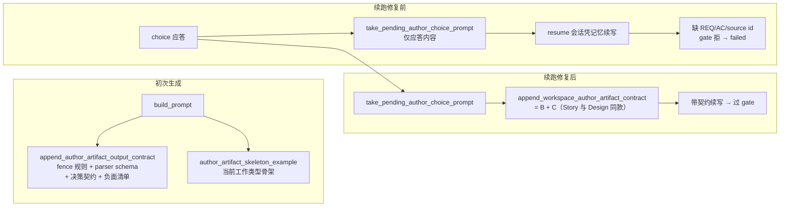

# F-60 修复报告：choice 应答续跑 prompt 完整格式契约（防线 2）

- 日期：2026-09-25
- 状态：已实施（防线 1 按用户裁决撤销，见「防线 1 撤销记录」）
- 分支：feat-b-0808-add-monorepo（worktree）
- 提交：fix(story) 前缀

## 一、现场复盘（issue_0002 story node_003）

事故链：

1. Story author run 中 provider 发起确认问题（choice），会话暂停等待用户。
2. 用户作答 → `take_pending_author_choice_prompt`（`lifecycle.rs`）构造 delta-only 续跑 prompt：「用户回答了 author 的确认问题：…请基于该回答继续生成完整候选产物…」。
3. 该 prompt 经 `handle_author_choice_followup_message`（`AuthorPromptMode::DeltaOnly`）resume 原 provider 会话续跑。
4. author 在 resume 会话里答完题、凭记忆续写完整 Story Spec（15534B，六 heading/source id/[AC-*]/待确认项全部齐备）——但**丢掉 [REQ-*] 追踪标记**。
5. `complete_assistant_message` 跑 artifact gate（`workspace_artifact_selection` + F-46 候选选择）：零 gate-passing 候选 → 阻断原因「缺少 [REQ-*]」→ 节点直接 failed。

直接根因：**续跑 prompt 不带任何输出格式契约**。初次生成 prompt 由 `build_prompt` 注入完整契约（artifact fence 规则 + parser schema `[artifact_schema_contract]` + 结构化交互决策契约 + 负面清单 + 结构骨架），而 delta-only 续跑 prompt 只有应答内容——provider 会话里的系统契约记忆随轮次衰减，author 答完题「忘了格式」。事故前该注入只有 Design 有（`append_design_author_artifact_contract`），**Story 完全没有**——事故正发生在 Story。

## 二、修复（防线 2）：续跑 prompt 注入完整格式契约

原则：**与初次生成同源同块，复用既有 contract 常量**，不新写第二套契约文本。

改动（4 文件）：

| 文件 | 改动 |
|---|---|
| `prompts.rs` | `append_design_author_artifact_contract`（Design 特例）泛化为 `append_workspace_author_artifact_contract`：契约块 + 按 `session.workspace_type` 的结构骨架 |
| `lifecycle.rs` | `take_pending_author_choice_prompt` 的契约注入从 Design-only 扩为 `Story \| Design`（pending author choice 仅存在于这两种类型） |
| `prompts/author_revision.rs` | design 增量修订调用方迁移到通用方法（行为等价：design 会话下输出逐字节相同） |
| `tests/part_01.rs` | 旧测试 `story_author_choice_followup_prompt_remains_byte_for_byte_unchanged`（钉「Story 续跑 prompt 无契约」的旧形态）替换为 `story_author_choice_followup_prompt_includes_full_output_contract` |

注入内容（Story 会话实测）：应答原文（问题/选择/补充）+ 继续生成指令 + 「输出格式契约：」（fence 规则、四反引号包裹、`[artifact_schema_contract]` parser schema——必需 heading 六项、必需稳定 ID `[REQ-*]`/`[AC-*]` 含示例、必需追踪 token `source id`、待确认项策略）+ `author-decision-*` 结构化交互决策契约 + 输出纪律负面清单 + Story 结构骨架。

## 三、TDD 证据

- 红：`story_author_choice_followup_prompt_includes_full_output_contract` 先行失败——实际 prompt 只有应答内容（`cargo test --locked --lib story_author_choice_followup_prompt` FAILED @ part_01.rs:396）。
- 绿：实现后通过；Design 既有契约测试 `design_author_choice_followup_prompt_includes_output_contract_and_decision_traceability` 同步通过。
- 连带断言更新：`author_choice_followup_resumes_author_provider_session` 的逐字节直通断言改为 `prompt.trim()` 比较（契约块尾部含换行，`normalize_generation_prompt` 转发前 trim——delta 直通语义不变，resume_provider_session_id 断言保持原样）。

## 四、验证

- `cargo test --locked --lib workspace_engine`：1289 passed / 0 failed（含 F-46 候选选择既有回归：`automatic_artifact_retry_uses_separate_timeline_node_for_retry_stream`、`artifact_selection*` 族）。
- `cargo fmt --check` 通过；`cargo clippy --all-targets --all-features --locked -- -D warnings` 通过。
- `cargo test --locked` 全量：lib 单测与 it_web/it_core/it_provider 等集成套件全绿（it_web 351 passed；`workspace_engine` 1289 项全绿）。唯一失败 `web_logical_codebase_entrypoints::guards::single_repo_rejects_logical_codebase_routes_without_persisting_artifacts` 为**存量环境性失败**——临时目录 git 仓库不可用（`git show-ref ... in /tmp/...: No such file or directory`），已做基线对照（stash 掉本次全部改动后同一测试同样失败），与 F-60 改动无关，归 F-59/PIB 域处理。

## 五、防线 1 撤销记录（用户裁决 2026-09-25）

原方案（已撤销，未合入任何代码）：story/design gate 失败时错误清单回灌 author prompt 自动重驱恰一次（与 SC plan 教学重驱 F-48/WSC-09 同构），重驱产出重走同一 gate + F-46 候选选择，二次失败才 failed。

撤销理由：用户裁决「不要自动重试防线，只做防线 2」——已知直接根因是续跑丢契约导致 author 凭记忆忘标记；从源头把契约带上后，gate 失败重试属于第二道冗余防线，按裁决不做。

现场调研沉淀（供后续需要时参考，代码零改动）：workspace_engine 的 story/design author 链已有「缺失/无效 artifact 自动续写」机制（REQ-ACS-01，`provider_drive.rs` Completed 分支 + `provider_drive/artifact_retry.rs`），其触发谓词 `should_retry_missing_workspace_artifact` 与完成 gate 同源（`content_has_complete_workspace_artifact` = F-46 候选选择唯一通过判定），重驱 prompt（`build_artifact_retry_prompt`）本就包含错误清单回灌 + 同源契约；该机制被 `provider_allows_artifact_retry` 的 provider 白名单（排除 Pi/KimiCode，引入动机「第一阶段不实证 Kimi resume 稳定性」）限制为非全 provider 生效。若未来需要恢复防线 1，最小路径是重审该白名单而非新造机制。

## 六、遗留与影响面

- 影响面：仅 story/design 会话的 choice 应答续跑 prompt 与 design 增量修订 prompt 的构造（后者逐字节等价迁移）；不改 wire 协议、不改 gate 判定语义、不改前端。
- 运行中的服务器未受本次改动影响（未重启、未触碰其状态目录）。
