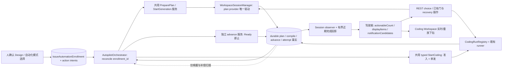

# Design: work-item-group-autopilot

## Context

参见 `proposal.md` 的 Why。现有 `prepare_work_item_plan` 在 `src/web/handlers/lifecycle.rs:612-785` 先创建 plan 再创建 session；若两者之间崩溃，直接重调会再分配 plan。`StartGeneration` 在 `src/web/workspace_ws_handler/decisions/inbound.rs:451-503` 先由 engine 初始化再 `spawn_provider_run_from_handler`；后者会取代活跃 run（`run/provider_run.rs:44-82`），不能当自动重试入口。`WorkspaceSessionManager::create` 独占 session engine/run 并在无活跃 run/连接时可回收（`src/web/workspace_session/manager/mod.rs:245-332,384-400`）。`advance` 的现行契约只建组；WS 层 `SC_CODING_REQUIRES_ADVANCE` 守卫在 `src/web/coding_ws_handler/socket.rs:297-380`，直接调用 `execute_start_coding_flow`（`runner.rs:250-269`）会越过它。

Choice 目前由 WS 接收后从 manager 的 pending frame 集移除，随后仅把命令送入 mpsc（`decisions/inbound.rs:252-351`；`manager/choices.rs:8-49`）；bridge 移除 oneshot sender 并忽略发送结果（`src/cross_cutting/approval_bridge/commands.rs:35-72`）。Coding choice 另由 coding WS 转给 runner（`src/web/coding_ws_handler/socket.rs:919-947`）。无 coding socket 的 amendment runner 激活被 `plan_amendment_coding_socket_unavailable` 拦截（`src/web/workspace_ws_handler/plan_repair_activation.rs:18-48`）；amendment 送达依赖 socket 写回执（`src/product/coding_workspace_engine/amendment.rs:644-675`）。这些都必须解除驱动页面承重，不能只扩大 UI。

`CockpitShell` 目前以 `countedInbox` 同时驱动 toast、计数与系统通知（`web/src/components/cockpit/CockpitShell.tsx:106-207`）；observer 只监视最近 K 个会话（`web/src/hooks/useWorkspaceSessionObservers.ts:83-112`）。业务完成事实不同于人工 Final Confirm：`prepare_group_final_confirm_from_readiness` 将 attempt 置于 `WaitingForHuman/FinalConfirm`（`src/product/coding_workspace_engine/handoffs.rs:472-502`），`handle_final_confirm` 在人工动作后才置 `Completed`（同文件 `21-99`）。R5 以**前者**作为「编码执行完成，待最终确认」通知时点；后者是实际终态，不另强制二次弹窗。

## Goals / Non-Goals

**Goals:** 仅授权的单 target 链跨页面关闭与进程重启推进；所有首启有同一准入和单发事实；驾驶舱能无 driver 解除 choice/门/recovery 阻塞；完成信息与待处理独立；手动链业务语义不变。

**Non-Goals:** 多 target 自动首启/依赖调度；自动 plan approval 或自动 Final Confirm；替代 provider 的唯一 manager/runner；另建通知持久表、全浏览器关闭时 OS push；resilience WP4.7 的独立归档。

## Decisions

### 架构与契约边界

图中 `AutopilotOrchestrator`、enrollment、共用服务与新 REST choice 是**拟新增**边界；其他符号为现有职责。`reconcile(enrollment_id)` 每次先读持久权威状态，按当前绑定与授权**最多认领一个**动作：`EnsurePreparedPlan` → `StartPlanGeneration` → `AdvancePlan` → `StartCodingOnce`。等待 choice/人工门/compile recovery/Final Confirm 时**没有自动门决策**；成功 compile + 出版 + durable Confirmed 后才允许请求 advance。事件不作为排序权威，manager 的内存 `event_seq` 不当 durable 游标。启动扫描未结束 enrollment，运行期间有界周期性补偿漏事件；无页面时可先经 registry 构造 manager，由 manager 持有唯一 plan provider run，coding 由现有 registry/runner 持有。`REQ-WCR-01` 不允许编排器再建 provider drive。初始 P0 仅打通控制面，不开放自动触发。

| 决策 | 推荐方案与理由 | 否决项及成本 |
|---|---|---|
| D1 编排者 | B：同进程独立薄编排器，以持久事实 reconcile，经共用应用服务发四动作；跨 plan/session/attempt 且 manager 可回收 | A：塞 manager 会把跨聚合恢复绑在可回收的单 session；C：在 engine/advance 内联会把首启伪装成 advance 副作用，违反 REQ-ADV-05 |
| D2 策略 | issue 级独立 durable `IssueAutomationEnrollment` + attempt 物化 `CodingStartRunPolicy`，plan session 始终 `Interactive` | issue 布尔位缺精确身份/修订；plan session `AutoIfValid` 在 `review/routing.rs:491-501` 会绕过人工门 |
| D3 choice | REST 有权限核验，WS/REST 共用 claim/resolve 和 bridge 真实交付回执 | observer 写权限破坏只读契约；临时升级 driver WS 令无页面闭环继续依赖连接 |
| D4 启动 | 共用 typed StartCoding 命令统一手工/后台准入、per-attempt 单发，复用原 runner | 裸调 runner 越过 socket 层 Ready 守卫、无法确保首启唯一 |
| D5 通知 | durable 业务事实派生 `info`，不进待处理数；有界历史补读 | 单纯 toast 无重启历史；独立通知表增加另一业务事实源 |
| D6 归属 | session/observer 的服务端归属投影令 `useCockpitAutopilot` 退位 | 前后端两个推进者即使 advance 幂等也可能出现双命令与误提示 |

### D2：身份、撤销与零迁移

新增独立持久记录 `IssueAutomationEnrollment`：`enrollment_id, enabled, policy_revision`；精确 story/design id 与版本、已选 provider/options、唯一 logical repository 范围、唯一绑定 plan_id/session_id（未准备可为空但有稳定创建意图）。同一 issue 的启用/停用用版本比较与交换确保**线性化**；默认缺失=off，旧 plan 不批量匹配/接管。准备时先持久化 plan/session 目标身份和创建意图，再以稳定身份创建/恢复两者，覆盖「plan 已建而 session/绑定尚未落盘」；重复 enrollment 请求同键同源返回既有绑定，冲突源拒绝。冻结 target 与 enrollment 范围再核对：零/多 target、改源或不一致时 fail-closed；手工多 target 路径不因此废除。

attempt 初建时物化 `CodingStartRunPolicy::Manual | AutoStartOnce { enrollment_id, policy_revision, source_plan_revision }`（**拟新增类型**）；默认 Manual，快照只是候选许可，不可代替**消费前重新核对当前有效授权**。关闭后尚未认领动作一律禁止，已认领的命令可完成/恢复，不中止已运行 provider；重新开启不能擦除已消费单发事实或重试 Failed/Aborted。会话 `WorkspaceSession.run_policy` 一直保留 `Interactive`；禁用 `AutoIfValid` 代表 enrollment（`src/product/workspace_engine/review/routing.rs:491-501` 明确它会直接 compile）。

### D3：可答 choice 的同一权威面

拟新增 `POST /api/workspace-sessions/{session_id}/choices/{choice_id}/response`：`command_id, expected_run_id, answers[{question_id,selected_option_ids,free_text}]`，coding 对应 attempt 的有授权响应入口通过共用选择应答门面送到 `CodingRunnerCommand::ChoiceResponse`（现有入口见 `src/web/coding_ws_handler/socket.rs:919-947`）；多问题回答不能丢字段。WS 与 REST 必须进入同一个 manager/run 的 claim/resolve：按 run incarnation + choice id + command_id + payload fingerprint 仲裁，先认领再向 bridge 发命令；**不得先等持有长时 provider run 的 engine mutex**。当前等待者实际解析并成功接收才是 Delivered 回执；mpsc 成功只是 accepted。pending 卡在 submitting/resolving 时保留，交付回执后收敛，失败或 run 重启失效显式呈现。HTTP `200`=交付当前等待者、`202`=期限内回执未知且需携可读状态/同 command_id 复查、`404`=未知、`409`=异 payload/竞争败者、`410`=run 或 choice 过期；HTTP 等待期限不是 provider 的 choice 业务期限。旧进程 oneshot 失效须根据 run 身份和持久审计/恢复态判过期，不能冒充新 run 有效 choice。observer 永远只读；人工门与 compile recovery 仍由原权限与门宿主处理，不造第二个门。

### D4：首启、恢复与五条红线

拟新增共用命令 `StartCodingCommand { attempt_id, command_id, origin: Manual | Enrolled{enrollment_id,policy_revision} }`，WS 与编排器共用。单一 attempt 临界区内顺序：重读 attempt → 状态矩阵及 origin 核验 → 对 enrolled 读当前授权与精确 plan/target/source revision → 用已有 `advance_is_ready_for_attempt` 验 Ready（包含未绑定/不可读的 fail-closed）→ 稳定 action key 认领单发意图及 `CodingRunRegistry` reservation → 持久启动 checkpoint/barrier → 复用既有 runner。`Created/PrepareContext` 并不是 `AdvanceRecord::Ready`；不能按 `flow_kind` 或 id 猜。人工原有 Restart/Recover 与首启分离；在进程启动时按已经认领的检查点恢复原 runner，无需先 attach socket。重复同键或 attempt 已首启返回原状态，不新建 runner；无法证明外部 provider 副作用是否发生则停止为人工恢复，不谎称 external exactly-once。

| 红线（REQ-ADV-05 原文） | 本设计如何落地 | 可见反例 |
|---|---|---|
| **opt-in 持久化 run_policy** | enrollment 与 attempt `CodingStartRunPolicy::AutoStartOnce` 都落盘，plan session 仍 Interactive | 仅 localStorage 开关或 `AutoIfValid` 不合格 |
| **默认 off** | 无 enrollment/旧 attempt 均 Manual；创建时明确同意 | 扫描历史 Confirmed plan 后自动开跑不合格 |
| **per-attempt 单发** | 每绑定 attempt 一个不可复位的稳定认领键+registry reservation+启动检查点 | 重新开启、崩溃重放触发二次首启不合格 |
| **绝不批量** | 只对恰一 logical repository/唯一 attempt 开放；多 target 自动请求整体拒绝 | 逐个循环多 target StartCoding 同样不合格 |
| **不动唯一人工门** | plan session Interactive；choice/门/compile recovery/Final Confirm 由原人工宿主处理 | 门关闭即 advance、自动 approve/Final Confirm 不合格 |

### 幂等与崩溃恢复矩阵

| 观察到的边界/中断窗口 | 稳定事实与处理 | 不得发生 |
|---|---|---|
| design 已确认但无 enrollment / 同键重复选择 | off 不动；同键按 source/options 返回既有 `enrollment_id` 与 revision；异源拒绝 | 猜测历史 plan 授权 |
| enrollment 已写，plan 尚未建 | 按 enrollment-bound 创建意图与稳定 plan/session 身份执行 `EnsurePreparedPlan` | REST prepare 每唤醒都分配新 plan |
| plan 已建而 session/绑定未落盘 | 查同一创建意图，补齐同一 plan/session/绑定或显式失败；绝不扫“最近 plan”冒认 | 第二个 plan/session |
| 生成动作已认领、manager 活 run / manager 已回收 | 同 session+动作键查 run 与持久节点，活 run 不 supersede；回收后构造 manager 按持久事实恢复 | 调 `spawn_provider_run_from_handler` 覆盖活 run |
| 人工 approve 后 compile 未完成/需 recovery | 停在既有 compile 和驾驶舱恢复面；仅成功 publication+Confirmed 可 advance | 把 `gate_closed`/approved_at 当成功 |
| AdvanceRecord/journal 中断或重复 | 复用固定 command_id、plan 唯一 AdvanceRecord/target-attempt 与 journal，直到 Ready | 中断造另一 attempt 或提前启动 |
| attempt 未 Ready、enrollment 已关闭、授权身份不符 | 各自 fail-closed；未消费策略被当前授权撤销；SC Ready 语义沿 `SC_CODING_REQUIRES_ADVANCE` | 因 policy 快照仍为 AutoStartOnce 而首启 |
| StartCoding 意图已写、registry/barrier 前后崩溃 | 同 attempt 单发键和检查点判断已接受/可恢复/外部不确定；恢复原 runner 或人工分诊 | 再发 provider 首启或说 exactly-once |
| choice 已认领、HTTP 超时、run 重启 | 原 command_id 状态可读/复试；旧 run incarnation `410`，未实际交付不返回 `200` | mpsc send 当作 Delivered；回卡消失 |
| 无 coding socket 的 amendment/断连恢复 | 按业务 journal 应用与恢复；observer 投递留真实未送达与补读 | 无 socket 阻断业务；假投递标记 |
| FinalConfirm 等待→人工 Completed 终态 | 等待态发「待最终确认」一次；人工确认后更新信息状态，不二次首启 | 把等待态写成 `Completed` 或自动代点 |

### D5：信息投影、D6：单一前端归属

Plan confirmed 必须从**成功 publication/compile 且 durable session Confirmed** 的完成 milestone 取稳定发生时间；`src/product/workspace_engine/compile.rs:494-595` 的一般 compile node 即使失败也可能标 Completed，不可用作唯一依据；`IssueWorkItemPlan` 仅有 `updated_at` 而无 `confirmed_at`（`src/product/models/lifecycle.rs:282-299`），必要时在成功确认事实补最小稳定时间。信息键采用 plan id + 成功确认的 revision/compile 身份 + kind。Coding 的「执行完成」键采用 attempt id + FinalConfirm readiness 完成世代 + kind，发生时间取持久等待态/快照时间；**不是 `attempt.completed_at`**（该字段在人工 Final Confirm 后才写）。人工确认后的真实 `Completed` 是独立状态事实：可更新原 info 文案/下钻状态，但不强制另发提醒；称「整组已交付」只能消费现有 `PlanGroupOverall::AllDelivered`，其判据是每 target Completed 且 review 已 push（`src/product/coding_attempt_store/plan_group_projection.rs:151-187`），不能把 FinalConfirm 等待态冒充交付。

驾驶舱数据层拆 `displayItems`（可操作卡+信息类）、`actionableCount`（仅卡壳）和 `notificationCandidates`（非首次 hydration 的新稳定事实）；TTL 从 durable occurred_at，刷新/重连不续期。首次补读有界近期历史只展示、不弹通知，后续同事实 key 每客户端至多提醒一次，跨设备可补事实但不声称同步已读。现有 observer K=8 不能覆盖所有近期完成，增加有界近期 durable 完成事实查询/刷新，事件只提示刷新；没有后端通知表也不承诺浏览器完全关闭后的 OS push。session summary/state/observer 投影的 `automation:{owner:client|server,enrollment_id,policy_revision,enabled}` 从 enrollment 精确绑定推导，不取 `localStorage`/plan run_policy。`web/src/hooks/useCockpitAutopilot.ts:26-80` 在归属未知先不发，在 server 归属退出，归属/修订改变清理旧 anchor 和未发送意图；已提交命令由服务端授权/advance 幂等兜底。非 enrolled 的 client 路径行为保持原先语义。

## Risks / Trade-offs

1. **多主体竞争与跨对象半提交→重复 plan/首启。** 稳定创建身份、CAS policy revision、幂等动作键、唯一 AdvanceRecord/journal、attempt 单发+reservation/barrier；不确定副作用进入人工恢复。代价是新增少量 durable 小记录/检查点。
2. **名义后台化却依赖 socket、长锁或进程内状态。** REST choice 不等 engine 长锁、旧 oneshot 不假交付、coding runner 无 attach 恢复、amendment 业务推进与观察 ack 解耦；主动无 WS/慢 observer 真实链验收。代价是要同时打通 workspace 和 coding 两种 choice 门面。
3. **授权扩张或手动零回归破坏。** 永不用 AutoIfValid、旧记录 off、单 target 严格绑定、不跨 target fan-out、plan 门/Final Confirm 保留、server 归属前端退位；每 Phase 有 enrolled 与手工对照。代价是自动化暂不覆盖多 target，须独立立项。
